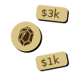
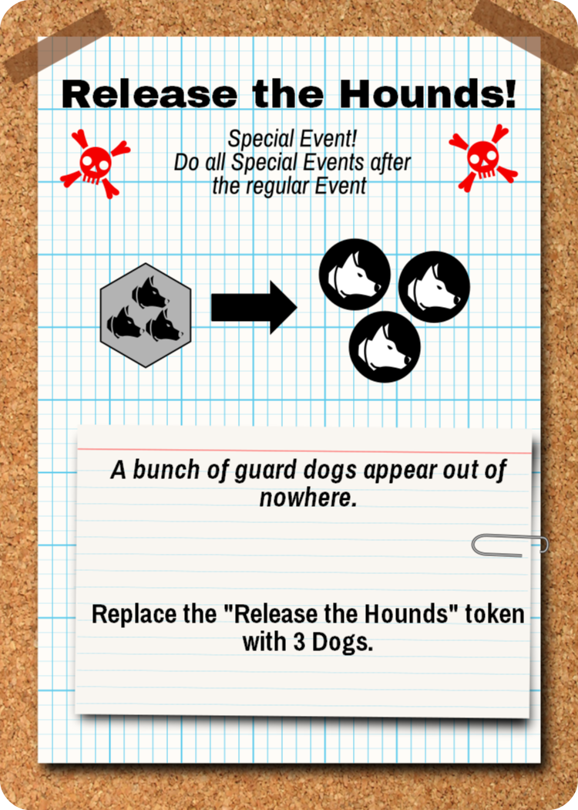
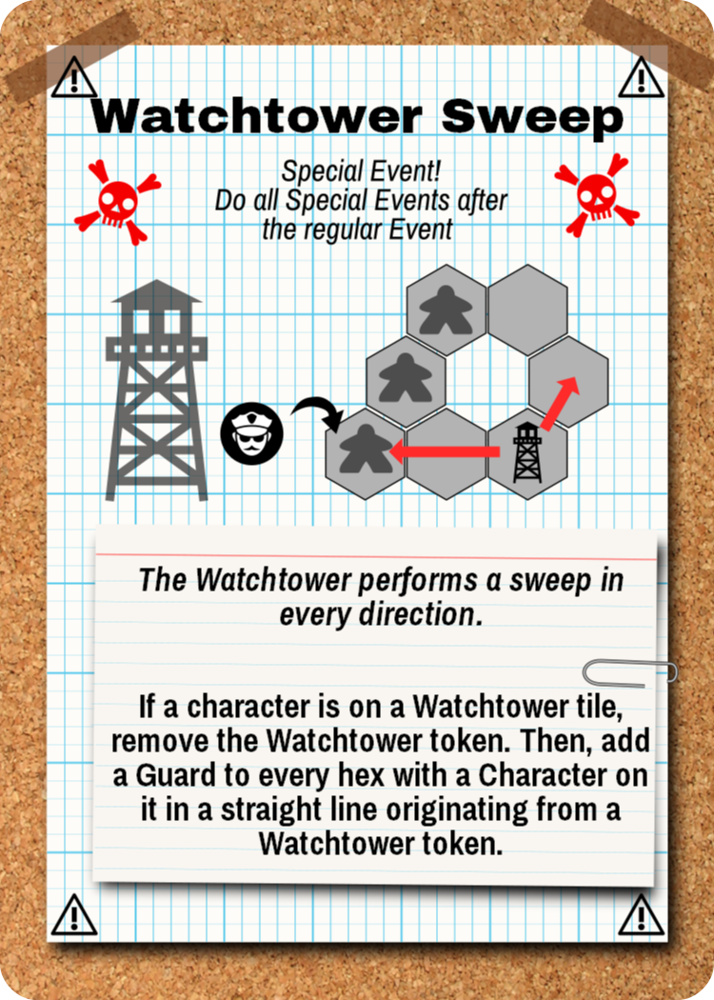
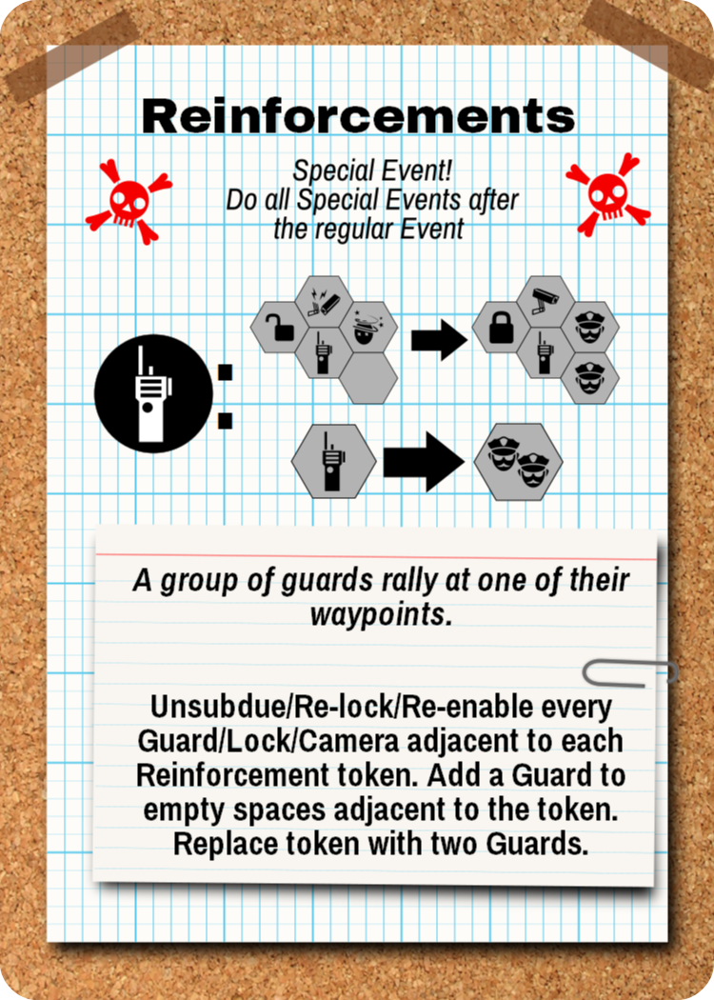
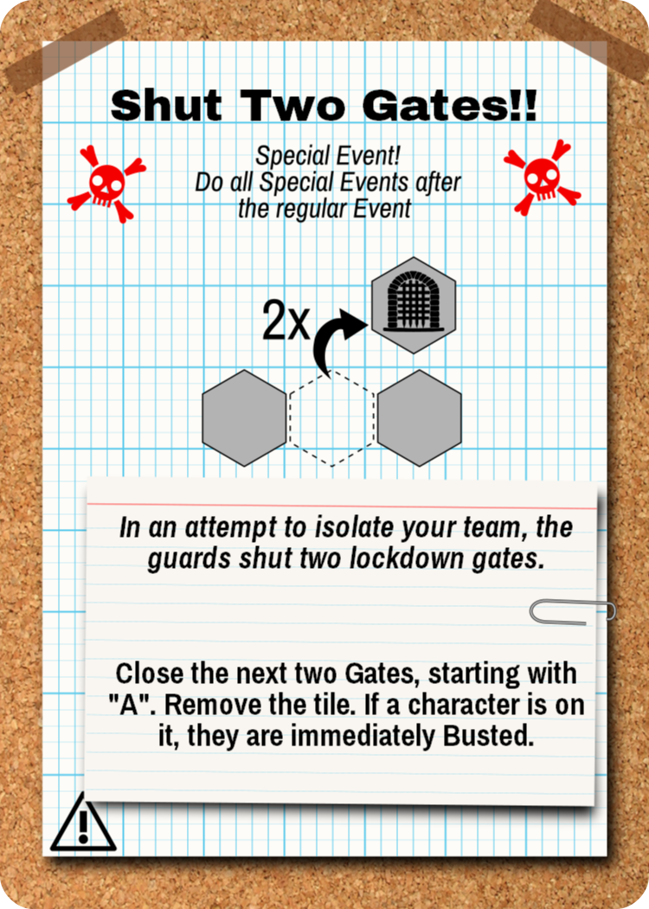

Masters of the Heist
{:.title}

_Masters of the Heist_ is a cooperative heist game set in a world of many possibilities. You are a uniquely skilled individual in a career of high-risk, high-reward thievery. You work with other skilled criminals to quietly traverse buildings while dealing with obstacles like closing gates, guards, locks, sensors, and cameras.

During each heist, you will collaborate using simultaneous gameplay. You will plan your heist, but you will also have to know when to abandon your plan. You use Ideas💡 to get the actions you need, but don't spend too many... you'll need those Ideas💡 to escape, too!

You will start as an Amateur criminal with Amateur skills who is new to River City. But over time, hopefully with a few good decisions along the way, you and your teammates will level up your characters and skills as you make your way through the city. Each heist unlocks new opportunities through doing favors for Fixers.

Version ⏱

## The Pieces

{:.parts-list}

* 28 Blank/Security hex tiles
* 4 Lockdown Gate hex tiles
* 5 Entrance square tiles
* 16 Character cards
* 24 Skill cards
* 18 Event cards
* 6 Special Event cards
* 10 Lock chits
* 10 Camera chits (circle)
* 14 Guard chits (circle)
* 10 Artwork chits (square)
* 4 Jewel chits (circle)
* 4 Control Panel chits (circle)
* 8 Pressure Sensors (ring)
* 1 Story chit (circle)
* 36 Idea💡 chits (oval)
* 4 Player meeples
* 1 Prisoner pawn (white)
* 48 Planning hex chits
* 5 six-sided dice
* 12 Petty Cash chits
* Noise tracker card
* 4 Game Helps

Page
{:.pagenumber}

# Starting a Campaign

On the campaign ledger, fill out the team name and character names. Each player gets a character sheet as well.

**Loosely Affiliated**. Players may freely come and go from the campaign. A player does is not limited to always playing their original character. All heists have 3- and 4-player options. You are always welcome to start out new characters.

**First time.** If this is your very first game, we recommend the using pre-built characters listed at the end of this booklet: Johnny Swagger, Tiny Mike, Phobia, and Showtime. Any of the Amateur heists from River City are good starters.

# Setting Up

**Step 1. As a team, decide your next heist.** Heists are available to you in the River City booklet. Each heist is labelled with a difficulty level and any other pre-requisites.

**Step 2. Set up the board** in the middle of the table. Following the diagram for your chapter, set up the hex tiles so that they match the picture. Place any Loot chits, Prisoner, and/or Security Systems according to the diagram. If the diagram depicts a shield, then use the Security side of the tile, in all other cases use the Blank side.

Tip: to verify the layout, match the shapes of the Gaps between tiles
{:.tip}

Some boards have already-revealed security chits. The Chapter will also indicate how many Guards, Locks, and Camera chits should go into the bag. Leave the other Security chits by the board (they are **the supply**).

**Step 3. Build Characters.** Every player gets one Character card and two Skill cards. Unless you have levelled up in a previous heist, start with Amateur. Otherwise, continue with the character build from your sheet.

Tip: The back of this booklet has some pre-built character+skill pairings.
{:.tip}

**Step 4. Distribute player tokens.** Distribute the 6-sided die, and pawn according to your color. Distribute the Planning tokens (small colored hex chits) to each character according to their Planning Memory on their character card. *For example, the Lookout has a Planning Memory of 6, so she gets 6 planning tokens*. Place remaining Planning tokens back in the box.

**Step 5. Distribute initial Ideas💡** to each player according to their character.

**Step 6. Set up Noise tracker** in view of everyone and according to the number of players (3- or 4-player). Place the Noise Tracker marker on its starting place.

**Step 7. Set up the Event cards** according to the scenario, using the numbered cards in the order indicated. The deck should be entirely face-up with the first card on the top and the last card on the bottom.

**Step 8. Select Fixers**. Determine which Fixers you will use for planning this heist. If this is your first heist, start with *Old Friend*.

## The Board

   
  Blue is adjacent to a Camera, but not to a Guard.

The board is a set of modular double-sided hex tiles. All hexes are considered symmetrical (i.e. orientation does not matter). For most tiles, each tile is Blank on one side, and is a Security tile on the other side. A **Security tile** represents an unknown Security Chit (see below).

Some tiles have **Lockdown Gates** printed on them, and they are lettered A,B,C, and D. A character may enter or exit this hex freely. Security Events may remove this tile from the board. Lockdown Gates are always removed in order: the A tile will be removed first, then B, and so on.

**Adjacent**. You are considered adjacent to something if you are on a tile that shares a border with another tile. Being on the same tile is *not* considered adjacent.

**Entrances & Exits**. Each board has one or more entrances/exits. These Entrances represent a space. If a character is on one of these spaces they are considered to be Outdoors, otherwise they are Indoors. An Entrance tile is also considered an Exit.

**Limit 2 to Entrance**. By default, unless the scenario specifies otherwise, Entrance/Exit tiles are limited to 2 characters at the beginning of the heist. This limit does not apply to the Escape phase, although the scenario may impose additional limits.

**External**. Some abilities refer to "external sides", which are a side of a hex tile that does not lead to a fully-enclosed space by hexes (see figure). An "external tile" is a tile with at least one external side.

**Gaps**. Some abilities refer to a "non-tiled gap", which is a hex-spaced area between two hex tiles that does *not* have a hex (see figure).

## Security Chits

Security Chits are randomized obstacles that your team will encounter. They are shown below.

Security chits are generally unknown at the beginning of the heist, and are placed in a bag to be drawn at random throughout the heist. Immediately when a character is adjacent to a unknown Security tile (i.e. no Security chit placed yet), the chit is **Auto-Revealed** where you remove a random chit from the bag and place it on the tile in its Active state. A Security chit may also be placed with a **Reveal** (🔍) sub-action (see below).

|  Name  |              Active              |                 Inactive                 | Behavior                                                                                                                                                                             |
|:------:|:--------------------------------:|:----------------------------------------:| ------------------------------------------------------------------------------------------------------------------------------------------------------------------------------------ |
| Guard  |   Guard  |     Subdued    | _Slows you down_. If you share a space with a Guard, you may not Move until he is Subdued. You may move into a space with a Guard.                                                   |
| Camera |   Live  |  Disabled | _Increases Alerts._ You may enter a space with a Live Camera, but raise an Alert (⚠) by 1. If a Disabled camera is powered back on while a player is on it, raise an Alert (⚠) by 1. |
|  Lock  |  Locked |    Unlocked   | _Prevents passage._ You may not enter a Locked tile at any time. You may exit a locked tile if it was re-locked while you were on it.                                                |
{:.security-table}

More security chits can be found in the Additional Modules section.

## Actions and Sub-Actions

Skills and Characters allow you to take Actions. Every Action is just a grouping of Sub-Actions with a name (e.g. Punch 👊➜🔊🔊). The Sub-Actions are:

* ➜ is  **Move** to an adjacent, planned, not locked tile
* 🔓 is **Unlock** 1 locked, adjacent tile
* 👊 is **Subdue** 1 guard on or adjacent to your tile
* 📷 is **Disable** 1 camera on or adjacent to your tile
* 💡 is Add 1 **Idea** to your character
* 🔍 is **Reveal** 1 security token anywhere on the board
* 💰 is **Loot:** Gain $1k from the supply and place it on your character.
* 🔊 is Increase the **Noise** level by 1 (Required)
* ⚠ is  **Alert**. Discard the top Event card. (Required)
{:.subactions}

## Characters

Each Character card has:

* **Level**. Amateur or Pro
* **Planning Memory**. The number of pre-planned hex tiles your character may move through during a heist.
* **Initial Ideas**. The number of Ideas 💡 you start with at the beginning of each heist.
* **Default Actions**. Actions that are available regardless of your die roll.
* **Special Ability**. Abilities that your character can uniquely do.
{:.figure_list}

Some Characters have two Default Actions, others have three.

For the Special Ability, some abilities will have a "Use this action..." sentence. You must use your Action to make use of this ability. If the text does not state "Use this action...", you may do the ability *in addition to* your Action.

Some abilities have a "Once per heist..." sentence. Place the once-per-heist token on this character at the beginning of the heist and discard when used.

Special abilities override any rules in this document.

## Skills

Each character gets two Skills. Each Skill has six Actions *①* that each correspond to a die roll *②*. During a heist, you will be rolling your die to determine which Actions are available to you. Every skill is either Amateur or Pro.

**Complementary skills**. When building a character, use Lacks *③* to see what the skill is missing so you can find a good combination.

## Events and Special Events

The Event cards represent the potential Security Events you will encounter each round.

**One Event per round**. You will not be affected by _every_ event in the deck, rather, you will be encountering _one_ event each round.

**Plan ahead**. At any time you are welcome (encouraged!) to look ahead at potential upcoming events. We recommend designating one person to keep track of the events and warn the group of potentially bad upcoming events.

**Raise Alert**. Every time you are told to "Raise ⚠", remove the topmost card and discard it for the rest of the heist. The top-most Event in the deck is the Active Event.

**All Special Events will happen**. Some cards are marked Special Event. All special events are guaranteed to happen in a heist when they are encountered. These do _not_ count as Alerts. When a Special Event card is the top-most card, immediately set it aside and continue dealing Event cards. You will be doing the Special Event in addition to an Event.

To summarize, you will be doing one (non-special) event per round, and zero or more special events per round.

## Noise and Alerts

Every action has a cost. The Noise Tracker card is used for determining how many Noise(🔊) sub-action penalties your team has incurred. For each 🔊 your teammates incur, raise the Noise tracker by one. If the Noise tracker reaches a space with an Alert ⚠, immediately Raise ⚠. If the Noise marker gets to the final slot, then the Escape Phase is Initiated at the end of the round (see Escape Phase).

Note that the card flips over to accomodate all of the slots.

## Loot Chits

The objective of the heist is (usually) to steal Loot chits, which can be  Jewels or Cash, or other tokens you may unlock. At any time when a character shares a space with Loot, they may immediately place that Loot chit on their Character card.

**Insta-transfer**. A character may also "drop" loot on their current space for no cost, which means that two characters may effectively "insta-transfer" loot from one to another when sharing a space.

When a character with Loot gets Outdoors, the team has acquired that loot for the heist. For Cash, increase the Team Cash tracker accordingly.

## Fixers

Throughout your time in River City, you will be introduced to various people who can help your planning. Completing heists give you access to new abilities and ways to spend your Team Cash. You can use as many Fixers as you have unlocked in planning, however Factions may limit your choices. You start with Old Friend.

**Factions**. Most Fixers are members of a Faction and will not work with members of other factions for a given heist. Multiple fixers from the same faction can be combined. Old Friend is not part of any faction.

**Get the lay of the land**. You are welcome (encouraged!) to read ahead and plan your path through River City. There are no "spoilers" narrative-wise. Fortune favors planners.

*Fixer faction example: you unlock the Pawn Shop Owner and the Frustrated Beat Cop. On your next heist, you have to choose one or the other during the Planning Phase to use in addition to your Old Friend. Later, you unlock Retired Detective, which allows Fences and Cops to work together, in which case you can use all of them together.*

# Heist Gameplay

The structure of each heist is:

  <ol class="gameplay-structure">
    <li>The Plan
    </li>
    <li>The Heist: (1) Roll for Skill, (2) Action Phase, (3) Event. Repeat until Escape Phase.
    </li>
    <li>Level Up</li>
  </ol>

## Part I: The Plan

 
Blue and Red place their planning tokens.

With your team, you will collaboratively come up with a plan of how you will pull this Heist. Every time you do a Move➜, you *must* move onto a hex that you have **Planned** with a Planning Token of your color. Thus, mark every hex tile that you will be allowed to move on by placing a Plan token of your color on the hex tiles you will (probably) move onto. Entrance tiles do not need a token.

*Note:* Unless a special ability allows you to re-plan mid-heist, you will not be able to change these planning tokens!
{:.tip}

**Use your Fixers**. Decide which Fixers you will use during Planning and use their abilities.

**Start on Entrances**. Place your Character pawn on the Entrance space where you will plan to start.
The default limit character limit per Entrance is 2 (unlimited during Escape phase.) Some scenarios dictate a different a limits on this.

**No auto-reveals yet**. Do not auto-reveal until Phase 2 if your character's starting place is adjacent to a security tile.

## Part II: The Heist

Repeat Phase 1 through 3 until the Escape Phase is initiated.

### Phase 1. Roll for Skill

Everybody simultaneously rolls their die.

### Phase 2. Action

In this phase, you use your die to execute one Action. You have a minimum of four options: at least two Actions from your Character and one Action from each Skill.

**Modify rolls**. You may also use any number of your Ideas💡 to modify the die roll by 1 each. You may "wrap around", that is, spend an 💡 to go from a 6 to a 1 and vice versa.

**Interleaving Subactions**. During the Action phase, everyone is working collaboratively and simultaneously. You decide which Action to take, and how to execute your sub-actions. You may execute your sub-actions in any order. You may interleave your sub-actions with the sub-actions of other players. Doing this part effectively takes teamwork and is the key to victory!

**Undoing**. When you begin an Action, place your die on that Action to indicate your commitment. If unknown information is revealed after you commit to an Action, your Action cannot be undone.

**Required subactions** The Noise(🔊) and the Alert(⚠) sub-actions are required, but all other sub-actions are not required.

*Tip: Wait to account for noise until the end of Action phase. Ask everyone to hold up a finger for the number of noises they incurred - which they can see from the die sitting on the action they took.*
{:.tip}

*Example of Modify Roll: Phil as the Angry Locksmith may always take Pick🔓🔊 or Walk🔊➜ regardless of what he rolled. Suppose he has the Wing It and Smash 'n' Grab Skills, and rolled a 1, then he also has Punch👊🔊🔊➜ and Discover🔍🔍 as options. If he spends an 💡, then he also has Smash📷🔊🔊➜, Grab💰🔊, Strongarm🔓👊🔊🔊➜, and Scamper🔊🔊🔊➜➜ available.*
{:.example}

*Example of Interleaving: Kelly takes Discover🔍🔍 and reveals a guard one space away from Tim. Tim, with this new information, then chooses to take Punch👊🔊🔊➜, and does a ➜ first, then a 👊 on the newly-discovered guard, then increases the 🔊 by 2.*
{:.example}

*Example of Undoing : Derek takes the Sprint(🔊🔊➜➜➜) action but after his first ➜ he Auto-Reveals a Lock in his path. Derek cannot undo his action. Fortunately, Jacob is one space away from the lock and takes Shim(🔓🔊🔊➜), which lets him ➜ and then 🔓. Derek continues with his other ➜➜. The noise level goes up by 4.*
{:.example}

**Help Out**. If you are Outdoors, you may spend 💡💡 to give 💡 to any player, any number of times, in addition to your action. _**This does not apply to the Escape phase!**_ (Sorry.)

**Initiate escape any time**. You may opt to initiate Escape Phase at any time (see *Escape Phase*).

**No passing**. You may NOT opt to "pass". You MUST choose an Action on your Character or Skills.

**Anti-alpha**. You have the final say about what to do with your own character.

### Phase 3. Event Phase

When all players have finished their Actions and all noise has been accounted for on the Noise Tracker, the team enters the Event phase.

**One event, then possibly special events**. During this phase, the team will do exactly _one_ Event, then possibly one or more Special Events.

**Active Event**. First, pick up the Event card that was on the top of the deck at the start of this phase. This is the Active Event. Read the text as instructed by the card. Some Events may incur more "Raise ⚠", in which you deal additional cards off the Event deck as you would during the Character Action phase (the Active Event card does not change).

**Discard Active Event**. When the Active Event is finished, even if it had no effect, discard the card.

**Events, then Special Events**. Follow any Special Event cards you have set aside this round. Multiple Special Events should be executed in the order they were encountered. Discard them after use.

**No actions or abilities**. Characters may not take actions or use abilities during this phase, unless the text on their card explicitly says so.

**Take from supply**. Whenever an Event or Special Event card calls for a new security tokens to be placed, take the chit from the *supply* (not the bag).

**Sound the Alarm**. If the *Sound the Alarm* card is discarded or is the Active Event, immediately enter the Escape Phase. Otherwise, proceed back to Roll for Skill.

### Escape Phase

When the Escape Phase is initiated, all Gates close and all Security chits are revealed. Then, each character who has not reached an exit (Entrance tile) determines if they can reach it.

**Escape Moves**. Determine and declare the number of Escape Moves your character will take to an exit. Ignore Plan tokens (Escape Moves do not need prior planning). Locked tiles are impassable. Exiting an Unsubdued Guard space costs one extra Escape Move per guard (e.g. two for one guard, three for two guards). Cameras and Pressure Sensors have no effect during Escape. Each leftover 💡 you have may be used for 1 Escape Move.

**Last Ditch Effort**. After you have declared your Escape moves and used up all of your 💡, you may roll your die. The number shown on the die is equal to the number of Escape Moves you may use to reach an Exit. If you still cannot reach an Exit, you are Busted.

**No costly abilities** You MAY NOT use abilities that cost 🔊 or ⚠ during the Escape Phase.

*For example, SEWER CRAWL is not allowed during Escape, but GREAT IN A PINCH is allowed*
{:.example}

**Insta-transfers**. You MAY pick up or drop off loot during the Escape Phase.

**No Help Out**. You MAY NOT use Help Out during the Escape phase.

 
*Escape move example: Blue needs 5 Moves to exit: one to enter the space with a Guard, two to exit the (unsubdued) Guard, and two more moves to reach the Exit. Using his last 💡💡, he now needs to roll a 3 or higher to get out. Red and Green are Busted.*

### Busted

When you are Busted, you are out of gameplay for the rest of this Heist. All loot on your character is lost. You may not be promoted for the next heist. Your Character is now in Jail, and your team may choose to rescue you in a future heist.

**Start Fresh**. Instead, you may choose an available Amateur character and two Amateur skills for the next heist. You may not choose an Amateur character of a Pro who is already on the team. The Amateur and Pro versions of a Skill card must be available for you to use as well (there are two copies of every Skill).

# Losing a Heist

Each Heist has an objective built into it. If your team does not complete its objective, you do not gain the favor of the Fixer. No Character may level up if the objective is lost, even if those characters escaped. You still keep any loot that was taken.

**Stashed away**. Even if every team member is Busted, the Team Cash and known Fixers is available for the next crew.

**Save Scumming**. You may replay a heist from your original conditions (i.e. restore from a previous "saved game").

# Winning a Heist

If you have completed your objective, you have gained the favor of that Fixer. Every character who is not Busted at the end of this heist may Level Up.

**Sacrifices**. An objective can still be fulfilled even if some characters get Busted.

Leftover 💡 are lost. Any cash on a Character is added to the Team Cash tracker, as well as any loot. Be sure to note everything in your Campaign History.

## Level Up

Each Amateur character is given two choices to level into, as indicated on the back of the card. Place your Amateur Character card in the box and choose one Pro card as your new character. Record your choice on your character sheet. Pro characters cannot be promoted. Skill cards work the same way.

**Progression**. The first time you level up, upgrade one Skill card of your choice. The second time, upgrade your Character. The third time, upgrade your other Skill.

# Security Reference

## Pressure Sensors

**Pressure Sensors**. You may not enter a tile with a Pressure Sensor chit on it. If you are on a tile with a pressure sensor already (e.g. at the beginning of a heist), you may not ➜🔓👊📷, but you may 💡💰🔍, and 🔊⚠ are still required.

For each Pressure Sensor, a corresponding **Control Panel** of the same color exists somewhere else on the board. If a character is standing on the Control Panel, then all corresponding Pressure Sensor rings may be immediately removed *__only__* if they are the outermost ring at the time.

**TODO: MAKE A FIGURE ABOUT THIS**

## Guard Dogs

{:.example-right .card-portrait}

Guard Dogs are Guards. Additionally, when a Guard Dog becomes adjacent to a Character:

  1. Move the Guard Dog onto that character and
  2. Place a Blank token over the Shield to mark that space as already Revealed (if necessary)

If a Guard Dog is added to a tile that does not already have a character and is adjacent to multiple characters, your team chooses which character the Dog jumps onto.

## Watchtower

{:.example-right .card-portrait}

The Watchtower is a thermal imaging system that can detect body movement across long distances. Standing on the Watchtower tile means you are _not_ detected.

## Reinforcements

{:.example-right .card-portrait}

## Lockdown Gates

{:.example-right .card-portrait}

# Additional Modules

These are some additional rules that come up in some scenarios.

## Non-Player Characters

{:.example-right .card-portrait}

A **Non-Player Character** is represented by a white pawn, a white die, and their NPC card. Your team will "remotely" control the NPC.

If an NPC starts inside a Pressure Sensor, then they are not "freed" yet and effectively do not exist on the board. Immediately when the Pressure Sensor is disabled, the NPC becomes active (e.g. triggers any auto-reveals).

Follow any additional abilities or limitations described on the NPC card.

In every other way, treat an NPC like a regular character. Place their die on the action to denote that their action is taken. NPCs may carry Loot and may be given sub-actions (e.g. Script Kiddie's AUTOPWN). They Auto-Reveal, count as Characters in Security Events, and might need a die roll of their own during the Escape Phase.

NPCs all come with three actions: two Default actions and one "Roll 6" action, which is available if the NPC die rolled a 6. If an NPC has any Ideas💡, they may modify their die roll as with a regular character.

## Story Beacon

A special loot chit is the **Story Beacon**, denoted by a question mark. When a character enters a space with the Beacon for the first time, refer to the scenario for what to do, then remove the chit.

# Pre-Built Characters

|      Name      |    Character    |     Skill      |     Skill      | Description                                |
|:--------------:|:---------------:|:--------------:|:--------------:|:------------------------------------------ |
| Johnny Swagger | Angry Locksmith | Smash 'n' Grab |     Bypass     | Well-rounded yet slower                    |
|     Karma      | Angry Locksmith |     Hurry      |    Wing It     | Fast, but noisy                            |
|   Tiny Mike    |      Thug       |    Wing It     |     Bypass     | Noisy, but with some quiet options         |
|    Jitters     |      Thug       |     Hurry      |   Yank Wires   | Fast, bad with locks                       |
|     Enigma     |  Street Urchin  |     Hurry      |     Bypass     | Fast and supportive, but easily stymied    |
|    Iceheart    |  Street Urchin  |    Wing It     |   Yank Wires   | Good with security                         |
|     Phobia     |  Script Kiddie  | Smash 'n' Grab |     Bypass     | Good for staying out in the van            |
|      Null      |  Script Kiddie  |     Hurry      |   Yank Wires   | A more mobile support                      |
|    Showtime    |     Burglar     |     Bypass     |    Wing It     | Skillful but noisy                         |
|     Clutch     |     Burglar     | Smash 'n' Grab |   Yank Wires   | Efficient with security                    |
|   Crazy Eyes   |     Lookout     |     Hurry      |    Wing It     | Great for staying outside, then rushing in |
|     Smokes     |     Lookout     | Smash 'n' Grab |     Bypass     | Slower, but can handle security better     |
|     Status     |   Pickpocket    |     Hurry      |   Yank Wires   | Fast and finds problems quick              |
|     Locket     |   Pickpocket    |  Hit 'n' Run   | Smash 'n' Grab | Noisy but handles security well            |
|     F-Stop     |   Shutter Bug   |    Wing It     |     Bypass     | Noisy but good with security               |
|    Stretch     |   Shutter Bug   |     Hurry      |  Hit 'n' Run   | Fast but bad with locks                    |
{:.prebuilt}
