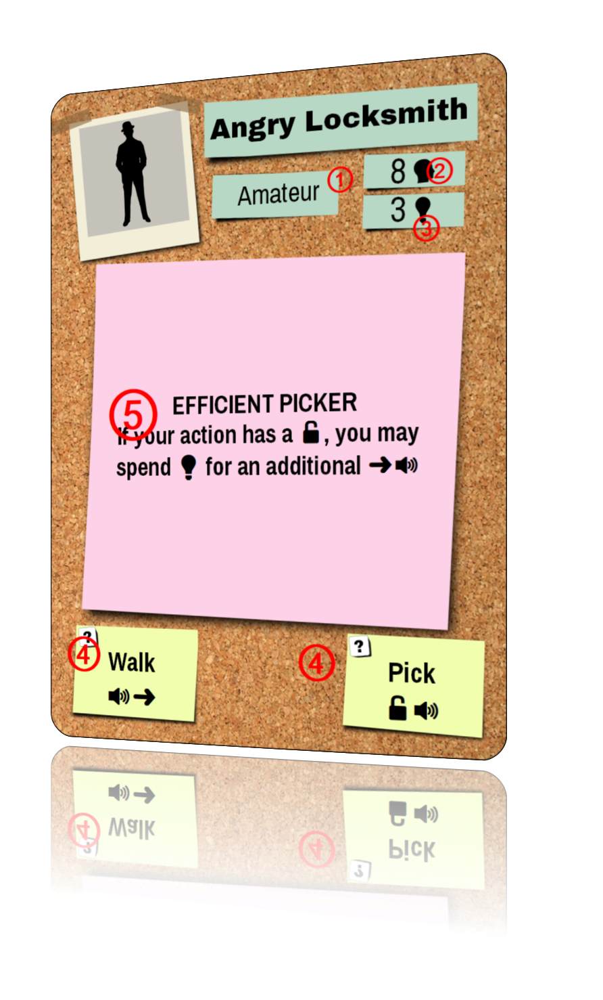
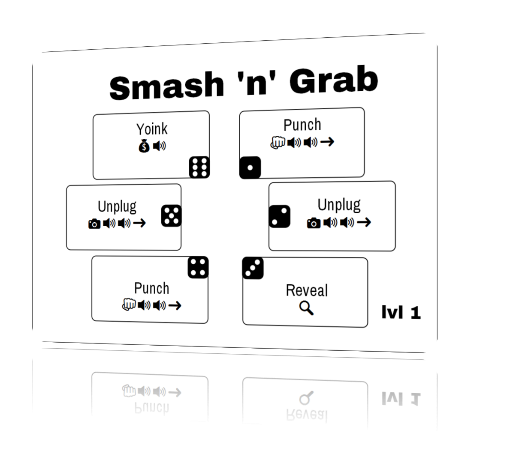

# _Your Last Heist_

_Your Last Heist_ is a cooperative, multi-stage heist game. You are playing the role of a uniquely skilled criminal who works with other skilled criminals to quietly traverse the building and steal items, all while dealing with obstacles like closing gates, guards, locks, sensors, and cameras.

A single heist takes 30-40 minutes, and is part of a narrative where your team improves their skills and characters over time. The scenarios are story-driven, highly replayable, and allow you to "save" your game between heists.

During each heist, you will collaborate with teammates with simultaneous gameplay to coordinate your movements. Each round begins with everyone rolling a die to determine which actions are available. You use Ideas💡 to modify that die roll, but don't spend too many - you'll need those Ideas💡 to escape, too!

## The Pieces

* 32 double-sided hex tiles.
  * 28 Blank/Security tiles
  * 4 Gate tiles
* 18 character cards (6 Amateurs, 12 Pros)
* 36 Skill cards (6 Amateurs, 12 Pros, 2 copies of each)
* 6 Lock chits
* 6 Camera chits
* 21 Guard chits
* 5 Artwork chits (square)
* 5 Entrance chits (square)
* 4 Jewel chits (circular)
* 6 Security System chits
* 8 Pressure Sensors (ring-shaped chits)
* 48 planning chits (12x4 player colors)
* 36 Idea chits (small circle)
* 4 Player pawns (red, green, blue, black)
* 4 Player six-sided dice (red, green, blue, black)
* 1 four-sided die (white)
* 1 Prisoner pawn (white)
* 12 Petty Cash chits ($1k and $3k)
* 1 Alert Bar marker (white wooden stick)
* 1 Noise Tracker marker (white wooden cylinder)

## Characters

The game comes with 18 unique characters. Each card has:

  * ① **Level.** There are 6 Amateur characters and 12 Pro characters.
  * ②	**Planning Memory.** This is the number of pre-planned hex tiles your character may move through during a heist.
  * ③	**Initial Ideas**. The number of Ideas💡 you start with at the beginning of each heist.
  * ④	**Default Actions**. Actions that are available regardless of your die roll.
  * ⑤	**Special Ability**. Abilities that your character can uniquely do.

Some Characters have two Default Actions, others have three. Actions are described more in the *Actions and Sub-Actions* section.

For the Special Ability, some abilities will have a "Use this action..." sentence. You must use your Action to make use of this ability. If the text does not state "Use this action...", you may do the ability *in addition to* your Action.

A Special Abilities may also *limit* a character's abilities (e.g. *THERE ARE BETTER WAYS*).

Some abilities have a "Once per heist..." sentence. Place the once-per-heist token on this character at the beginning of the heist and discard when used.

Between Heists, your scenario may give you an opportunity to **promote** (i.e. "level up") some of your characters. Each Amateur character is given two choices to level into, as indicated on the back of the card. Place your Amateur Character card in the box and choose one Pro card as your new character.

## Skills

Each character gets two Skills. Each Skill has six Actions(①) that each correspond to a die roll(②). During a heist, you will be rolling your die to determine which Actions are available to you (more details on this in Roll for Skill and Character Actions).

Between Heists, your team will get a chance to **refine** (i.e. level up) some of your Skills. Each Skill, like Characters, can be refined to one of two Skills, as summarized on the back of the Amateur skill cards. When refining, choose which Pro skill to refine and place the Amateur one back in the box.

## The Board

The board is a set of modular double-sided hex tiles. All hexes are considered symmetrical (i.e. orientation does not matter). You are considered **adjacent** to something if your are on a tile that shares a border with another tile. (Being on the same tile is *not* considered adjacent.)

For most tiles, each tile is Blank on one side, and is a Security tile on the other side. A Security tile represents an unknown Security Chit (see below). Some tiles have Gates printed on them, which is described in *Security Systems*.

Each board has one or more **Entrances**. These Entrances (they are also Exits) represent a space. If a player is on one of these spaces, they are considered to be Outdoors, otherwise they are Indoors.

By default, unless the scenario specifies otherwise, Entrances are limited to 2 characters at the beginning of the heist. This limit does not apply to the Escape phase, although the scenario may impose additional limits.

## Security Chits
Security Chits are randomized obstacles that your team will encounter. They are:

| Name | Active | Inactive | Behavior |
|---|---|---|---|
| Guard |  Guard | Subdued | _Slows you down_. If you share a space with a Guard, you may not Move until he is Subdued. You may walk into a space with a Guard. |
| Camera |  Live |  Disconnected | _Increases Alerts._ You may enter a space with a Live Camera, but increase the Alert (⚠) by 1. If a Disconnected camera is powered back on while a player is on it, increase the Alert (⚠) by 1.  |
| Lock |  Locked |  Unlocked | _Prevents passage._ You may not enter a Locked tile at any time. You may exit a locked tile if it was re-locked while you were on it.  |

Security chits are generally unknown at the beginning of the heist, and are placed in a bag to be drawn at random throughout the heist. Immediately when a player is adjacent to a unknown Security tile (i.e. no Security chit placed yet), the chit is **Auto-Revealed** where you remove a random chit from the bag and place it on the tile in its Active state. A Security chit may also be placed with a **Reveal** (🔍) sub-action (see below).

## Actions and Sub-Actions

Skills and Characters allow players to take Actions. Every Action is just a grouping of Sub-Actions with a name (e.g. Punch 👊➜🔊🔊). The Sub-Actions are:

| Icon | Description |
|---|---|
| ➜ | **Move** to an adjacent, planned, not locked tile |
| 🔓 | **Unlock** 1 locked, adjacent tile |
| 👊 | **Subdue** 1 guard on or adjacent to your tile |
| 📷 | **Disable** 1 camera on or adjacent to your tile |
| 💡 | Add 1 **Idea** to your character |
| 🔍 | **Reveal** 1 security token anywhere on the board |
| 💰 | **Loot:** Gain $1k and place it on your character. |
| 🔊 | Increase the **Noise** level by 1 (Required) |
| ⚠ | Increase Alert bar by 1 (Required) |

## Trackers: Noise, Alerts, Loot

The Noise tracker is used for determining how many Noise(🔊) sub-action penalties your team has incurred. Immediately upon entering a Noise level with an Alert ⚠, increase the Alert Bar by 1. If the Noise marker gets to the final slot, increase ⚠ for each 🔊 incurred.

The Alert Bar represents the potential Security Events you will encounter in the near future. The Alert Bar marker (a long wooden bar) is only ever placed *between* events. The Alert Bar represents a lower-bound of what events could possibly occur, so nothing happens immediately when you increase the Alert bar. If the Alert bar goes beyond its final slot, then the Escape phase is initiated in the *Roll for Security* stage no matter what is rolled. Details on the Security Event iconography is in the *Roll for Security* section.

These mats also have spaces for team loot and some prisoner-related tracking (described later).

## Security Systems

**Gate** (gate icon here). A player may enter or exit this space freely. Security Events may remove this tile from the board.

**Pressure Sensors** (sensor icons here). You may not enter a tile with a Pressure Sensor chit on it. If you are on a tile with a pressure sensor already (e.g. at the beginning of a heist), you may not ➜🔓👊📷, but you may 💡💰🔍 and 🔊⚠ are still required.

For each Pressure Sensor, A corresponding Control Panel (control panel icon here) exists somewhere else on the board. If a player is standing on the Control Panel, then all corresponding Pressure Sensor rings may be immediately removed *__only__* if they are the outermost ring at the time.

**Reinforcements** (reinforcements icon here). Reinforcements are triggered at the *__end__* of the Roll for Security phase if the Alert bar is on or beyond the Reinforcements icon. When triggered, Reveal all Security Tokens adjacent to the Reinforcements chit. Un-Subdue any Guards adjacent to the Reinforcements chit, re-lock any Locks, and re-activate any disabled Cameras. Place a new Guard token from the supply onto any tile adjacent to the Reinforcements chit that was without a Security Token. Replace the Reinforcements chit with two Guards.

## Loot Chits

The objective of the heist is (usually) to steal Loot chits, which can be Artwork, Jewels, Documents, or Cash. At any time when you are on a space with Loot, you may immediately place that Loot chit on the Character card. You may also "drop" loot on your current space (which means that you may "transfer" loot from one character to another when sharing a space immediately and without cost).

When a character with Loot gets Outdoors, the team has acquired that loot for the heist - place it on the Team Loot square. For Cash, increase the Team Cash tracker accordingly.

## Prisoner

Some heists have a **Prisoner** token. A Prisoner is a non-Player Character that your team can "remotely" control. A Prisoner is not Freed until their Pressure Sensor space is fully disabled. A Freed Prisoner has one Action available (Crawl➜), cannot carry Ideas💡, and needs no planning tokens. As a team, you must decide how to use the prisoner's Crawl Action.

In every other way, treat a Freed Prisoner like a regular character. Freed Prisoners may carry Loot and may be given sub-actions (e.g. Script Kiddie's Exploit). They Auto-Reveal, count as Characters in Security Events, and might need a die roll of their own during the Escape Phase (use a player die for this).

# Setting Up

**Step 1. As a team, decide upon a scenario.** Some scenarios are designed for one evening's play, others can be played over the course of multiple evenings. Each heist in the scenario will consist of Chapters, which involve one Heist. Read the story text. (To save time, you may begin setting up the board in Step 6 simultaneously.)

**Step 2. Set up the board** in the middle of the table. Following the diagram for your chapter, set up the hex tiles so that they match the picture. *(Tip: to verify the layout, match the shapes of the Gaps between tiles).* Place any Loot chits, Prisoner, and/or Security Systems according to the diagram. Some boards have already-revealed security chits. The Chapter will also indicate how many Guards, Locks, and Camera chits should go into the bag. Leave the other Security chits by the board (they are "the supply").

**Step 3. Decided on player colors.** Take the planning tokens, 6-sided die, and pawn according to your color.

**Step 4. Build Characters.** If the scenario says "Suggested Characters", then you are allowed (and encouraged!) to explore other options for Character-Skill pairings. If the scenario says "Required", then the storyline requires that those characters and/or skills are used. Place the two Skill cards below the Character card (make a figure of this).

**Step 5. Distribute the Planning tokens** to each character according to their color and Planning Memory. *For example, the Lookout has a Planning Memory of 6, so she gets 6 planning tokens*. Place remaining Planning tokens back in the box.

**Step 6. Distribute initial Ideas💡** to each player according to their character.

**Step 7. Place the Noise and Alert trackers** in view of everyone and according to the number of players (3- or 4-player)

**Step 8. Place the Noise Tracker markers** on their starting place.

**Step 9. Place the Alert Bar** marker on its starting place.

**Step 10. Place the Team Cash tracker** on the starting place according to the scenario.

**Step 11. Record your team on the provided document**. Determine a Team Name. Players are encouraged to make up a name for their characters too.

# Heist Gameplay

The structure of each heist is:

  1. The Plan
    * Plot movement
    * Purchase and use extra Reveals 🔍
    * Purchase and place extra Ideas 💡
  2. The Heist
    1. Roll for Skill
    2. Character Actions
    3. Roll for Security
    4. Escape Phase
  3. Team Building
    * Promote Characters
    * Refine Skills

## Part 1: The Plan

With your team, you will collaboratively come up with a plan of how you will pull this Heist. Every time you do a Move➜, you *must* move onto a hex that you have **Planned** with a Planning Token of your color. Thus, mark every hex tile that you will be allowed to move on by placing a Plan token of your color on the hex tiles you will (probably) move onto. Entrance tiles do not need a token. *__Note:__* Unless a special ability allows you to re-plan mid-heist, you will not be able to change these planning tokens!

During this phase, you may purchase and immediately use any number of Reveal🔍 for $1k of team loot each. You may also purchase any number of Ideas💡 for $1k of team loot each. Place each purchased Idea💡 on a character immediately.

Place your Character pawn on the Entrance space where you will plan to start. Remember that some entrance tiles have a limit on the number of starting players.

## Part 2: The Heist

### Roll for Skill

Everybody simultaneously rolls their die. Place the Noise Tracker Ring on the noise Tracker Marker.

### Character Action

In this phase, you use your die to execute one Action. You have a minimum of four options: at least two Actions from your Character and one Action from each Skill. You may also use any number of your Ideas💡 to modify the die roll by 1 each. You may "wrap around", that is, spend an 💡 to go from a 6 to a 1 and vice versa.

*For example, Phil as the Angry Locksmith may always take Pick🔓🔊 or Walk🔊➜ regardless of what was rolled. Suppose he has the Self-Defense and Hurry Skills, and rolled a 1, then he also has Study💡💡 and Run🔊🔊➜➜ as options for his action. Suppose he has 1💡, then he also has Sprint🔊🔊➜➜➜ and Punch👊🔊🔊➜ available multiple ways *

During this time, everyone is working collaboratively and simultaneously. (You are *__not__* taking turns!!) You decide which Action to take, and how to execute your sub-actions. You may execute your sub-actions in any order. You may interleave your sub-actions with the sub-actions of other players. (Note: doing this effectively takes teamwork and is the key to victory!)

When you begin an Action, you must place your die on that Action to indicate your commitment. If unknown information is revealed after you commit to an Action, that Action cannot be undone.

*For example, Kelly takes DISCOVER🔍🔍 and reveals a guard one space away from Tim. Tim, with this new information, then chooses to take PUNCH👊🔊🔊➜, and does a ➜ first, then a 👊 on the newly-discovered guard, then increases the 🔊 by 2.*

*Another example: Derek takes the Sprint(🔊🔊➜➜➜) action but after his first ➜ he auto-reveals a Lock in his path. He cannot undo his action now that he's committed. Fortunately, Jacob is one space away from the lock and takes Shim(🔓🔊🔊➜), which lets him ➜ and then 🔓. Derek continues with his other ➜➜. The noise level goes up by 4.*

The Noise(🔊) and the Alert(⚠) sub-actions are **required**, but all other sub-actions are not required. *For example, you do not need to be able to unlock two locks to take Rake🔓🔓🔊➜, but it costs you a 🔊 regardless.*

Like other sub-actions, noise may be increased at any time during Character action (just don't forget!). *Tip: wait to account for noise until the end of Character Action phase and everyone holds up a finger for the number of noises they incurred - which they can see from the die sitting on the action they took.*

You have the final say about what to do with your own character.

You may opt to simply PASS, and take no actions with no noise penalty.

You may also **Help Out.** If you are Outdoors, you may spend 💡💡 to give 💡 to any player, any number of times. (**__This does not apply to the Escape phase!__** Sorry.)

You may opt to Initiate Escape Phase at any time (see below).

### Roll for Security

When all players have finished their Actions, one player rolls the four-sided security die. (The number on the bottom is the number that is rolled.) The event the occurs is the one counted along the track starting with the first event after the alert bar. Below is the translation of the event iconography:

**Watch Where You're Going!** (neighboring). If a tile has exactly 2/3/4 characters on it, increase the alert bar by 2/3/4.

**Caught in a Reflection** (adjacent to camera). For each player adjacent to a Live Camera, increase Alert(⚠) bar by 1. If a player is adjacent to multiple cameras, increase for each camera.

**Suspicious Guards** (adjacent to guard icon). For each player adjacent to a Guard, increase ⚠ by 1.

**Let Me Go!** (on a subdued guard). For each player on a Subdued Guard, increase Alert(⚠) bar by 1.

**Electrocute** (on a disconnected camera). For each player on a Disconnected Camera, increase Alert(⚠) bar by 1.

**Power On** (power on icon). Make every Disconnected Camera Live, and increase ⚠ every time you do this

**Gate Close**. (close gate). Close the next Gate (starting with "A"). Remove the tile from the board. If a player is on the gate, or if it is impossible for a player to reach an exit, they are Busted. Increase ⚠ twice.

**Oops**. For each player on a tile with a Subdued Guard, Un-Subdue that guard. Do the same for sharing a space with Unlocked Locks and Disconnected Cameras. Increase ⚠ every time you do this.

**Hey You!** (adjacent to a guard) For each player adjacent to a Guard, add a Guard to the player's current tile.

**Call It In**. Replace every Disconnected Camera with a Guard.

**Alarm** (Alarm) Initiate Escape Phase.

Whenever an Event calls for a new Guard to be place, take it from the supply (not the bag).

*__After__* the Security Event has been resolved, check to see if Reinforcements needs to be triggered (see *Security Systems*).

### The Escape Phase

When the Escape Phase is initiated, all Gates close and all Security chits are revealed.

Then, each player who has not reached an exit (Entrance tile) determines if they can reach it. Determine the number of Escape Moves you will take to an exit. Ignore Plan tokens. Locked tiles are impassable. Exiting an Unsubdued Guard costs two Escape Moves per guard. Cameras and Pressure Sensors have no effect during Escape. Each leftover 💡 that a character has may be used for 1 Escape Move.

After your use up all of your 💡, you may roll your die. The number shown on the die is equal to the number of Escape Moves you may use to reach an Exit. If you still cannot reach an Exit, you are Busted.

*For example Andy needs (draw an example here) 5 Moves to exit: one to enter the space with Guards, two to exit the Guards, and two more moves to reach the Exit. Using his last 💡💡, he now needs to roll a 3 or higher to get out.*

You may *__not__* use abilities that cost 🔊 or ⚠ during this phase. *For example, SEWER CRAWL is not allowed during Escape, but GREAT IN A PINCH is allowed*.

You may pick up or drop off loot during the Escape Phase.

You may NOT use Help Out during the Escape phase.

### Busted

When you are Busted, you are out of gameplay for the rest of this heist. All loot on your character is lost. You cannot level up for the next heist (if the scenario allows it anyway). Instead, you choose a new Amateur character and two Amateur skills for the next heist.

# Losing a Heist

Each Heist has an objective built into it. If your team does not complete their objective, the campaign is lost. Record the loss on your sheet. Some scenarios may define what to do if the heist is lost.

Your may retry a heist from the original conditions (i.e. restore from a previous "saved game"). If the objective is fulfilled, regardless of how many teammates are Busted, then the heist is still successful.
