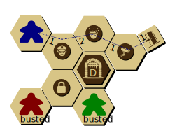

<!-- 

  RULES

 -->

# RULES

_Masters of the Heist_ is a cooperative heist game set in a campaign. You are a uniquely skilled individual in a career of high-risk, high-reward thievery. You work with other skilled criminals to quietly traverse buildings while dealing with obstacles like closing gates, guards, locks, sensors, and cameras.

During each heist, you will collaborate using simultaneous gameplay. You will plan your heist, but you will also have to know when to abandon your plan. You use Ideas💡 to get the actions you need, but don't spend too many... you'll need those Ideas💡 to escape, too!

You will start as an Amateur criminal with Amateur skills. But over time, and with good decisions along the way, you and your teammates will level up your characters and skills as you make your way through a story-driven campaign. Each heist is highly replayable, with various outcomes.

## The Pieces

NOTE! This list is totally out of date. Sorry.

* 32 double-sided hex tiles.
  * 28 Blank/Security tiles
  * 4 Lockdown Gate tiles (A,B,C,D)
* 24 character cards: 8 Amateurs, 8 double-sided Pros
* 24 Skill cards: 6 Amateurs, 12 Pros (2 copies of each)
* 24 Event cards, including 6 Special Event cards
* 10 Lock chits
* 10 Camera chits (circle)
* 14 Guard chits (circle)
* 10 Artwork chits (square)
* 5 Entrance chits (square)
* 4 Jewel chits (circle)
* 4 Control Panel chits (circle)
* 8 Pressure Sensors (ring)
* 1 Story chit (circle)
* 36 Idea💡 chits (circle)
* 4 Player pawns (red, green, blue, black)
* 1 Prisoner pawn (white)
* 48 Planning chits (by player colors)
* 4 Player D6 dice (by player colors)
* 1 Security Die (white, four-sided die)
* 12 Petty Cash chits ($1k and $3k)
* Noise tracker card
* 4 Game Helps
* 4 Noise Tracker & Team Cash Markers (white wooden cylinders)

## The Board

   
  Blue is adjacent to a Camera, but not to a Guard.

The board is a set of modular double-sided hex tiles. All hexes are considered symmetrical (i.e. orientation does not matter). For most tiles, each tile is Blank on one side, and is a Security tile on the other side. A **Security tile** represents an unknown Security Chit (see below).

Some tiles have **Lockdown Gates** printed on them, and they are lettered A,B,C, and D. A character may enter or exit this hex freely. Security Events may remove this tile from the board. Lockdown Gates are always removed in order: the A tile will be removed first, then B, and so on.

You are considered **adjacent** to something if you are on a tile that shares a border with another tile. (Being on the same tile is *not* considered adjacent.)

Each board has one or more **Entrances**. These Entrances represent a space. If a character is on one of these spaces they are considered to be Outdoors, otherwise they are Indoors. An Entrance tile is also considered an Exit.

By default, unless the scenario specifies otherwise, Entrance/Exit tiles are limited to 2 characters at the beginning of the heist. This limit does not apply to the Escape phase, although the scenario may impose additional limits.

Some abilities refer to **external sides**, which are a side of a hex tile that does not lead to a fully-enclosed space by hexes (see figure). An **external tile** is a tile with at least one external side.

Some abilities refer to a **non-tiled gap**, which is a hex-spaced area between two hex tiles that does *not* have a hex (see figure).

## Security Chits

Security Chits are randomized obstacles that your team will encounter. They are shown below.

Security chits are generally unknown at the beginning of the heist, and are placed in a bag to be drawn at random throughout the heist. Immediately when a character is adjacent to a unknown Security tile (i.e. no Security chit placed yet), the chit is **Auto-Revealed** where you remove a random chit from the bag and place it on the tile in its Active state. A Security chit may also be placed with a **Reveal** (🔍) sub-action (see below).

| Name | Active | Inactive | Behavior |
|:----:|:------:|:--------:|---|
| Guard |  Guard |  Subdued | _Slows you down_. If you share a space with a Guard, you may not Move until he is Subdued. You may move into a space with a Guard. |
| Camera |  Live |  Disabled | _Increases Alerts._ You may enter a space with a Live Camera, but increase the Alert (⚠) by 1. If a Disabled camera is powered back on while a player is on it, increase the Alert (⚠) by 1.  |
| Lock |  Locked |  Unlocked | _Prevents passage._ You may not enter a Locked tile at any time. You may exit a locked tile in any direction if it was re-locked while you were on it.  |

## Actions and Sub-Actions

Skills and Characters allow you to take Actions. Every Action is just a grouping of Sub-Actions with a name (e.g. Punch 👊➜🔊🔊). The Sub-Actions are:

| Icon | Sub-Action Description |
|:--:|---|
| ➜ | **Move** to an adjacent, planned, not locked tile |
| 🔓 | **Unlock** 1 locked, adjacent tile |
| 👊 | **Subdue** 1 guard on or adjacent to your tile |
| 📷 | **Disable** 1 camera on or adjacent to your tile |
| 💡 | Add 1 **Idea** to your character |
| 🔍 | **Reveal** 1 security token anywhere on the board |
| 💰 | **Loot:** Gain $1k from the supply and place it on your character. |
| 🔊 | Increase the **Noise** level by 1 (Required) |
| ⚠ | Raise **Alert** by 1 (Required) |

## Characters

Each Character card has:

  * ① **Level.** There are Amateur characters and Pro characters.
  * ②	**Planning Memory.** The number of pre-planned hex tiles your character may move through during a heist.
  * ③	**Initial Ideas**. The number of Ideas💡 you start with at the beginning of each heist.
  * ④	**Default Actions**. Actions that are available regardless of your die roll.
  * ⑤	**Special Ability**. Abilities that your character can uniquely do.

Some Characters have two Default Actions, others have three.

For the Special Ability, some abilities will have a "Use this action..." sentence. You must use your Action to make use of this ability. If the text does not state "Use this action...", you may do the ability *in addition to* your Action.

Some abilities have a "Once per heist..." sentence. Place the once-per-heist token on this character at the beginning of the heist and discard when used.

Special abilities override any rules in this document.

Between Heists, your scenario may give you an opportunity to **promote** (i.e. "level up") some of your characters. Each Amateur character is given two choices to level into, as indicated on the back of the card. Place your Amateur Character card in the box and choose one Pro card as your new character. Pro characters cannot be promoted.

  

## Skills

Each character gets two Skills. Each Skill has six Actions(①) that each correspond to a die roll(②). During a heist, you will be rolling your die to determine which Actions are available to you (more details on this in Roll for Skill and Character Actions).

Between Heists, your team will get a chance to **refine** (i.e. "level up") some of your Skills. Each Skill, like Characters, can be refined to one of two Skills, as summarized on the back of the Amateur skill cards. When refining, choose which Pro skill to refine and place the Amateur one back in the box. Pro skills cannot be refined.

## Trackers: Noise Tracker, Alerts, and Events

The Event cards represent the potential Security Events you will encounter in the near future. You will not be affected by _every_ event in the deck, rather, you will be encountering _one_ event each round.

The event cards are in the order specified by the scenario in a single pile, face-up. The lowest number should be on top. At any time you are welcome (encouraged!) to look ahead at potential upcoming events.

Every time you "Raise ⚠", remove the topmost card and discard it for the rest of the heist. The top-most Event in the deck is the Active Event.

Some cards are marked Special Event. These do _not_ count as Alerts. When a Special Event card is the top-most card, immediately set it aside and continue dealing Event cards. You will be doing the Special Event in addition to an Event.

More on how Events are resolved can be found in the Gameplay section.

The Noise Tracker mat is used for determining how many Noise(🔊) sub-action penalties your team has incurred. For each 🔊, raise the Noise tracker by one. If the Noise tracker reaches a space with an Alert ⚠, immediately Raise ⚠. If the Noise marker gets to the final slot, then the Escape Phase is Initiated at the end of the round (more on that later).

## Loot Chits

The objective of the heist is (usually) to steal Loot chits, which can be  Jewels or Cash, or other tokens you may unlock. At any time when a character shares a space with Loot, they may immediately place that Loot chit on their Character card.

A character may also "drop" loot on their current space for no cost, which means that two characters may effectively "insta-transfer" loot from one to another when sharing a space.

When a character with Loot gets Outdoors, the team has acquired that loot for the heist. For Cash, increase the Team Cash tracker accordingly.

# Setting Up

**Step 1. As a team, decide upon a scenario.** Some scenarios are designed for one evening's play, others can be played over the course of multiple evenings. Each heist in the scenario will consist of Chapters, which involve one Heist.

**Step 2. Read the story text.** To save time, you may begin setting up the board in Step 3 simultaneously with this step.

**Step 3. Set up the board** in the middle of the table. Following the diagram for your chapter, set up the hex tiles so that they match the picture. Place any Loot chits, Prisoner, and/or Security Systems according to the diagram. If the diagram depicts a shield, then use the Security side of the tile, in all other cases use the Blank side.

Tip: to verify the layout, match the shapes of the Gaps between tiles

Some boards have already-revealed security chits. The Chapter will also indicate how many Guards, Locks, and Camera chits should go into the bag. Leave the other Security chits by the board (they are **the supply**).

**Step 4. Distribute player tokens.** Distribute the 6-sided die, and pawn according to your color.

**Step 5. Build Characters.** Assign a character to each player according to preference. If the scenario says "Suggested Characters", then you are allowed (and encouraged!) to explore other options for Character-Skill pairings. If the scenario says "Required", then the storyline requires that those characters and/or skills are used. Place the two Skill cards below the Character card.

**Step 6. Distribute the Planning tokens** to each character according to their color and Planning Memory. *For example, the Lookout has a Planning Memory of 6, so she gets 6 planning tokens*. Place remaining Planning tokens back in the box.

**Step 7. Distribute initial Ideas💡** to each player according to their character.

**Step 8. Set up Noise and Alert trackers** in view of everyone and according to the number of players (3- or 4-player). Place the Noise Tracker marker on its starting place. Place Team Cash markers on their starting places.

**Step 9. Record your team on the ledger**. Determine a name for your team. Players are encouraged to name their characters.

# Heist Gameplay

The structure of each heist is:

  <ol class="gameplay-structure">
    <li>The Plan: Place planning tokens, and other planning
    </li>
    <li>The Heist: (1) Roll for Skill, (2) Character Action, (3) Event. Repeat until Escape Phase.
    </li>
    <li>Promote Characters &amp; Refine Skills</li>
  </ol>

 
Blue and Red place their planning tokens.

## Part I: The Plan

With your team, you will collaboratively come up with a plan of how you will pull this Heist. Every time you do a Move➜, you *must* move onto a hex that you have **Planned** with a Planning Token of your color. Thus, mark every hex tile that you will be allowed to move on by placing a Plan token of your color on the hex tiles you will (probably) move onto. Entrance tiles do not need a token.

*Note:* Unless a special ability allows you to re-plan mid-heist, you will not be able to change these planning tokens!

Individual scenarios may also define other things you may do during the planning part. Be sure to pay attention to this, as it can be a good opportunity to spend your Team Cash to improve your plan.

Place your Character pawn on the Entrance space where you will plan to start.
The default limit character limit per Entrance is 2 (unlimited during Escape phase.) Some scenarios dictate a different a limits on this.

Do not auto-reveal until Phase 2 if your character's starting place is adjacent to a security tile.

## Part II: The Heist

Repeat Phase 1 through 3 until the Escape Phase is initiated.

### Phase 1. Roll for Skill

Everybody simultaneously rolls their die.

### Phase 2. Character Action

In this phase, you use your die to execute one Action. You have a minimum of four options: at least two Actions from your Character and one Action from each Skill.

You may also use any number of your Ideas💡 to modify the die roll by 1 each. You may "wrap around", that is, spend an 💡 to go from a 6 to a 1 and vice versa.

*For example, Phil as the Angry Locksmith may always take Pick🔓🔊 or Walk🔊➜ regardless of what he rolled. Suppose he has the Wing It and Smash 'n' Grab Skills, and rolled a 1, then he also has Punch👊🔊🔊➜ and Discover🔍🔍 as options. If he spends an 💡, then he also has Smash📷🔊🔊➜, Grab💰🔊, Strongarm🔓👊🔊🔊➜, and Scamper🔊🔊🔊➜➜ available.*

During this time, everyone is working collaboratively and simultaneously. (You are *__not__* taking turns!!) You decide which Action to take, and how to execute your sub-actions. You may execute your sub-actions in any order. You may interleave your sub-actions with the sub-actions of other players. Doing this part effectively takes teamwork and is the key to victory!

*For example, Kelly takes Discover🔍🔍 and reveals a guard one space away from Tim. Tim, with this new information, then chooses to take Punch👊🔊🔊➜, and does a ➜ first, then a 👊 on the newly-discovered guard, then increases the 🔊 by 2.*

When you begin an Action, place your die on that Action to indicate your commitment. If unknown information is revealed after you commit to an Action, your Action cannot be undone.

*For example: Derek takes the Sprint(🔊🔊➜➜➜) action but after his first ➜ he Auto-Reveals a Lock in his path. Derek cannot undo his action. Fortunately, Jacob is one space away from the lock and takes Shim(🔓🔊🔊➜), which lets him ➜ and then 🔓. Derek continues with his other ➜➜. The noise level goes up by 4.*

The Noise(🔊) and the Alert(⚠) sub-actions are **required**, but all other sub-actions are not required.

*For example, you do not need to be able to unlock two locks to take Rake🔓🔓🔊➜, but it costs you a 🔊 regardless.*

Like other sub-actions, noise may be increased at any time during Character action (just don't forget!).

*Tip: Wait to account for noise until the end of Character Action phase. Ask everyone to hold up a finger for the number of noises they incurred - which they can see from the die sitting on the action they took.*

You may **Help Out.** If you are Outdoors, you may spend 💡💡 to give 💡 to any player, any number of times, in addition to your action. _**This does not apply to the Escape phase!**_ (Sorry.)

You may opt to **Initiate Escape Phase** at any time (see *Escape Phase*).

You may NOT opt to "pass". You MUST choose an Action on your Character or Skills.

You have the final say about what to do with your own character.

### Phase 3. Event Phase

When all players have finished their Actions and all noise has been accounted for on the Noise Tracker, the team enters the Event phase.

During this phase, the team will do exactly _one_ Event, then possibly one or more Special Events.

First, follow the Event card currently on the top of the deck (Active Event).
Pick up the Active Event card and read the text as instructed by the card. Some Events may incur more "Raise ⚠", in which you deal additional cards off the Event deck as you would during the Character Action phase (the Active Event card does not change).

When the Active Event is finished, even if it had no effect, discard the card.

Second, follow any Special Event cards you have set aside. Multiple Special Events should be executed in the order they were encountered.

Characters may not use their abilities during this phase, unless the text on their card explicitly says so.

Whenever an Event or Special Event card calls for a new security tokens to be placed, take the chit from the **supply** (not the bag).

If the Sound the Alarm card is discarded, immediately enter the Escape Phase. If Sound the Alarm is the last card in the deck, proceed back to Roll for Skill.

### Escape Phase

When the Escape Phase is initiated, all Gates close and all Security chits are revealed. Then, each character who has not reached an exit (Entrance tile) determines if they can reach it.

Determine and declare the number of Escape Moves your character will take to an exit. Ignore Plan tokens (Escape Moves do not need prior planning). Locked tiles are impassable. Exiting an Unsubdued Guard space costs one extra Escape Move per guard (e.g. two for one guard, three for two guards). Cameras and Pressure Sensors have no effect during Escape. Each leftover 💡 you have may be used for 1 Escape Move.

After you have declared your Escape moves and used up all of your 💡, you may roll your die. The number shown on the die is equal to the number of Escape Moves you may use to reach an Exit. If you still cannot reach an Exit, you are Busted.

 
Blue needs 5 Escape Moves. Red and Green are Busted.

*For example Blue needs 5 Moves to exit: one to enter the space with a Guard, two to exit the Guard, and two more moves to reach the Exit. Using his last 💡💡, he now needs to roll a 3 or higher to get out.*

You MAY NOT use abilities that cost 🔊 or ⚠ during the Escape Phase.

*For example, SEWER CRAWL is not allowed during Escape, but GREAT IN A PINCH is allowed*

You MAY pick up or drop off loot during the Escape Phase.

You MAY NOT use Help Out during the Escape phase.

### Busted

When you are Busted, you are out of gameplay for the rest of this Heist. All loot on your character is lost. You may not be promoted for the next heist (if the scenario allows it anyway). Instead, you choose an available Amateur character and two Amateur skills for the next heist. You may not choose an Amateur version of a Pro who is already on the team.

# Losing a Heist

Each Heist has an objective built into it. If your team does not complete its objective, the campaign is lost. Some scenarios may define what to do if the heist is lost. If the objective is fulfilled, regardless of how many teammates are Busted, then the heist is still successful.

If you lose a heist, you have three options:

* **Restore**. You may play a heist from your original conditions (i.e. restore from a previous "saved game").
* **Retry**. You may attempt the heist again, but with an additional 💡💡 given to each character during Planning. You may only do this once per chapter per campaign.
* **Rebuild**. You may continue onward with any non-Busted characters, hire new Characters with Skills, and play a Rebuilding Scenario of your choice. You may play any of the Rebuilding Scenarios as many times as you like.

# Winning a Heist

If you have completed your objective, your team advances to the next chapter. If the objective is fulfilled, regardless of how many teammates are Busted, then the heist is still successful.

Leftover 💡 are lost. Any cash on a Character is added to the Team Cash tracker, as well as any loot. Be sure to note everything in your Campaign History.

## Pressure Sensors

**Pressure Sensors**. You may not enter a tile with a Pressure Sensor chit on it. If you are on a tile with a pressure sensor already (e.g. at the beginning of a heist), you may not ➜🔓👊📷, but you may 💡💰🔍, and 🔊⚠ are still required.

For each Pressure Sensor, a corresponding **Control Panel** of the same color exists somewhere else on the board. If a character is standing on the Control Panel, then all corresponding Pressure Sensor rings may be immediately removed *__only__* if they are the outermost ring at the time.

**TODO: MAKE A FIGURE ABOUT THIS**

## Non-Player Characters

A **Non-Player Character** is represented by a white pawn, a white die, and their NPC card. Your team will "remotely" control the NPC.

If an NPC starts inside a Pressure Sensor, then they are not "freed" yet and effectively do not exist on the board. Immediately when the Pressure Sensor is disabled, the NPC becomes active (e.g. triggers any auto-reveals).

Follow any additional abilities or limitations described on the NPC card.

In every other way, treat an NPC like a regular character. Place their die on the action to denote that their action is taken. NPCs may carry Loot and may be given sub-actions (e.g. Script Kiddie's AUTOPWN). They Auto-Reveal, count as Characters in Security Events, and might need a die roll of their own during the Escape Phase.

NPCs all come with three actions: two Default actions and one "Roll 6" action, which is available if the NPC die rolled a 6. If an NPC has any Ideas💡, they may modify their die roll as with a regular character.

## Guard Dogs

Guard Dogs are Guards. Additionally, when a Guard Dog becomes adjacent to a Character:

  1. Move the Guard Dog onto that character and
  2. Place a Blank token over the Shield to mark that space as already Revealed (if necessary)

If a Guard Dog is added to a tile that does not already have a character and is adjacent to multiple characters, your team chooses which character the Dog jumps onto.

**TODO MAKE A FIGURE FOR THIS**

## Story Beacon

A special loot chit is the **Story Beacon**, denoted by a question mark. When a character enters a space with the Beacon for the first time, refer to the scenario for what to do, then remove the chit.

## Bosses

Some scenarios have a Boss. A Boss is not an NPC, rather, it is an uncontrollable security system that your team must react to. Bosses are represented by the black pawn and a card given by the scenario.

Bosses have Waypoint tokens. The Boss pawn starts at the Waypoint marked 1. Before each Roll for Skill phase, the Boss moves one tile directly toward the next Waypoint. If a Boss reaches the end of the Waypoints, they reverse their direction and go back through the waypoints.

A Boss **encounters** something (e.g. a subdued guard) if he shares a tile with that thing as a result of a move.

Bosses do not traverse non-tiled gaps. Bosses ignore locks, guards, cameras, and any other security system. If a Boss is on a lockdown gate when it closes, first move them forward on their path until they are off of the gate before it closes. Waypoints are not movable unless otherwise specified.

Bosses also have a Suspicion(⁉) tracker. The card will define what causes a Boss's Suspicion(⁉) to be raised, and what happens at each level with a Suspicion Action. If the tracker says "immediately", then the action is done once, when the Suspicion(⁉) was first raised to that level. Otherwise, the action is done each round.

*For example, "Release 1 Dog immmediately for Supsicion Level 1" means you release only 1 Dog, when Level 1 is first reached and not on subsequent rounds.*

Place the Suspicion token on the starting place on the Boss tracker during planning. When suspicion reaches its maximum level, repeat the highest Suspicion Action.

All other instructions for individual bosses are on their given cards.
