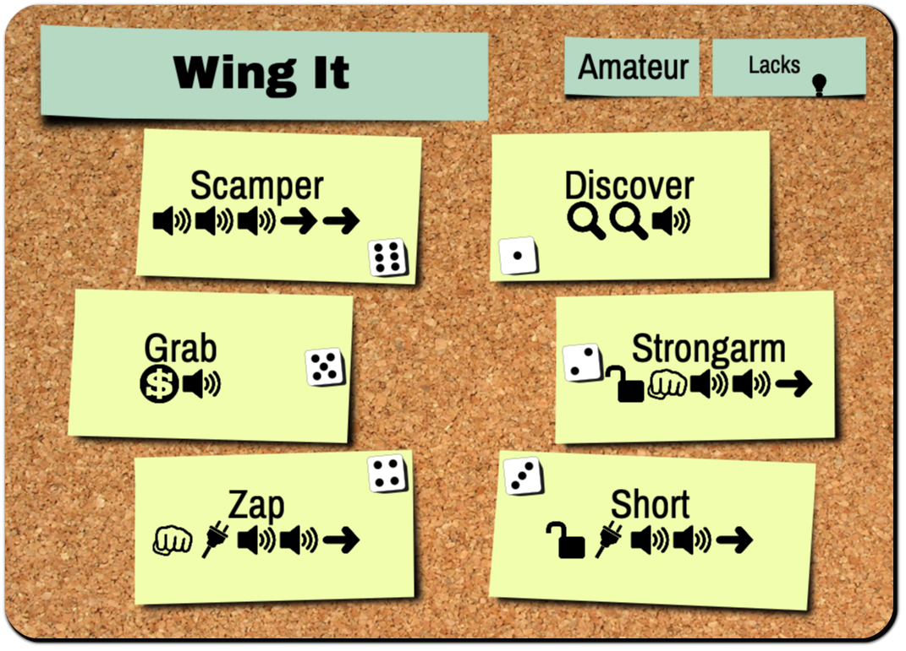
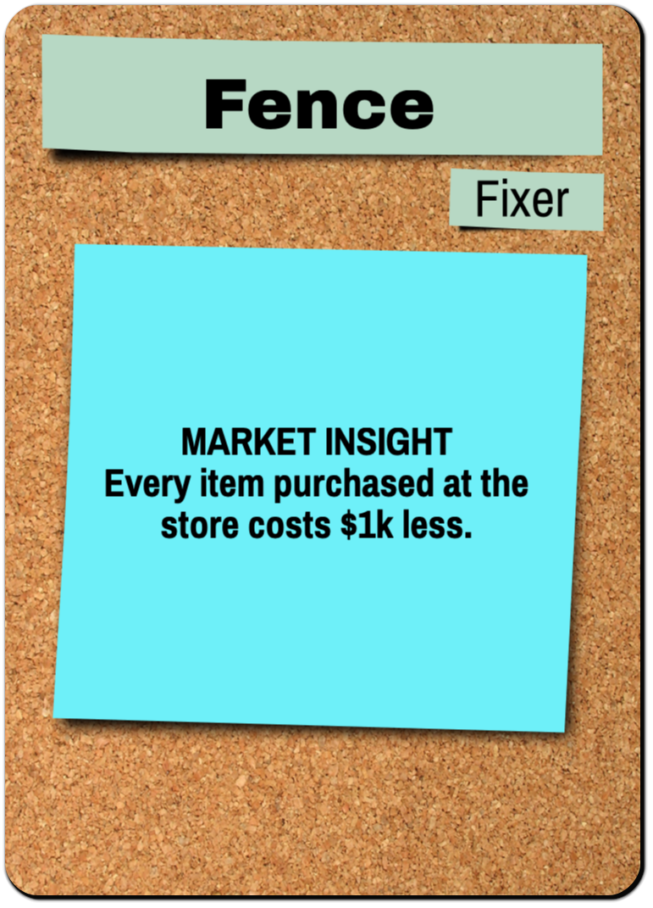
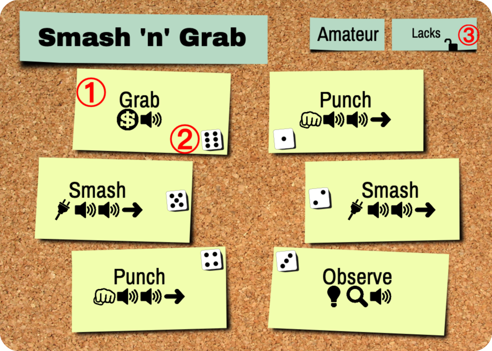
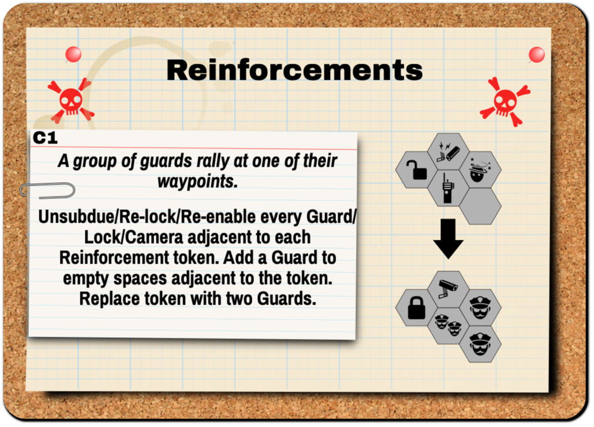
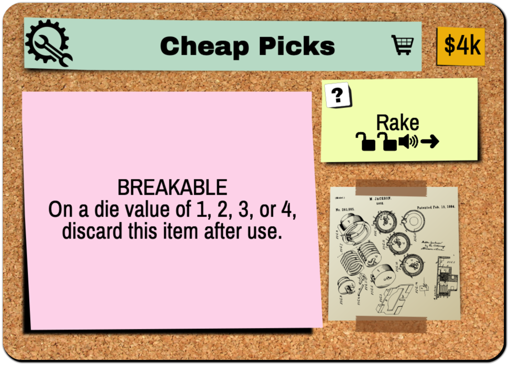
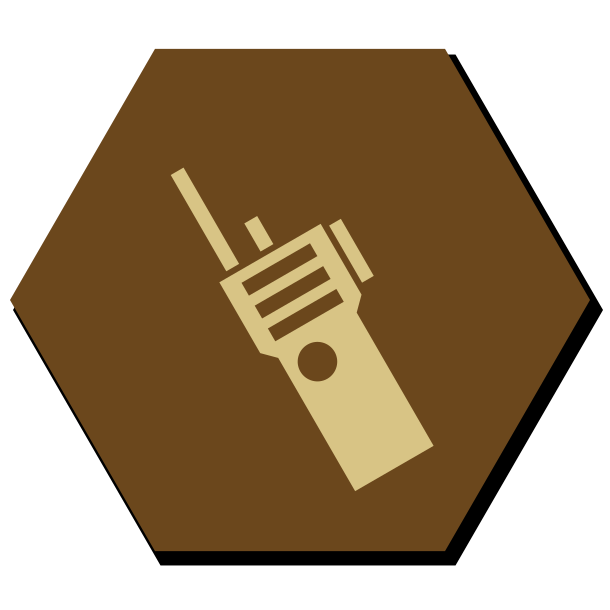

{:.title-img}

You are a uniquely skilled individual in a career of high-risk, high-reward thievery. You work with other skilled criminals to quietly traverse buildings, making friends along the way.

During each heist, you will collaborate using simultaneous gameplay. You will plan your heist, but you will also have to know when to abandon your plan. You use Ideas💡 to get the actions you need, but don't spend too many... you'll need those Ideas💡 to escape, too!

You will start as an Amateur criminal with Amateur skills who is new to River City.

But over time, hopefully with a few good decisions along the way, you and your teammates will level up your characters and skills as you make your way through the city.

Version ⏱

_Please note that this rulebook is a draft. We are in the process of blind playtesting and will be testing the readability and usability of this document. Expect change._

Questions? Contact Andy Meneely at andy.meneely@gmail.com

# Table of Contents

* TOC
{:toc}

# The Pieces

Note: precise counts may change as part of the prototyping process.

{:.parts-list}

* 32 Blank/Security hex tiles
* 4 Lockdown Gate hex
* 5 Entrance square tiles
* 16 Character cards
* 24 Skill cards
* 42 Event cards
* 6 Item cards
* 6 Special Event cards
* 12 Fixer cards
* 2 Noise tracker mats
* 12 Lock chits (circle)
* 12 Camera chits (circle)
* 14 Guard chits (circle)
* 4 Jewel chits (circle)
* 1 USB key chit (circle)
* 4 Server chits (circle)
* 8 Pressure Sensors (ring)
* 2 Story chits (circle)
* 36 Idea💡 chits (oval)
* 4 Player meeples
* 1 NPC pawn (white)
* 48 Planning mini hex chits
* 5 six-sided dice
* 12 Petty Cash chits
* 4 Game Helps

# Setting Up

**Step 1. As a team, decide your next heist.** Heists are available to you in the River City booklet. Each heist is labeled with a difficulty level based on your team's average level. New players are level 1.

{:.med_fig .example-left}

**Step 2. Set up the board** in the middle of the table. Following the diagram for your heist, set up the hex tiles so that they match the picture.

If the hex has a shield, use the Security side of the tile. In all other cases use the blank side and add the pieces neccessary to match the diagram.

{:.large_fig .example-right}

**Step 3. Set up the security bag**. The scenario indicates how many Guards, Locks, Cameras and other circle chits should go into the bag. Leave leftover circle chits by the board.

{:.chit .example-left}

{:.chit_h .example-left}

**Step 4. Build Characters.** Every player gets one Character card and two Skill cards. New players start with Amateur cards.

 _Tip: The scenario booklet has some pre-built character+skill pairings. If this is your very first game, we recommend Johnny Swagger, Tiny Mike, Phobia, and Showtime._

{:.chit .example-right}

{:.chit .example-right .rotate-left}

**Step 5. Distribute player tokens.** These are: 6-sided die, meeple, planning tokens, and ideas 💡. Give ideas and planning tokens as indicated by the character card. *For example, the Angry Locksmith has a Planning Memory of 8*.

{:.med_fig .example-left .rotate-left}

**Step 6. Place Noise tracker** in view of everyone and according to the number of players (3- or 4-player). Place the Noise Tracker marker on its starting place.

{:.med_fig .example-right}

**Step 7. Set up the Event Deck** according to the scenario, using the numbered cards in the order indicated. The deck should be entirely face-up with the first card on the top and the last card on the bottom. It will consist of both Event and Crisis cards.

{:.med_fig .example-left .rotate-right}

**Step 8. Get Your Fixers**. If this is your first heist, start with _Old Friend_. Otherwise, locate all of the Fixers you have unlocked from previous heists. Place them where everyone can read them.

# Play Overview

## The Board

   
  Blue is adjacent to a Camera, but not to a Guard.

The board is a set of modular double-sided hex tiles. The rotational orientation does not matter. Each tile is Blank on one side, and is a Security tile on the other side. A **Security tile** represents an unknown Security Chit that will be drawn from the Security Bag.

**Adjacent**. You are adjacent to something if you are on a tile that shares a border with another tile. Being on the same tile is *not* considered adjacent.

**Entrances & Exits**. Each board has one or more entrances/exit tiles. If a character is on one of these spaces they are considered to be **Outdoors**, otherwise they are Indoors. The terms Entrance and Exit refer to the same tile and can be used interchangeably.

**Limit 2 to Entrance During Planning**. By default, unless the scenario specifies otherwise, Entrance/Exit tiles are limited to 2 characters at the beginning of the heist. This limit does not apply to the Escape phase, by default.

**External**. Some cards refer to "external sides", which are a side of a hex tile that does not lead to a fully-enclosed space by hexes (see figure). An "external tile" is a tile with at least one external side.

**Gaps**. Some cards refer to a "non-tiled gap", which is a hex-spaced area between two hex tiles that does *not* have a hex (see figure).

---

## Security Chits

Security Chits are obstacles your team will encounter. Some will be known when you set up the board, others will be unknown in the Security Bag.

|  Name  |                  Active                  |                      Inactive                      | Behavior                                                                                                                                                                                |
|:------:|:----------------------------------------:|:--------------------------------------------------:| --------------------------------------------------------------------------------------------------------------------------------------------------------------------------------------- |
| Guard  |   Guard   |     Subdued     | _Slows you down_. If you share a space with a Guard, you may not leave the tile until he is Subdued. You may move into a space with a Guard.                                            |
|  Lock  |  Locked |    Unlocked   | _Prevents passage._ You may not enter a Locked tile. You may exit a locked tile if it was re-locked while you were on it.                                                               |
| Camera |    Live   |  Disabled | _Increases Alerts._ You may enter a space with a Live Camera, but raise an Alert ⚠ (i.e. discard the top Event card). If a Disabled camera is powered back on while a character is on it, discard one Event card per character. |
{:.security-table}

**More chits in the back.** Other chits that go into the security bag can be found in the back of the rulebook. Any circle-shaped chit may at some point go into the security bag.

**Reveal and Auto-Reveal**. During a heist, when a character is adjacent to an unknown Security tile (i.e. no Security chit placed yet), the chit is "auto-revealed" where you remove a random chit from the bag and place it on the tile in its Active state. A Security chit may also be placed with a **Reveal** (🔍) sub-action (see below).

## Actions & Sub-Actions

Skills and Characters allow you to take Actions. Most Actions are a grouping of Sub-Actions with a name (e.g. Punch 👊➜🔊🔊). All sub-actions are optional, except for Noise and Alert. The Sub-Actions are:

* ➜ is  **Move** to an adjacent, planned, not locked tile
* 🔓 is **Unlock** 1 locked, adjacent tile
* 👊 is **Subdue** 1 guard on or adjacent to your tile
* 📷 is **Disable** 1 camera on or adjacent to your tile
* 💡 is Add 1 **Idea** to your character
* 🔍 is **Reveal** 1 security token anywhere on the board
* 💰 is **Loot:** Gain $1k from the supply and place it on your character.
* 🔊 is Increase the **Noise** level by 1 (Required)
* ⚠ is  **Alert**. Discard the top Event card. (Required)
{:.subactions}

## Characters

{:.card-portrait .card-right .rotate-right}

Each Character card has:

* **Level**. Amateur or Pro
* **Planning Memory**. The number of planning tokens this character has. Represents the number of pre-planned hex tiles your character may move through during a heist.
* **Initial Ideas**. The number of Ideas 💡 you start with at the beginning of each heist.
* **Default Actions**. Actions that are available regardless of your die roll. Some Characters have two Default Actions, others have three.
* **Ability**. What the character can uniquely do.
  - Some abilities will have a "Use this action..." sentence referring to a Default Action space below. You must use your Action to make use of this ability.
  - Some abilities have a "Once per heist..." sentence.
  - Otherwise, the ability is a passive effect.
{:.figure_list .numbered_fig}

## Skills

{:.card-landscape .card-right .rotate-left}

Each character gets two Skills. Each Skill has six Actions *①* that each correspond to a die roll *②*. During a heist, you will be rolling your die to determine which Actions are available to you. Every skill is either Amateur or Pro.
{:.numbered_fig}

Tip: When building a character, use Lacks *③* to see what the skill is missing so you can find a good combination.
{:.tip .numbered_fig}

---

## Events

{:.card-portrait .card-right}

In addition to security chits, Events will impact your team each round.

**One Event per round**. You will not experience _every_ event in the deck, rather, you will be encountering _one_ event each round and which event happens will be determined by a variety of factors.

**Raise Alert**. Every time you are told to "Raise ⚠", remove the topmost card and discard it for the rest of the heist. The top-most Event in the deck is the **Active Event**.

**Plan ahead**. You are welcome (encouraged!) to look ahead at potential upcoming events at any time. We recommend designating one person to keep track of the Event Deck and warn the group of potentially bad situations.

## Crises

{:.card-landscape .card-right .rotate-left}

Every Event Deck will have a few Crisis cards in them. These are particularly strong and can create big problems for any team of scoundrels.

**All Crises will happen**. Unlike Events, all Crises are guaranteed to happen in a heist. You will be doing all encountered Crisis cards _after_ your round's Event. (_see Phase 3. Event Phase for more details_).

**Not an Alert**. Crisis cards do _not_ count as Alerts. When a Crisis card is the top-most card in the Event Deck, immediately set it aside and continue dealing Event cards.

To summarize, you will be doing _one_ Event per round, then zero or more Crises per round. A Crisis is not an Event.

## Noise

{:.xl_fig .example-right}

**Every action has a cost.** For each 🔊 your team incurs, increase the Noise tracker by one.

**Raise Alert ⚠**. If the Noise tracker reaches a space with an Alert ⚠, immediately Raise Alert ⚠. When the Noise marker reaches to the final slot, each noise thereafter raises one Alert ⚠.

## Loot & Items

{:.chitlist .chit}

**Pickup**. When a character shares a tile with a Loot chit, you may immediately place the chit on their Character card.

**Insta-transfer**. A character may also "drop" loot on their current space for no cost, which means that two characters may effectively "insta-transfer" loot from one to another when sharing a space. This can be done at any time.

**Deep Pockets**. There is no limit to the amount of loot you can carry.

{:.card-landscape .card-right .rotate-left}

**Items are like transferrable skills**. Item cards can have passive abilities and/or actions (like Character or Skill cards), except they can be transferred just like any other Loot.

**Not Ours Until It's Out**. When a character with Loot gets Outdoors, the team has acquired that loot for the heist. For Cash, increase the Team Cash tracker accordingly.

{:.chit .example-right}

**Cash is one item.** Any amount of cash in one place is considered to be one piece of loot no matter how many chits it takes to represent it.

## The Shop

Between heists, your team may visit The Shop to purchase Item cards.

**Shop grows with you.** Initially, the only cards in the Shop are the ones with the Shop icon {:.emoji-svg}. However, once a a player discards a discovered item, that card is available for purchase in later planning phases.

**Returning Items**. You may sell items back to the shop for half of their price, rounded down.

## Fixers

{:.card-portrait-small .card-right .rotate-right}

**Fixers help you plan.** Completing heists give you access to additional Fixers. Fixers provide a variety of helpful bonuses to assist you in future heists. You can use as many Fixers as you have unlocked in a given heist.

**Get the lay of the land**. You are welcome (encouraged!) to read ahead and plan your path through River City. There are no "spoilers" narrative-wise. Fortune favors the prepared.

# Heist Gameplay

## Part I: The Plan

 
Blue and Red place their planning tokens.

**Place Planning Tokens**. With your team, you will collaboratively come up with a plan of how you will pull this Heist. Every time you do a Move➜, you *must* move onto a hex that you have **Planned** with a Planning Token of your color. Thus, mark every hex tile that you will be allowed to move on by placing a Plan token of your color on the hex tiles you will (probably) move onto. Entrance tiles do not need a token.

*Note:* Unless a special ability allows you to re-plan mid-heist, you will not be able to change these planning tokens!
{:.tip}

**Start on Entrances**. Place your Character pawn on the Entrance tile where you will plan to start. The default limit character limit per Entrance in planning is 2, unlimited during Heist and Escape parts.

**No auto-reveals yet**. Do not auto-reveal any hidden security chits you may be adjacent to until Heist phase.

**Visit the Shop.** Your heists will earn you money to purchase Items. Using team cash, you may purchase as many Item cards as are available.
*Note: on your first heist, you have $0k team cash and therefore cannot purchase anything from the shop.*

## Part II: The Heist

For each Round, repeat Phase 1 through 3 until the Escape Phase. All phases are **simultaneous play**.

### Phase 1. Roll

Roll your die.

### Phase 2. Action

**Your die is your action**. You have a minimum of four options: at least two Actions from your Character and one Action from each Skill. When you choose an Action, place your die on that Action to indicate your commitment.

**Modify rolls**. You may spend your Ideas💡 to modify the die roll by +1 or -1 each. You may "wrap around", that is, spend an 💡 to go from a 6 to a 1 and vice versa.

**Interleaving Subactions**. During the Action phase, everyone is working collaboratively and simultaneously. You may execute your sub-actions **in any order**. You may **interleave** your sub-actions with the sub-actions of other players. Doing this part effectively takes teamwork and is the key to victory!

**Undoing**. If unknown information is revealed after you commit to an Action, your Action cannot be undone, otherwise you may undo in good faith.

**Required subactions** The Noise(🔊) and the Alert(⚠) sub-actions are required, but all other sub-actions are not required. If any Crisis card appears on the top of the Event deck, immediately queue it for the Event phase.

**No passing**. You MUST choose an Action on your Character or Skills.

**No alphas**. You have the final say about what to do with your own character.

**Escape any time**. You may opt to initiate Escape Phase at any time. You must still do the Event phase.

*Tip: Wait to account for noise until the end of Action phase. Ask everyone to hold up a finger for the number of noises they incurred - which they can see from the die sitting on the action they took. By design, accounting for noise at the beginning or end of the phase makes no strategic difference.*
{:.tip}

*Example of Modify Roll*. Phil as the Angry Locksmith may always take Pick🔓🔊 or Walk🔊➜ regardless of what he rolled. Suppose he has the Wing It and Smash 'n' Grab Skills, and rolled a 1, then he also has Punch👊🔊🔊➜ and Discover🔍🔍 as options. If he spends an 💡, then he also has Smash📷🔊🔊➜, Grab💰🔊, Strongarm🔓👊🔊🔊➜, and Scamper🔊🔊🔊➜➜ available.
{:.example}

*Example of Interleaving & Undoing*. Jacob takes the Sprint(🔊🔊➜➜➜) action but after his first ➜ he Auto-Reveals a Lock in his path. Derek cannot undo his action. Fortunately, Kelly the Angry Locksmith is one space away and takes PICK with EFFICIENT PICKER (🔓🔊🔊➜), which lets her ➜ and then 🔓. Jacob continues with his other ➜➜. Increase 🔊 level by 4.
{:.example}

### Phase 3. Event

When all players have finished their Actions and all noise has been accounted for on the Noise Tracker, the team enters the Event phase.

**One Event, Multiple Crises**. In this phase, you will do exactly one Event, and then any Crises that have queued up.

**Active Event**. First, pick up the Event card that was on the top of the deck at the start of this phase. This is the Active Event. Read the text as instructed by the card. Some Events may incur more "Raise ⚠", in which you deal additional cards off the Event deck as you would during the Action phase, but the Active Event card does not change. If the Event deck was exhausted in the Action phase, the final Event card will be the Active Event. A Crisis card can even be queued during an Active Event.

**Discard Active Event**. When the Active Event is finished, discard the card.

**Events then Crisis Queue**. Follow any Crisis cards you have set aside in the queue. Crises should be executed in the order they were encountered. Discard them after use.

**No actions**. Characters may not take actions or use abilities during this phase, unless the text on their card explicitly says so.

**Take from supply**. Whenever an Event or Crisis calls for new chits to be placed, take them from the *supply*, not the bag.

**Sound the Alarm**. If final Crisis is reached, enter the Escape Phase. Otherwise, proceed back to Roll.

It is the end of the first round of a 4-player game. The team generated 🔊🔊🔊🔊🔊 noise, meaning they raised one ⚠. Thus, the Active Event in this case is event card 2 (_Get Outta My Way_). Following the card leads them to ⚠⚠, so they discard Events 3 and 4 along with their Active Event card (event 2). After the 4th Event card is discarded, the topmost card is a Crisis card. This is immediately added to the queue. The team now enters the Crisis Queue and does the one crisis card, then discards that card too.
{:.example}

Remember: Events are something you can potentially avoid with crafty noise management. Crises will always happen. Events and Crises never cause noise, but they can ⚠.
{:.tip}

### Phase 4. Escape

When the Escape Phase starts, all Security chits are revealed. Then, in any order, each character who has not reached an Exit tile determines if they can reach it.

**Escape Moves**. Declare the number of Escape Moves you will take to an exit. Escape Moves are not the same as ➜. Instead:

  * Ignore Planning tokens (Escape Moves do not need prior planning).
  * Locked tiles are impassable by Escape Moves
  * You may Exiting an Unsubdued Guard for one extra Escape Move per guard.
  * Cameras have no effect during Escape.
  * Each leftover 💡 you have may be used for 1 Escape Move.

**Last Ditch Effort**. After declaring your Escape Moves, you may roll your die. The number shown on the die is equal to the number of Escape Moves you may use to reach an Exit. If you still cannot reach, you are Busted.

**No costly abilities** You MAY NOT use abilities that cost 🔊 or ⚠ during Escape.

**Insta-transfers**. You MAY pick up or drop off loot during the Escape Phase, even during Last Ditch Effort.

*Last Ditch Effort example.* Mark the Mastermind has 💡💡💡 and escape is initiated. He calculates he needs 7 Escape Moves. He uses his 💡💡💡 and now he needs 4 Escape Moves. So, for his last ditch effort he rolls his die and gets a 3. He's now Busted at the door with the loot, and the heist appears to be lost. BUT! Sally the Script Kiddie realizes she still has 💡💡 and decides to run in and get the loot from Mark. She gets the loot, and the heist succeeds with. Mark is still Busted, however.
{:.example}

*Costly abilities example:* VENT CRAWL is not allowed during Escape, but GREAT IN A PINCH is allowed
{:.example}

 *Example of Escape Moves*. Blue needs 5 Moves to exit: one to enter the space with a Guard, two to exit the (unsubdued) Guard, and two more moves to reach the Exit. Using his last 💡💡, he now needs to roll a 3 or higher to get out. Red and Green are Busted.
{:.example}

### Busted

If you are Busted, you are out of gameplay for the rest of this Heist. All loot on your character is lost. Your Character is now in jail, and your team may choose to rescue this character in a future heist. Both you as a player and your character still level up (see _Level Up_).

## End of a Heist

**Ideas don't carry over**. Leftover 💡 are lost at the end of a heist.

**Keep a record**. No matter what happens, record the outcome!

**Level Up**. At the end of every heist, every player levels up the character they just played (see _Progression_)

# Campaign

**Your box is your universe.** Every time a new character is built, they must be named and their status tracked on their **Character Sheet**.

## Named Characters

A **named character** is a pairing of one character and two skill cards.

For example, Josh has a character named *Cam* who is a *Tinkerer* with *Assault* and *Smash 'n' Grab*.
{:.example}

**Peristent Statuses**. A named character's status, such as "Busted", persists between games. Individual scenarios may assign statuses to named characters based on the outcome of a heist attempt.

For following the above example, suppose _Cam_ is Busted at the end of a heist, then anyone who wants to play Cam again must use the Busted status.
{:.example}

**Loosely Affiliated**. Players may freely come and go from the campaign. A player is not limited to always playing their original named character. All heists have 3- and 4-player options. You are welcome (encouraged!) to try out new characters.

## Losing a Heist

If your team does not complete the heist objective, you do not gain the favor of the Fixer. You still keep any loot that was taken. All players level up after a heist (see Level Up).

**Stashed away**. Even if every team member is Busted, the Team Cash and known Fixers is available for the next crew.

## Winning a Heist

If you have completed your objective, you have gained the favor of that Fixer. All players level up after a heist (see Level Up).

**Sacrifices**. An objective can still be fulfilled even if some characters get Busted.

Any cash on a Character is added to the Team Cash tracker, as well as any loot. Be sure to note everything in your Campaign History.

## Level Up

**Players level up** as well as characters. Every human player starts at level 1 when they are new to this game. At the end of every heist, regardless of the objective outcome or character fate, every player levels up the named character they just played - even if they have no plans to play them ever again.

**Characters Start at Player Level**. For the next heist, a player may start with a character of the _player's level_ (or less). That character may be new or used previously.

**No evil twins.** A player may NOT create a new named character with exactly the same card combinations as another named character.

For example, Josh's character *Cam* (see above examples) who is a *Tinkerer* with *Assault* and *Smash 'n' Grab* is Busted. Josh wants to build a new *Tinkerer* with *Assault* named _Iris_. He may not use *Smash 'n' Grab* as the other skill as that would be identical to Cam.
{:.example}

**Progression**. At Level 2, a character upgrades one Skill card of your choice. At Level 3, upgrade your Character to a Pro version. At Level 4, upgrade your other Skill card. The maximum player and character level is 4 (both pro Skills and a pro Character).

Each Amateur card is given two choices to level into, as indicated on the back of the card. Place your Amateur Character card in the box and choose one Pro card as your new character. Record your choice on your character sheet. Skill cards work the same way.

**One Character Class Per Heist**. A character class is the name of the amateur version of a character.

For example, a Grease Man and a Burglar cannot be in the same heist.
{:.example}

**Conflicting Skills**. Named characters are only compatible with each other if the components are available.

For example, the named characters Larry, Curly, and Moe all have _Wing It_ as a skill, but the game has only two _Wing It_ cards. A heist may only have two of those characters, though they all may exist in your universe.
{:.example}

# Additional Modules

## Remote Locks

{:.example-right .hexchit .rotate-left}

You may not enter a tile with a Remote Lock chit on it.

**Starting Imprisoned**. If you are locked within a remote lock tile at the beginning of a heist, you may not ➜🔓👊📷, but you may 💡💰🔍 if actions allow it and 🔊⚠  are still required.

{:.example-right .hexchit .rotate-right}

For each Remote Lock, a corresponding **Server** exists somewhere else on the board (e.g. x or y). If a character is standing on the Server, then all corresponding Remote Lock rings may be immediately removed.

## Guard Dogs

{:.example-right .hexchit .rotate-left}

**Guard Dogs are Guards.**

**Chasers.** Additionally, when a Guard Dog becomes adjacent to a Character, and is not already sharing a tile with a Character, then:

  1. Move the Guard Dog onto that character, and
  2. If the Dog came from the security bag, place a Blank token over the Shield to mark that space as already Revealed.

**Indoor creatures**. Guard Dogs do not move onto entrances/exits.

{:.example-right .hexchit .rotate-right}

**Kennel**. The hex with a kennel can be freely moved on with no automatic effect. Dogs spawn here as a result of Events and Crises.

**Team optimizes ambiguity**. If ambiguity ever arises in the behavior of a Guard Dog, the team chooses.

For example, if a Guard Dog is added to a tile that does not already have a character and is adjacent to multiple characters, your team chooses which character the Dog jumps onto.
{:.example}

**THERE ARE BETTER DOGS**. Some characters have the ability to escape Guards without 👊. If one of these characters shares a hex with a dog and their action puts one tile of separation between them and the dog (e.g. ➜➜), the dog stays where it is instead of chasing.

## Watchtower

{:.example-right .hexchit .rotate-left}

**Ranged Camera**. The Watchtower is a thermal imaging system that can detect body movement across long distances. A series of Crisis cards will add Guards to locations along the path emanating from a Watchtower.

**There must be some kind of way outta here**. A Watchtower can be disabled when a character is on that tower when the _Watchtower Sweep_ crisis occurs.  The Watchtower does nothing during Escape.

## Reinforcements

{:.example-right .hexchit .rotate-right}

**Problem for Later**. A hex with the reinforcements token on it is freely passable initially. However, a later Crisis card will cause an area effect centered on this token.

## Lockdown Gates

{:.example-right .hexchit .rotate-left}

There are four **Lockdown Gate** hex chits lettered A,B,C, and D. The hex is treated as normal (i.e. characters may enter or exit the tile freely unless something else prevents them).

The event deck for the scenario will have Crisis cards and Event cards that will lock these down. This means that the entire hex tile underneath this chit is removed from the board, and that space is now considered a gap. Lockdown Gates are always removed in order: the A tile will be removed first, then B, and so on.

Any character caught on a locked down hex is busted.

Any planning tokens on a locked down hex may be immediately re-planned.

Any other pieces on the locked down hex is removed from the board.

All Lockdown Gates are removed at the start of the Escape phase.

## Keycard

{:.example-right .hexchit .rotate-right}

**No normal lock**. Characters may not move onto a space with the Keycard Door, and only the keycard can open it. When a character who has the keycard is adjacent to the Keycard Door, they may remove the Keycard Door token from the baord. The Keycard is a form of loot.

{:.example-left .chit .rotate-left}

{:.example-left .chit .rotate-right}

**Held by a Guard**. If this chit is pulled from the security bag, **add a Guard to the hex** from the supply.

**This never works the first time**. The Keycard can be used during Escape, but to open a Keycard Door it costs one Escape Move.

## USB key

{:.example-left .chit}

A USB key is a loot item that can go into the security bag, meaning it must be revealed to discover its location.

**Held by a Guard**. If this chit is pulled from the security bag, **add a Guard to the hex** from the supply.

## Tunnels

{:.example-right .hexchit}

When a scenario map shows Tunnel spaces, then you may add an Entrance token to one of those spaces during planning. If you are allowed more than one Entrance, they cannot physically overlap, i.e. they cannot share the same hex-shaped gap.

## Non-Player Characters

{:.example-right .card-portrait .rotate-right}

A **Non-Player Character** (NPC) is represented by a white pawn, a white die, and their NPC card. Your team will collaboratively decide on how the NPC spends their action each round. Follow any additional abilities or limitations described on the NPC card. NPCs do not need planning tokens.

**Inactive NPCs**. Some NPCs such as Hostages and Prisoners do nothing until freed or taken.

**Freed**. A Prisoner is freed when they have no movement impediments (e.g. remote locks, keycard doors, guards). Immediately when the prisoner is freed, take out the NPC card and roll a white die for the current round.

**Up Close And Personal**. To take a Hostage, a player character must be on the same tile as the hostage.

**Panic Mode**. Every NPC has a Panicked side, enabled by a Crisis.

**Just a character**. In every other way, treat an NPC like a regular character.

## Safecracking

{:.example-right .hexchit .rotate-left}

**Need the tools for the job.** You will need a special subaction to unlock a safe, called **crack** 🧩. The 🧩 is only found on Item cards, for example, _Safecracking Tools_ or _Plasma Torch_. You must be on the tile with the safe to use 🧩. Any character may 🧩.

**Some safes are harder than others**. The scenario description will tell you how many 🧩 you need to unlock the safe. Each 🧩 is cumulative, even across rounds. Use a leftover planning token to mark your progress. When the safe is unlocked, replace the chit with its contents.

<!-- ## TBD modules -->

<!-- These are in various states of playtesting -->

<!-- * Inspiration Chits: 2-idea and 3-idea chits
* Elite Security: Needs multiple subactions in one turn
* TBD needs playtesting. Like an extra skill card that you carry -->
