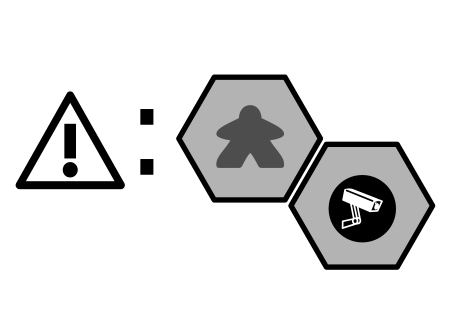
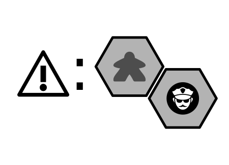
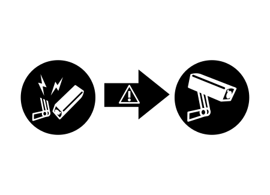
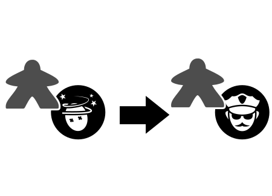
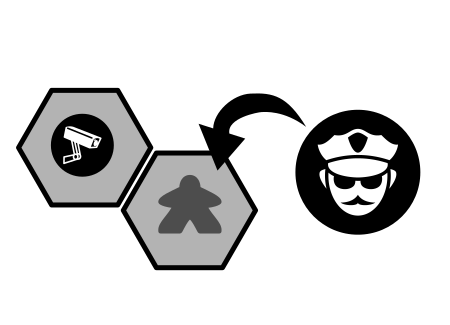
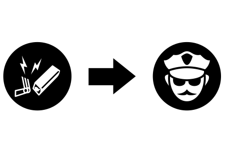

# Rules for _Your Last Heist_

_Your Last Heist_ is a cooperative, multi-stage heist game. You are playing the role of a uniquely skilled criminal who works with other skilled criminals to quietly traverse the building and steal items, all while dealing with obstacles like closing gates, guards, locks, sensors, and cameras.

A single heist takes 30-40 minutes, and is part of a narrative where your team improves their skills and characters over time. The scenarios are story-driven, highly replayable, and allow you to "save" your game between heists.

During each heist, you will collaborate with teammates with simultaneous gameplay to coordinate your movements. Each round begins with everyone rolling a die to determine which actions are available. You use Ideas💡 to modify that die roll, but don't spend too many - you'll need those Ideas💡 to escape, too!

## The Pieces

* 32 double-sided hex tiles.
  * 28 Blank/Security tiles
  * 4 Gate tiles (A,B,C,D)
* 12 character cards: 6 Amateurs, 6 double-sided Pros
* 24 Skill cards: 6 Amateurs, 12 Pros, 2 copies of each)
* 6 Lock chits
* 6 Camera chits (circle)
* 21 Guard chits (circle)
* 5 Artwork chits (square)
* 5 Entrance chits (square)
* 4 Jewel chits (circle)
* 4 Control Panel chits (circle)
* 8 Pressure Sensors (ring)
* 1 Story chit (circle)
* 36 Idea💡 chits (circle)
* 4 Player pawns (red, green, blue, black)
* 1 Prisoner pawn (white)
* 48 Planning chits (by player colors)
* 4 Player D6 dice (by player colors)
* 1 Security Die (white, four-sided die)
* 12 Petty Cash chits ($1k and $3k)
* 1 Alert Bar marker (white wooden stick)
* 4 Noise Tracker & Team Cash Markers (white wooden cylinders)

## Characters

The game comes with 18 unique characters. Each card has:

  * ① **Level.** There are Amateur characters and Pro characters.
  * ②	**Planning Memory.** The number of pre-planned hex tiles your character may move through during a heist.
  * ③	**Initial Ideas**. The number of Ideas💡 you start with at the beginning of each heist.
  * ④	**Default Actions**. Actions that are available regardless of your die roll.
  * ⑤	**Special Ability**. Abilities that your character can uniquely do.

Some Characters have two Default Actions, others have three. Actions are described more in the *Actions and Sub-Actions* section.

For the Special Ability, some abilities will have a "Use this action..." sentence. You must use your Action to make use of this ability. If the text does not state "Use this action...", you may do the ability *in addition to* your Action.

A Special Abilities may also *limit* a character's abilities (e.g. *THERE ARE BETTER WAYS*).

Some abilities have a "Once per heist..." sentence. Place the once-per-heist token on this character at the beginning of the heist and discard when used.

Between Heists, your scenario may give you an opportunity to **promote** (i.e. "level up") some of your characters. Each Amateur character is given two choices to level into, as indicated on the back of the card. Place your Amateur Character card in the box and choose one Pro card as your new character. Pro characters cannot be promoted.

## Skills

Each character gets two Skills. Each Skill has six Actions(①) that each correspond to a die roll(②). During a heist, you will be rolling your die to determine which Actions are available to you (more details on this in Roll for Skill and Character Actions).

Between Heists, your team will get a chance to **refine** (i.e. "level up") some of your Skills. Each Skill, like Characters, can be refined to one of two Skills, as summarized on the back of the Amateur skill cards. When refining, choose which Pro skill to refine and place the Amateur one back in the box. Pro skills cannot be refined.

## The Board

   
  Blue is adjacent to a Camera, but not to a Guard.

The board is a set of modular double-sided hex tiles. All hexes are considered symmetrical (i.e. orientation does not matter). For most tiles, each tile is Blank on one side, and is a Security tile on the other side. A Security tile represents an unknown Security Chit (see below). Some tiles have Gates printed on them, which is described in *Security Systems*.

 You are considered **adjacent** to something if your are on a tile that shares a border with another tile. (Being on the same tile is *not* considered adjacent.)

Each board has one or more **Entrances**. These Entrances (they are also Exits) represent a space. If a player is on one of these spaces, they are considered to be Outdoors, otherwise they are Indoors.

By default, unless the scenario specifies otherwise, Entrance/Exit tiles are limited to 2 characters at the beginning of the heist. This limit does not apply to the Escape phase, although the scenario may impose additional limits.

Some abilities refer to **external sides**, which are a side of a hex tile that does not lead to a fully-enclosed space by hexes (see figure).

Some abilities refer to a **non-tiled gap**, which is a hex-spaced area between two hex tiles that does *not* have a hex (see figure).

## Security Chits

Security Chits are randomized obstacles that your team will encounter. They are shown to the right.

Security chits are generally unknown at the beginning of the heist, and are placed in a bag to be drawn at random throughout the heist. Immediately when a player is adjacent to a unknown Security tile (i.e. no Security chit placed yet), the chit is **Auto-Revealed** where you remove a random chit from the bag and place it on the tile in its Active state. A Security chit may also be placed with a **Reveal** (🔍) sub-action (see below).

| Name | Active | Inactive | Behavior |
|:----:|:------:|:--------:|---|
| Guard |  Guard |  Subdued | _Slows you down_. If you share a space with a Guard, you may not Move until he is Subdued. You may walk into a space with a Guard. |
| Camera |  Live |  Disabled | _Increases Alerts._ You may enter a space with a Live Camera, but increase the Alert (⚠) by 1. If a Disabled camera is powered back on while a player is on it, increase the Alert (⚠) by 1.  |
| Lock |  Locked |  Unlocked | _Prevents passage._ You may not enter a Locked tile at any time. You may exit a locked tile if it was re-locked while you were on it.  |

## Actions and Sub-Actions

Skills and Characters allow you to take Actions. Every Action is just a grouping of Sub-Actions with a name (e.g. Punch 👊➜🔊🔊). The Sub-Actions are:

| Icon | Sub-Action Description |
|:--:|---|
| ➜ | **Move** to an adjacent, planned, not locked, non-pressure sensored tile |
| 🔓 | **Unlock** 1 locked, adjacent tile |
| 👊 | **Subdue** 1 guard on or adjacent to your tile |
| 📷 | **Disable** 1 camera on or adjacent to your tile |
| 💡 | Add 1 **Idea** to your character |
| 🔍 | **Reveal** 1 security token anywhere on the board |
| 💰 | **Loot:** Gain $1k from the supply and place it on your character. |
| 🔊 | Increase the **Noise** level by 1 (Required) |
| ⚠ | Increase Alert bar by 1 (Required) |

## Trackers: Noise, Alerts, Loot

The Noise tracker mat is used for determining how many Noise(🔊) sub-action penalties your team has incurred. Immediately upon entering a Noise level with an Alert ⚠, increase the Alert Bar by 1. If the Noise marker gets to the final slot, increase ⚠ for each 🔊 incurred.

The Alert Bar represents the potential Security Events you will encounter in the near future. The Alert Bar marker (a long wooden bar) is only ever placed *between* events. The Alert Bar represents a lower-bound of what events could possibly occur, so nothing happens immediately when you increase the Alert bar.

The Alert bar does not go beyond its final slot. Thus if the team runs out of alerts, the Escape phase is initiated in the *Roll for Security* stage no matter what is rolled.

Details on the Security Event iconography is in the *Roll for Security* section.

These mats also have spaces for team loot and some prisoner-related tracking (described later).

## Security Systems

**Gate**. A character may enter or exit this space freely. Security Events may remove this tile from the board.

**Pressure Sensors**. You may not enter a tile with a Pressure Sensor chit on it. If you are on a tile with a pressure sensor already (e.g. at the beginning of a heist), you may not ➜🔓👊📷, but you may 💡💰🔍 and 🔊⚠ are still required.

For each Pressure Sensor, a corresponding **Control Panel** of the same color exists somewhere else on the board. If a character is standing on the Control Panel, then all corresponding Pressure Sensor rings may be immediately removed *__only__* if they are the outermost ring at the time.

**Reinforcements**. This is an open tile while it is on the board - but bad things will happen here later! Reinforcements are triggered at the *__end__* of the Roll for Security phase if the Alert bar is on or beyond the Reinforcements icon. See *Phase 3. Roll for Security* for more details.

## Loot Chits

The objective of the heist is (usually) to steal Loot chits, which can be Artwork, Jewels, Documents, or Cash. At any time when a character shares a space with Loot, they may immediately place that Loot chit on their Character card.

You may also "drop" loot on your current space, which means that you may effectively "insta-transfer" loot from one character to another when sharing a space.

When a character with Loot gets Outdoors, the team has acquired that loot for the heist - place it on the Team Loot square. For Cash, increase the Team Cash tracker accordingly.

A special loot chit is the **Story Beacon**, denoted by an asterisk. When a character enters a space with the Beacon for the first time,  refer to the scenario for what to do and remove the chit.

## Prisoner

Some heists have a **Prisoner**, represented by a white pawn. A Prisoner is a non-Player Character that your team can "remotely" control. A Prisoner is not Freed until their Pressure Sensor space is fully disabled. A Freed Prisoner has one Action available (Crawl➜), cannot carry Ideas💡, and needs no planning tokens. As a team, you must decide how to use the prisoner's Crawl Action.

In every other way, treat a Freed Prisoner like a regular character. Freed Prisoners may carry Loot and may be given sub-actions (e.g. Script Kiddie's AUTOPWN). They Auto-Reveal, count as Characters in Security Events, and might need a die roll of their own during the Escape Phase (use a player die for this).

# Setting Up

**Step 1. As a team, decide upon a scenario.** Some scenarios are designed for one evening's play, others can be played over the course of multiple evenings. Each heist in the scenario will consist of Chapters, which involve one Heist.

Tip: If this is your first game, we recommend playing *The Fall Guys*.

**Step 2. Read the story text.** To save time, you may begin setting up the board in Step 3 simultaneously with this step.

**Step 3. Set up the board** in the middle of the table. Following the diagram for your chapter, set up the hex tiles so that they match the picture. Place any Loot chits, Prisoner, and/or Security Systems according to the diagram. If the diagram depicts a shield, then use the Security side of the tile, in all other cases use the Blank side.

Tip: to verify the layout, match the shapes of the Gaps between tiles

Some boards have already-revealed security chits. The Chapter will also indicate how many Guards, Locks, and Camera chits should go into the bag. Leave the other Security chits by the board (they are **the supply**).

**Step 4. Decide on player colors.** Distribute the 6-sided die, and pawn according to your color.

**Step 5. Build Characters.** Assign characters to each player according to preference. If the scenario says "Suggested Characters", then you are allowed (and encouraged!) to explore other options for Character-Skill pairings. If the scenario says "Required", then the storyline requires that those characters and/or skills are used. Place the two Skill cards below the Character card.

**Step 6. Distribute the Planning tokens** to each character according to their color and Planning Memory. *For example, the Lookout has a Planning Memory of 6, so she gets 6 planning tokens*. Place remaining Planning tokens back in the box.

**Step 7. Distribute initial Ideas💡** to each player according to their character.

**Step 8. Place the Noise and Alert trackers** in view of everyone and according to the number of players (3- or 4-player).

**Step 9. Place the Noise Tracker markers** on their starting place. Place both cylinders on top of each other.

**Step 10. Place the Alert Bar** marker on its starting place.

**Step 11. Place the Team Cash trackers** on the starting place according to the scenario.

**Step 12. Record your team on the provided document**. Determine a name for your team. Players are encouraged name their characters.

# Heist Gameplay

The structure of each heist is:

  <ol class="gameplay-structure">
    <li>The Plan: Place planning tokens, Purchase Extra reveals 🔍, Purchase Extra Ideas 💡
    </li>
    <li>The Heist: (1) Roll for Skill, (2) Character Action, (3) Roll for Security. Escape Phase.
    </li>
    <li>Promote Characters &amp; Refine Skills</li>
  </ol>

 
Blue and Red place their planning tokens.

## Part I: The Plan

With your team, you will collaboratively come up with a plan of how you will pull this Heist. Every time you do a Move➜, you *must* move onto a hex that you have **Planned** with a Planning Token of your color. Thus, mark every hex tile that you will be allowed to move on by placing a Plan token of your color on the hex tiles you will (probably) move onto. Entrance tiles do not need a token.

*Note:* Unless a special ability allows you to re-plan mid-heist, you will not be able to change these planning tokens!

During this phase, you may purchase and immediately use any number of Reveal🔍 for $1k of team loot each. You may also purchase any number of Ideas💡 for $1k of team loot each. Place each purchased Idea💡 on a character immediately.

Place your Character pawn on the Entrance space where you will plan to start. The default limit character limit per Entrance is 2 (unlimited during Escape phase.) *Note:* some scenarios dictate a different a limits on this.

## Part II: The Heist

Repeat Phase 1 through 3 until the Escape Phase is initiated.

### Phase 1. Roll for Skill

Everybody simultaneously rolls their die.

### Phase 2. Character Action

In this phase, you use your die to execute one Action. You have a minimum of four options: at least two Actions from your Character and one Action from each Skill.

You may also use any number of your Ideas💡 to modify the die roll by 1 each. You may "wrap around", that is, spend an 💡 to go from a 6 to a 1 and vice versa.

*For example, Phil as the Angry Locksmith may always take Pick🔓🔊 or Walk🔊➜ regardless of what he rolled. Suppose he has the Wing It and Smash 'n' Grab Skills, and rolled a 1, then he also has Punch👊🔊🔊➜ and Discover🔍🔍 as options. If he spends an 💡, then he also has Smash📷🔊🔊➜, Grab💰🔊, Strongarm🔓👊🔊🔊➜, and Scamper🔊🔊🔊➜➜ available.*

During this time, everyone is working collaboratively and simultaneously. (You are *__not__* taking turns!!) You decide which Action to take, and how to execute your sub-actions. You may execute your sub-actions in any order. You may interleave your sub-actions with the sub-actions of other players. Doing this part effectively takes teamwork and is the key to victory!

When you begin an Action, you must place your die on that Action to indicate your commitment.

*For example, Kelly takes Discover🔍🔍 and reveals a guard one space away from Tim. Tim, with this new information, then chooses to take Punch👊🔊🔊➜, and does a ➜ first, then a 👊 on the newly-discovered guard, then increases the 🔊 by 2.*

If unknown information is revealed after you commit to an Action, that Action cannot be undone.

*For example: Derek takes the Sprint(🔊🔊➜➜➜) action but after his first ➜ he Auto-Reveals a Lock in his path. Derek cannot undo his action. Fortunately, Jacob is one space away from the lock and takes Shim(🔓🔊🔊➜), which lets him ➜ and then 🔓. Derek continues with his other ➜➜. The noise level goes up by 4.*

The Noise(🔊) and the Alert(⚠) sub-actions are **required**, but all other sub-actions are not required.

*For example, you do not need to be able to unlock two locks to take Rake🔓🔓🔊➜, but it costs you a 🔊 regardless.*

Like other sub-actions, noise may be increased at any time during Character action (just don't forget!).

*Tip: wait to account for noise until the end of Character Action phase. Ask everyone to hold up a finger for the number of noises they incurred - which they can see from the die sitting on the action they took.*

You may opt to simply PASS, and take no actions with no noise penalty.

You may **Help Out.** If you are Outdoors, you may spend 💡💡 to give 💡 to any player, any number of times, in addition to your action. **This does not apply to the Escape phase!** (Sorry.)

You may opt to Initiate Escape Phase at any time (see *Escape Phase*).

You have the final say about what to do with your own character.

### Phase 3. Roll for Security

When all players have finished their Actions, one player rolls the four-sided security die. Trigger the event denoted by the number of squares away from the alert bar.

Below is the translation of the event iconography. (Note that these are examples - some of these events are combined on the actual alert tracker)

  *  
        **Outta My Way!** 
        For each hex tile with at least 2 characters on it, increase the alert bar by 1. For Entrance tiles, 2 alerts.
  *  
        **Caught in a Reflection** 
        For each character adjacent to a Live Camera, increase Alert(⚠) bar by 1. If a character is adjacent to multiple cameras, increase for each camera.
  *  
        **Suspicious Guards** 
        For each character adjacent to a Guard, increase ⚠ by 1. If a character is adjacent to multiple Guards, increase for each Guard.
  *  
        **Let Me Go!** 
        For each character on a Subdued Guard, increase Alert(⚠) bar by 1. For each character on a Disabled Camera, increase Alert(⚠) bar by 1.
  *  
        **Reboot** 
        Make every Disabled Camera Live. Increase ⚠ every time you do this only if it has an "⚠:" on it.
  *  
        **Lockdown** 
        Close the next Gate, starting with "A". Remove the tile. If a character is on it, they are immediately Busted. Increase alert for each ⚠ shown.
  *  
        **I Thought I Had Him** 
        For each character on a tile with a Subdued Guard, Un-Subdue that guard.  Increase ⚠ twice (if applicable).
  *  
        **Hey You!** 
        For each character adjacent to at least one Guard, add a Guard to the character's current tile.
  *  
        **Call It In** 
        Replace every Disabled Camera with a Guard.
  *  
        **Alarm** 
        Initiate Escape Phase.

Whenever an Event calls for a new Guard to be placed, take it from the supply (not the bag).

**Reinforcements**. *After* the Security Event has been resolved, check to see if the Alert Bar is on or beyond the Reinforcements space. If so:

  1. _Reveal_ all Security Chits adjacent to the Reinforcements chit.
  2. _Un-Subdue_ any Guards adjacent to the Reinforcements chit,
  3. _Re-lock_ any Locks adjacent to the Reinforcements chit,
  4. _Re-activate_ any disabled Cameras adjacent to the Reinforcements chit. Increase ⚠ for each character on one of these Cameras.
  5. _Place a new Guard token_ from the supply onto any tile adjacent to the Reinforcements chit that was without a Security Token.
  6. _Replace the Reinforcements_ chit with two Guards.

### Escape Phase

When the Escape Phase is initiated, all Gates close and all Security chits are revealed. Then, each character who has not reached an exit (Entrance tile) determines if they can reach it.

Declare the number of Escape Moves your character will take to an exit. Ignore Plan tokens. Locked tiles are impassable. Exiting an Unsubdued Guard space costs one extra Escape Move per guard (e.g. two for one guard, three for two guards). Cameras and Pressure Sensors have no effect during Escape. Each leftover 💡 you have may be used for 1 Escape Move.

After you have declared your Escape moves and used up all of your 💡, you may roll your die. The number shown on the die is equal to the number of Escape Moves you may use to reach an Exit. If you still cannot reach an Exit, you are Busted.

 
Blue needs 5 Escape Moves. Red and Green are Busted.

*For example Blue needs 5 Moves to exit: one to enter the space with a Guard, two to exit the Guard, and two more moves to reach the Exit. Using his last 💡💡, he now needs to roll a 3 or higher to get out.*

You MAY NOT use abilities that cost 🔊 or ⚠ during the Escape Phase.

*For example, SEWER CRAWL is not allowed during Escape, but GREAT IN A PINCH is allowed*

You MAY pick up or drop off loot during the Escape Phase.

You MAY NOT use Help Out during the Escape phase.

### Busted

When you are Busted, you are out of gameplay for the rest of this Heist. All loot on your character is lost. You may not be promoted for the next heist (if the scenario allows it anyway). Instead, you choose an available Amateur character and two Amateur skills for the next heist. You may not choose an Amateur version of a Pro who is already on the team.

# Losing a Heist

Each Heist has an objective built into it. If your team does not complete its objective, the campaign is lost. Some scenarios may define what to do if the heist is lost. If the objective is fulfilled, regardless of how many teammates are Busted, then the heist is still successful.

You may retry a heist from the original conditions (i.e. restore from a previous "saved game").

# Winning a Heist

If you have completed your objective, your team advances to the next chapter. Leftover 💡 are lost. Any cash on a Character is added to the Team Cash tracker, as well as any loot. Be sure to note everything in your Campaign History.
