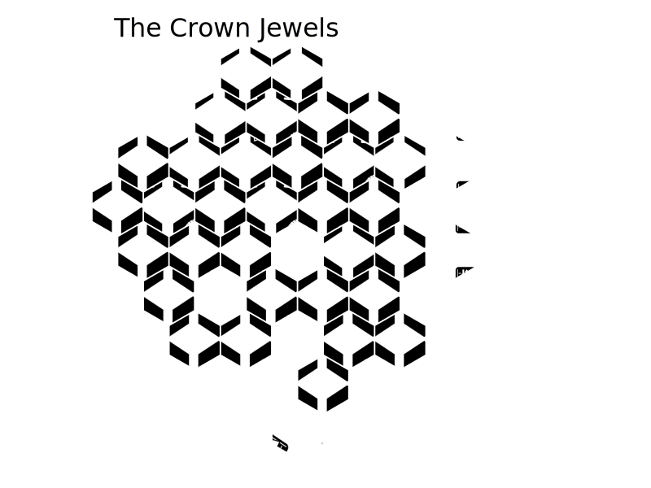

  River City

Welcome back! You'll find that things around here haven't changed much at all. Except I hear you all have some new skills you want to try out? If you prove yourselves, I can introduce you to a few people.

-An Old Friend

*River City is an open-ended sandbox campaign. Every heist you complete will introduce you to a new Fixer and provide you with new opportunities. You are welcome to explore all scenarios and fixers before completing them.*

**Breakouts**. *If any character is Busted, your team may opt to break them back out of County Jail. See page 3.*

**Gain the Old Friend Fixer.**

**Gain $5k of team cash.**

# Opportunities

| Opportunity | Difficulty | Unlocks Fixer | Faction | Page |
|----+----|
| The Crown Jewels | Amateur | Pawn Shop Owner | Fence | 2 |
| TBD | Amateur | Frustrated Beat Cop | Cops | 2 |
| TBD | Amateur | Sr. Tech Support Analyst | Hackers | 2 |
| TBD | Amateur | Extorted Locksmith | Mafia | 2 |
| TBD | Semi-Pro | The Curator | Fence | 2 |
| TBD | Semi-Pro | Prison Guard | Cop | 2 |
| TBD | Semi-Pro | Spammer | Hackers | 2 |
| TBD | Semi-Pro | "Retired" Thief | Mafia | 2 |
| TBD | Semi-Pro | Online Mogul | Hackers+Mafia | 2 |
| TBD | Semi-Pro | Retired Detective | Cops+Fences | 2 |
| TBD | Pro | The Tunneler | Fence | 2 |
| TBD | Pro | Burned Out Sergeant | Cops | 2 |
| TBD | Pro | Internet Troll | Hacker | 2 |
| TBD | Pro | Recruiter | Mafia | 2 |

**The Final Score**. This finale is a challenging, two-part heist. You may only attempt the Final Score if your team has successfully completed three heists. See page 2.

# County Jail

**Breakout Rule**. No limit on the number of characters on entrances. However, each character must leave out a different exit. If they do not, all characters are Busted.

**Help from Outside**. Busted characters must start inside the jail. Non-Busted characters must start outside of the jail.

**Rehabilitated?** Characters who started the breakout Busted may level up if they escape. Characters who started the breakout Non-Busted do not level up.

**Pick Your Moment**. Your team may choose which .

| Nickname | Difficulty | Team Reward | Page |
|----+----|
| The Yard | Amateur | $5k | 2 |
| The Bricks | Semi-Pro | $10k | 2 |
| The Hole | Pro | $15k | 2 |

# Factions

You would discover this anyway, but I'll fill you in real quick.

-An Old Friend

**Fence Cartel**. A bunch of snooty academics, this collective can really help you make money moving merchandise like artwork and jewelry.

**Corrupt Cops**. You want these on your side when you get busted or handle some Guards.

**Hacker Collective**. Experts at cameras and information.

**Mafia**. They're people people, and they've been doing this a lot longer than we have.

*Remember:* most Fixer only work with others in their faction for a given heist. However, you can still be introduced to Fixers of multiple factions across the campaign.

# The Crown Jewels

# The Final Score

Lots of moving pieces on this one. You're gonna need a breather halfway through to regroup and adjust your plans. Sorry but this one is out of my league.

This is a two-part heist. For the first part, you must start in the middle of the board and break out of all four doors. For the second heist, your characters keep their ideas and your team may discuss your plan for the next board.

Your **Old Friend** Fixer is not available for this heist.

If you have been introduced two or more Fixers who can work with a faction, you are considered a **friend** of that faction. Otherwise, you are an **enemy** of that faction. (Your Old Friend does not count.)

For each enemy faction, the following happens:

  * *Corrupt Cops*: add four Guard Dog tokens to the bag
  * *Hackers*: add a Watchtower to a certain corner
  * *Fence Cartel*: add a Reinforcement token in the southwest corner of the first map
  * *Mafia*: add a hostage to one of the unlocked gates. You must rescue this hostage

Fixers who you have not been introduced to will then turn on you and hurt you. If you don't use those fixers for THIS heist, you don't get their negative effect.
