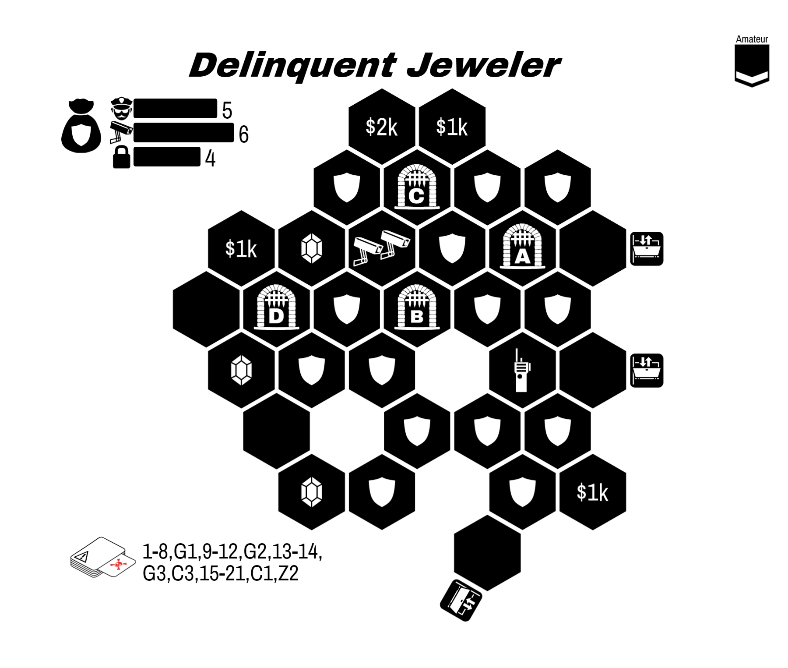
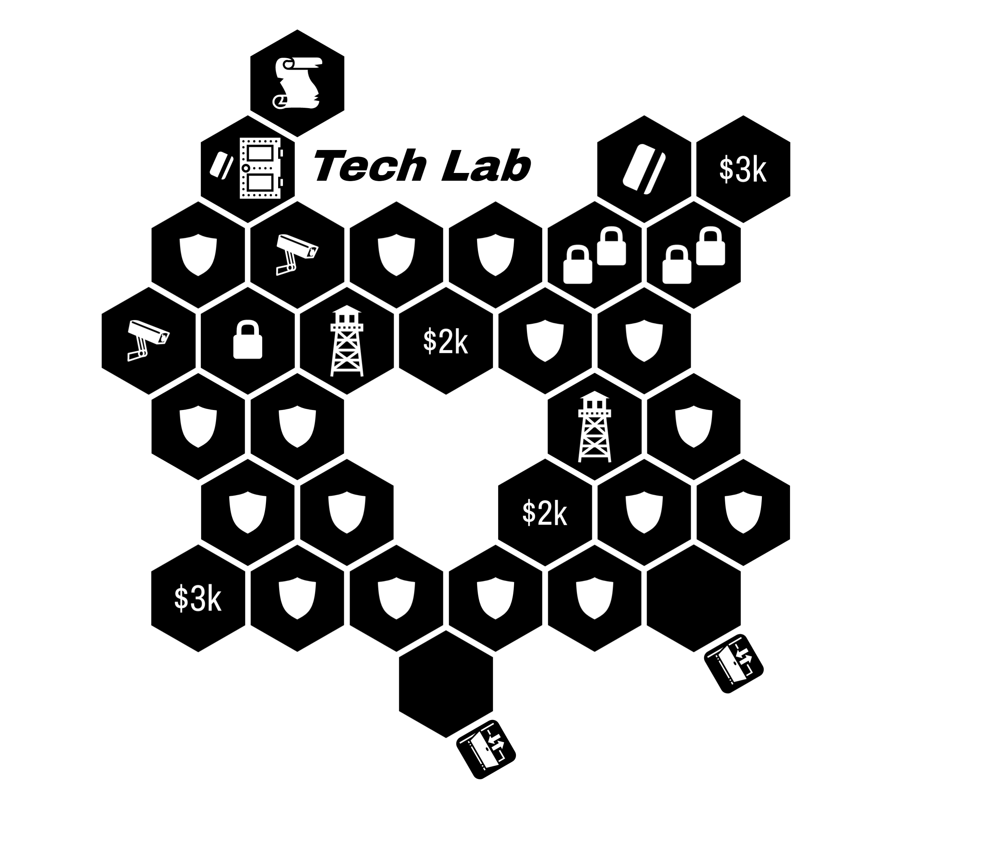
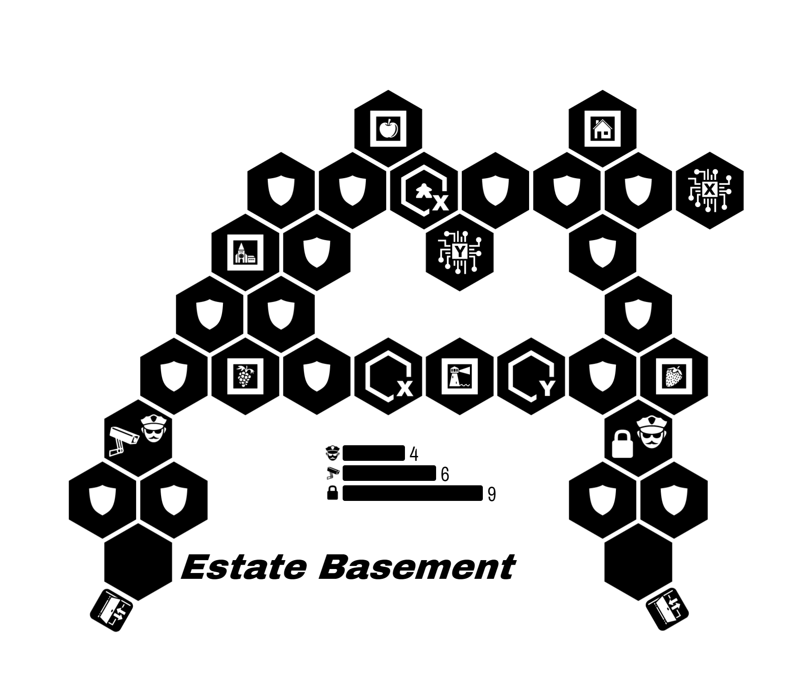
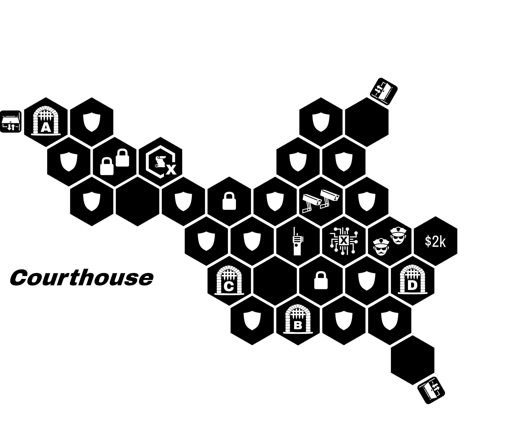
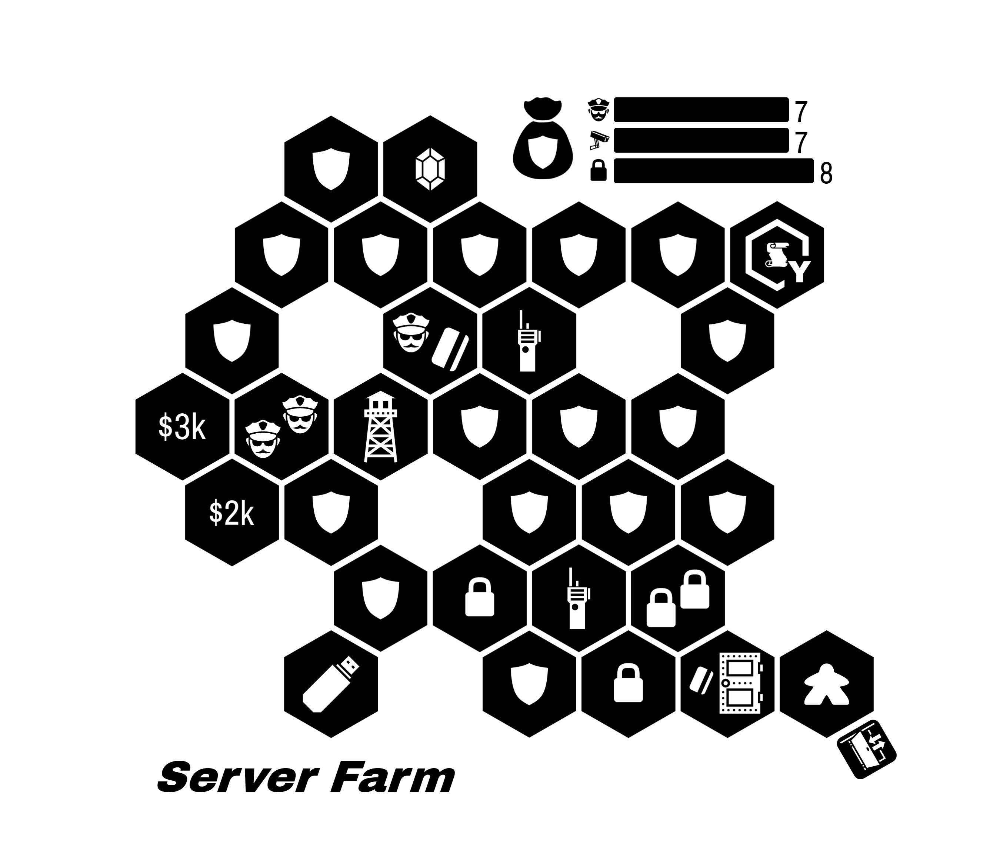
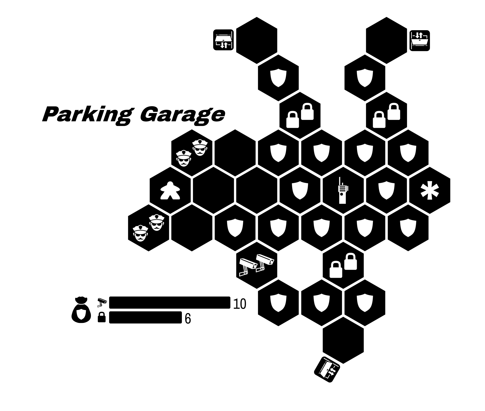
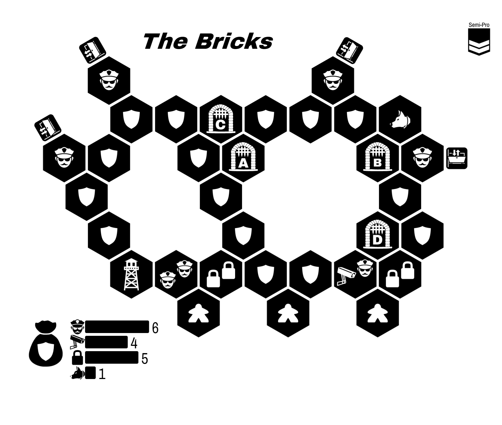
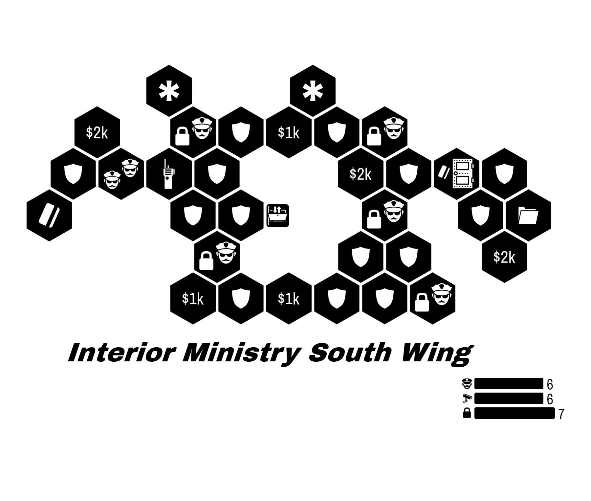

  River City

Your journey begins with some text messages from an old friend:

> Welcome back! Things around here haven't changed since you left.
{:class="text-message"}

> I hear you have some new skills to try out? I can introduce you to some folks... but you and your friends will need prove yourselves before they provide their services.
{:class="text-message"}

River City is an **open-ended** campaign.

* All heists are **available** to any team.
* Every heist you complete will introduce you to a new **Fixer**
* You are welcome to **explore this booklet** without spoilers.
* **Players can come and go**. Your party can change between heists as needed.
* When a character is Busted, your team may opt to do a **breakout**. See page 3.
* During planning, you may visit the Shop to **purchase items**.

Version ⏱

---

* Choose an entirely Amateur team.
* Gain the *Old Friend* Fixer.
* You have $0k team cash.
{:class="directions"}

# Opportunities

| Difficulty | Avg. Level |
| ---------- | ---------- |
| Amateur    | < 2        |
| Semi-Pro   | 2-3        |
| Pro        | > 3        |
{:class="difficulty-table"}

> Just name the fixer and I'll arrange an introduction.
{:class="text-message"}

| Opportunity           | Difficulty | Unlocks Fixer       | Page |
|:--------------------- |:---------- |:------------------- |:---- |
| The Inclusion Job     | Amateur    | Pawn Shop Owner     | TBD  |
| The Startup Job       | Amateur    | Visage              | TBD  |
| The Dark Horse Job    | Amateur    | Bookie              | TBD  |
| The Greedy Prisoner   | Semi-Pro   | The Connoisseur     | TBD  |
| The Blind Justice Job | Semi-Pro   | Beat Cop            | TBD  |
| TBD                   | Semi-Pro   | Extorted Locksmith  | TBD  |
| TBD                   | Semi-Pro   | Security Consultant | TBD  |
| TBD                   | Semi-Pro   | The Scavenger       | TBD  |
| TBD                   | Semi-Pro   | Persuasive Jeweler  | TBD  |
| The Side Channel      | Semi-Pro   | Shell               | TBD  |
| TBD                   | Pro        | The Architect       | TBD  |
| The Safehouse Rescue  | Pro        | Retired Mastermind  | TBD  |
| The Final Score       | Pro        | The Mayor           | TBD  |
{:class='tabletoc'}

Can't decide? These are some good threads:

* **Get That Loot**
  - _The Inclusion Job_
  - _The Melee Job_
  - _The Greedy Prisoner_
  - _TBD: Scavenger_
* **When A Plan Comes Together**
  - _The Startup Job_
  - _TBD: The Machinist_
  - _The Side Channel_
  - _The Safehouse Rescue_
* **Confidence**
  - _The Dark Horse Job_
  - _The Blind Justice Job_
  - _TBD_
{:.heistthread}

# County Jail Opportunities

> Busted? Minor occupational hazard.
{:class="text-message"}

If a character is busted, you may simply build a new character. Alternatively, your team my opt to rescue you. Even if the entire team is busted, you may opt for a breakout using these rules.

---

  * **Spread Out**. No limit on the number of characters on entrances. However, each character must leave out a different exit. If they do not, all characters are Busted.
  * **Break-in to Breakout**. Busted characters must start inside the jail. Non-Busted characters must start outside of the jail.
  * **Pick Your Moment**. Your team may choose which opportunity is appropriate. The more difficult the job, the more profitable it is.

---

| Opportunity | Difficulty | Unlocks Fixer | Team Reward | Page |
|:----------- |:---------- |:-------------:|:-----------:| ---- |
| The Yard    | Semi-Pro   | Prison Guard  |    $10k     | 18   |
| The Bricks  | Semi-Pro   | Prison Guard  |    $10k     | 19   |
| The Hole    | Pro        | Prison Guard  |    $15k     | 20   |
{:class='tabletoc'}

# Pre-Built Characters

TODO: finish filling these out.

<!-- •••••••••••••••••• -->

|                                                                       |      Name      |                Character & Skills                | ➜             | 💡      | 🔍   | 🔓     | 👊  | 📷     | 🔊                    |
|:---------------------------------------------------------------------:|:--------------:|:------------------------------------------------:| ------------- | ------- | ---- | ------ | --- | ------ | --------------------- |
| {:.s} | Johnny Swagger | **Angry Locksmith**   Smash 'n' Grab, Bypass | ∎∎∎∎∎∎∎∎∎∎    | ∎∎∎     | ∎∎∎∎ | ∎∎     | ∎∎  | ∎∎     | ∎∎∎∎∎∎∎∎∎∎∎∎∎∎∎∎∎     |
| {:.s} |     Karma      |     **Angry Locksmith**   Hurry, Wing It     | ∎∎∎∎∎∎∎∎∎∎∎∎  | ∎∎∎∎    | ∎∎∎  | ∎∎∎    | ∎∎  | ∎∎     | ∎∎∎∎∎∎∎∎∎∎∎∎∎∎∎∎∎∎∎∎  |
|            {:.s}            |    Jitters     |         **Thug**   Hurry, Yank Wires         | ∎∎∎∎∎∎∎∎∎∎∎∎∎ | ∎∎∎∎∎∎∎ | ∎∎∎  | ∎      |     | ∎∎∎∎   | ∎∎∎∎∎∎∎∎∎∎∎∎∎∎∎∎∎∎∎   |
|            {:.s}            |   Tiny Mike    |          **Thug**   Wing It, Bypass          | ∎∎∎∎∎∎∎∎∎∎∎   | ∎∎      | ∎∎   | ∎∎∎∎∎∎ | ∎∎  | ∎∎     | ∎∎∎∎∎∎∎∎∎∎∎∎∎∎∎∎∎∎∎   |
|   {:.s}   |     Enigma     |      **Street Urchin**   Hurry, Bypass       | ∎∎∎∎∎∎∎∎∎∎∎∎∎ | ∎∎∎∎∎∎  | ∎    | ∎∎∎∎∎  |     |        | ∎∎∎∎∎∎∎∎∎∎∎∎∎∎∎∎∎     |
|   {:.s}   |    Iceheart    |   **Street Urchin**   Wing It, Yank Wires    | ∎∎∎∎∎∎∎∎∎∎∎   | ∎∎∎     | ∎∎∎∎ | ∎∎     | ∎∎  | ∎∎∎∎∎∎ | ∎∎∎∎∎∎∎∎∎∎∎∎∎∎∎∎∎∎∎∎∎ |
|   {:.s}   |     Phobia     |  **Script Kiddie**   Smash 'n' Grab, Bypass  |               |         |      |        |     |        |                       |
|   {:.s}   |      Null      |    **Script Kiddie**   Hurry, Yank Wires     |               |         |      |        |     |        |                       |
|         {:.s}         |    Showtime    |        **Burglar**   Bypass, Wing It         |               |         |      |        |     |        |                       |
|         {:.s}         |     Clutch     |   **Burglar**   Smash 'n' Grab, Yank Wires   |               |         |      |        |     |        |                       |
|         {:.s}         |   Crazy Eyes   |         **Lookout**   Hurry, Wing It         |               |         |      |        |     |        |                       |
|         {:.s}         |     Smokes     |     **Lookout**   Smash 'n' Grab, Bypass     |               |         |      |        |     |        |                       |
|      {:.s}      |     Status     |      **Pickpocket**   Hurry, Yank Wires      |               |         |      |        |     |        |                       |
|      {:.s}      |     Locket     | **Pickpocket**   Hit 'n' Run, Smash 'n' Grab |               |         |      |        |     |        |                       |
|     {:.s}     |     F-Stop     |      **Shutter Bug**   Wing It, Bypass       |               |         |      |        |     |        |                       |
|     {:.s}     |    Stretch     |     **Shutter Bug**   Hurry, Hit 'n' Run     |               |         |      |        |     |        |                       |
{:.prebuilt}

# The Inclusion Job

  

From the Pawn Shop Owner:

> Our friends down the road have decided to experiment with capitalism again. I need to show them the cost of leaving a cartel.
{:.text-message}

**Objective:** Steal all three jewels.

**Special Rules:**

* Lockdown Gates (see rules)
* Reinforcements (see rules)

**Success Unlocks:** Pawn Shop Owner

{::comment}
https://mastersoftheheist.com/design/?savekey=Delinquent+Jeweler|55|5|5|6|4|0|0|0|0|0|20|15|1-8,G1,9-12,G2,13-14,G3,C3,15-21,C1,Z2|35|225|A|OIBQBKHpPXUNo8ASATGFBGZulIGUBhCE4sc-ebMAKQHUwiNKBBMAUQFlOBWPcNwgARCiWAAhMdKoIG0yuABKHTjw79ZkIZHJ7x8WfMXSaWwxbUDrSDjnNA
{:/comment}

# The Startup Job

  

From Visage:

> Trade secrets are for cowards. Get me a copy of their code and I can help you out.
{:.text-message}

**Objective:** Steal the document from the vault.

**Special Rules**

* Keycard (see rules)
* Watchtower (see rules)

**Success Unlocks:** Visage

{::comment}
https://mastersoftheheist.com/design/?savekey=Tech+Lab|110|5|3|6|6|0|0|0|0|0|15|220|1-12,C2,13-18,C2,19-24,Z1|190|245|A|OIBQBKYumz8QQaQMIBlGcqsASAzFggMopgoCyYp1ZATMBmnUeVWgPJgDqAKngEZawuKxo1RfEQkiVpg4RJnhcLcWXVgAolVF7wO1loBsrfZhNn4QA
{:/comment}

# The Greedy Prisoner

  

From The Connoisseur:

> I... got distracted by their beauty. I also figured he'd free me eventually but it appears that I'm his new... prize.  Anyways I would greatly appreciate my freedom. The loot is my payment.
{:.text-message}

**Objective:** Steal at least two jewels and the NPC must escape.

**Special Rules**:

* The NPC token is a Prisoner (see NPCs in rules)
* Remote Locks (see rules)
* Guard Dogs (see rules)

**Success Unlocks:** The Connoisseur

{::comment}
http://localhost:3000/design/?savekey=Estate+Basement|50|230|2|6|5|0|0|2|0|0|105|135|1-8,D1,9-15,C6,16-18,D2,C4,C5,A1,A4,19-20,21-24,Z1|90|200|S|OIBQBKHpAkDMVH0ZV4DKANM6DCYAlTAWTACkB1HfPHbNJAJjABEB5RdATU-wYdqUU0DHxG9qrANKFsQgj1q1IjYGOEaVwADIal6-uP2IAoqUObwZjSYCMlh5BMA2R+IuGgA
{:/comment}

{::comment}
Group feel bifurcated - the right hand side is clearly the objective side, but it doesn't help the other side. Can one side be more helpful? Or maybe the X remote lock should be on the tougher side?
{:/comment}

# The Blind Justice Job

  

From the beat cop:

> I need to know what they have on me. Get me the dossier at the courthouse, then we'll talk.
{:.text-message}

**Objective:** Steal the document

**Special Rules:**

* Lockdown Gates (see rules)
* Remote Locks (see rules)
* Reinforcements Locks (see rules)

**Success Unlocks:** Beat Cop, Gain $5k

{::comment}
https://mastersoftheheist.com/design/?savekey=Courthouse|80|35|4|4|8|0|0|0|0|0|25|200|1-7,C3,8-12,G1,A2,16,G2,G3,19-21,C4,22-24,Z2|35|175|S|OIBQBKHpPXUNo+TIFEAsC0CYIEEwBlAYWXNLDQFkKyAZPAJQA0ARO4s1eSmrsPQDyAknko9OlJmmIsIeACR5JqMv2EDgHVb24AhARJQnyk-rrOm0ANiA
{:/comment}

# The Side Channel

  

From Shell:

> Greatest cybersecurity in the world can't beat a tunnel. Too bad I'm a bit claustrophobic.
{:.text-message}

{::comment}
https://mastersoftheheist.com/design/?savekey=Server+Farm|175|30|7|7|8|0|0|0|0|0|20|225|1-6,C2,7-10,A5,12-15,C5,16-17,C2,20,C1,21-24,Z1|155|235|S|OIBQBKHpPXUNggygYTAKQOqPk-4aYRJ6RASgJoAiuK6MA0uuQKL11IAkAzBAExgsAFWJlxneF0FFIpMZMVEAMgHkwbMMsEE6AVWQAhDmrDNlYALI5dtvPFYA2RXclA
{:/comment}

**Objective:** Steal the documents inside remote lock Y.

**Special Rules:**

* TUNNEL. In planning, you place one Entrance on any external side.
* NO ENTRANCE LIMITS. Any number of player characters may start on an entrance.
* Guide NPC (see rules). Special ability for Guide is CRACK CIPHER. Immediately when Shell has possession of the USB key, they open up the Y gate.
* USB key is a loot item.
* Watchtower (see rules)
* Keycard (see rules)
* Reinforcements (see rules)

**Success Unlocks:** Visage

# The Safehouse Rescue

  

From Old Friend:

> Found the safehouse where the feds keep my mentor. Let's grab her in transit.
{: class="text-message"}

**Objective:** Rescue Prisoner before she reaches the van

**Success Unlocks:** Retired Mastermind, $10k

**Special Rules:**

  * MOVING TARGET. Each round, except the first round, move all guards and Captured Prisoner one hex in a straight line closer to the van.
  * GUARDS HAVE KEYS. Guards and Captured Prisoner move without restriction.
  * AMBUSH REQUIRED. All four Guards must be subdued **in a single round**. If one is subdued but not the others, activate the C1 crisis during Event phase early.
  * ABORT ABORT ABORT. Prisoner cannot be Freed during the Escape Phase (i.e. the NPC must be activated prior to escape).

{::comment}
https://mastersoftheheist.com/design/?savekey=Parking+Garage|0|60|0|10|6|0|0|0|0|0|10|170|1-3,5-13,16-18,A5,20-24,C1,Z1|50|220|P|OIBQBKHpCiBMYYFkquYgrKyPrgMoDCqR2eZFkAMgtbebhAuqa8aY40gOqIovEASjDCkAVJWYo2o9nMoNyhemBoL1kGR0Uad6TjoOIAjAqA
{:/comment}

# County Jail: The Bricks

  

**Objective:** Everyone escapes out a different exit.

**Upon Success:** Gain $10k

{::comment}
https://mastersoftheheist.com/design/?savekey=The+Bricks|70|5|6|4|5|0|0|1|0|0|20|200||50|200|S|OIBQBAogzGq+dHggFnuxBVDDe20utOgMoDCY5sFVtFAIgPIbZVxsCCOsAQvpAFZSFQmzzsReMcO7B6lSdwDqAFVgAmMABlNdMOuAUdsvAFkl6c5YuFb4+ycd2nIIA
{:/comment}

# The Final Score

From your old friend:

> So you've decided to hit up the world's largest gang huh? Nice.
{:class="text-message"}

> Wait... you're gonna STAY in there hidden with all those government secrets?
{:class="text-message"}

> Lots of moving pieces on this one. Sorry but this one is out of my league.
{:class="text-message"}

This is a two-part heist.

  * Part 1. You will be stealing the government secrets from their vault, then hiding in the building itself.
  * Part 2. Once the alarms die down, make a break for it! Break out of all four doors.

Your **Old Friend** Fixer is not available for this heist.

Once the alarm sounds for the first heist, your only escape points are the hideouts*.  You may now rebuild the board for the second heist, keeping the hexes with players on them on the table. Rebuild the security bag according to the new security token distributions.

Plan for the additional heist by setting new planning tokens (you no longer need a planning token on your current location). You may not use Fixer abilities during this phase, but you may use Character powers that impact this phase.

Before Part 2: the two people who are on the same tile can share ideas with each other between heists.

# The Final Score: Part 1

  

| Difficulty: | Amateur |
| -----------:|:------- |
|     Events: | Pro     |
{:class="scenario-stats"}

{::comment}
http://localhost:3000/design/?savekey=Interior+Ministry+South+Wing|10|190|6|6|7|250|200|OIBQBKHpPXUNggVI8qmfgEgEwN2ABkwBlAYTGwEYzLCSs6J8AlAUWaT2YGlySFBPzTMh7AKwFiCISHhIGooUMg8ma2kJpj6MjQsOiDxoyfNnLp6xahA
{:/comment}

From our insider contact:

> We need two people to go in through the loading dock and then we'll have the other two come in through our tunnel under the south wall.
{:class="text-message"}

> Also, this needs to look like a regular robbery. Steal at least $5k worth of money.
{:class="text-message"}

**Objectives:**

  * Get the documents
  * Escape to the hideouts.

**Special rules:**

  * TUNNEL UNDER THE SOUTH WALL. Choose the entrypoint
  * SMALL HIDEOUTS. Maximum of 2 characters per hideout
  * Keycard (see rules)
  * Reinforcements (see rules)

# The Final Score: Part 2

  

| Difficulty: | Amateur |
| -----------:|:------- |
|     Guards: | TBD     |
|      Locks: | TBD     |
|    Cameras: | TBD     |
|     Events: | TBD     |
{:class="scenario-stats"}

**Objective:**

{::comment}

{:/comment}
