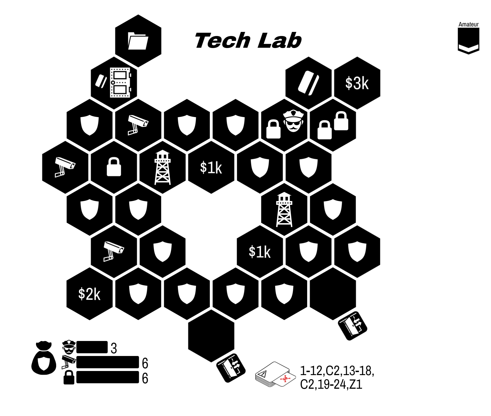

  River City

Your journey begins with some text messages from an old friend:

> Welcome back! Things around here haven't changed since you left.
{:class="text-message"}

> I hear you have some new skills to try out? I can introduce you to some folks... but you and your friends will need prove yourselves before they provide their services.
{:class="text-message"}

River City is an **open-ended sandbox** campaign.

* All heists are **available** to any team.
* Every heist you complete will introduce you to a new **Fixer**
* You are welcome to **explore this booklet** without spoilers.
* **Players can come and go**. Your party can change between heists as needed.
* When a character is Busted, your team may opt to do a **breakout**. See page 3.
* During planning, you may visit the Shop to **purchase items**.

---

* Choose an entirely Amateur team.
* Gain the *Old Friend* Fixer.
* You have $0k team cash.
{:class="directions"}

# Opportunities

> The city is bursting with great opportunities and new people to meet.
  Let me know what you want and I'll arrange the introduction.
{:class="text-message"}

| Opportunity           | Difficulty | Unlocks Fixer        | Page |
|:--------------------- |:---------- |:-------------------- |:---- |
| The Inclusion Job     | Amateur    | Pawn Shop Owner      | 4    |
| Chain of Custody      | Amateur    | Frustrated Beat Cop  | 5    |
| The Track Job         | Amateur    | Bookie               | 7    |
| The Startup Job       | Semi-Pro   | Visage               | 6    |
| Rivalries             | Semi-Pro   | Extorted Locksmith   | 11   |
| The Blind Justice Job | Semi-Pro   | Prison Guard         | 9    |
| The Amnesty Job       | Semi-Pro   | Security Consultant  | 12   |
| TBD                   | Semi-Pro   | Looting Specialist   | 10   |
| The Exhibition        | Semi-Pro   | Unscrupulous Jeweler | 8    |
| Server Farm           | Semi-Pro   | Shell                | 13   |
| The University Job    | Pro        | The Architect        | 16   |
| The Safehouse Rescue  | Pro        | Retired Mastermind   | 17   |
| The Final Score       | Pro        | The Minister         | 21   |
{:class='tabletoc'}

**The Final Score**. This finale is a challenging, two-part heist. You may attempt it at any time. We recommend a fully Pro team.

Heists are labelled with their difficulty based on the team:

| Difficulty | Avg. Level |
| ---------- | ---------- |
| Amateur    | < 2        |
| Semi-Pro   | 2-3        |
| Pro        | > 3        |
{:class="difficulty-table"}

# County Jail Opportunities

> Busted? Minor occupational hazard.
{:class="text-message"}

If a character is busted, you may simply build a new Amateur character. Alternatively, your team my opt to rescue you. Even if the entire team is busted, you may opt for a breakout using these rules.

---

  * **Spread Out**. No limit on the number of characters on entrances. However, each character must leave out a different exit. If they do not, all characters are Busted.
  * **Break-in to Breakout**. Busted characters must start inside the jail. Non-Busted characters must start outside of the jail.
  * **Pick Your Moment**. Your team may choose which opportunity is appropriate. The more difficult the job, the more profitable it is.

---

| Opportunity | Difficulty | Team Reward | Page |
|:----------- |:---------- |:-----------:|:----:|
| The Yard    | Amateur    |     $5k     |  18  |
| The Bricks  | Semi-Pro   |    $10k     |  19  |
| The Hole    | Pro        |    $15k     |  20  |
{:class='tabletoc'}

# The Inclusion Job

  

|                  Difficulty: | Amateur |
| ----------------------------:|:------- |
|                      Events: | TBD     |
| Max characters per Entrance: | 2       |
|     Max characters per Exit: | ∞       |
{:class="scenario-stats"}

You receive a text from the Pawn Shop Owner:

> Our friends down the road have decided to experiment with capitalism again. I need to show them the cost of leaving a cartel.
{: class="text-message"}

"If you help me with this, I can move merchandise for you better than your friend here."

**Objective:** Steal all three jewels.

**Success Unlocks:** Pawn Shop Owner

{::comment}
http://localhost:3000/?savekey=Delinquent+Jeweler|30|5|5|6|4|235|210|OIBQBKHpPXUNggJAJjMgjI+S-gGUBhCE4sc-FbAKQHUwj1KBBMAUQFkOBWHBLhAAiFEsABCoqVUj0plcACV2Hbuz4zwgyOV1jcBsHIVSs-Tf22GLkdthsggA
{:/comment}

# Chain of Custody

|                  Difficulty: | Amateur |
| ----------------------------:|:------- |
|                      Guards: | TBD     |
|                       Locks: | TBD     |
|                     Cameras: | TBD     |
|                      Events: | TBD     |
| Max characters per Entrance: | 2       |
|     Max characters per Exit: | ∞       |
{:class="scenario-stats"}

**Objective:**

**Success Unlocks:** Frustrated Beat Cop

{::comment}

{:/comment}

# The Startup Job

  

|                  Difficulty: | Amateur                      |
| ----------------------------:|:---------------------------- |
|                      Events: | 1-4, S2, 5-10, S2, 11-21, S2 |
| Max characters per Entrance: | 2                            |
|     Max characters per Exit: | ∞                            |
{:class="scenario-stats"}

"Trade secrets are for cowards. Get me info on their tech and I can help you out."

**Objective:** Steal the document.

**Success Unlocks:** Tech Support Guy

{::comment}
http://localhost:3000/design?savekey=Tech+Lab|110|35|4|6|6|225|225|OIBQBKHi6XsKkg0gYQDJPmNYAkAzFogMqpioCyYZN5ATMJuvcRdegPJgDqAKvgCMdEdmy1a2fqMSQqMoSMmzweVhPIawAUWpiVOvYm0A2NvqSnzIIA
{:/comment}

# Semper Paratus

  

|                  Difficulty: | Amateur |
| ----------------------------:|:------- |
|                      Guards: | TBD     |
|                       Locks: | TBD     |
|                     Cameras: | TBD     |
|                      Events: | TBD     |
| Max characters per Entrance: | 2       |
|     Max characters per Exit: | ∞       |
{:class="scenario-stats"}

**Objective:**

**Success Unlocks:** Extorted Locksmith

{::comment}

{:/comment}

# The Exhibition Job

  

|                  Difficulty: | Semi-Pro        |
| ----------------------------:|:--------------- |
|                      Guards: | 4               |
|                       Locks: | 6               |
|                     Cameras: | 9               |
|                      Events: | 1-15, S6, 16-27 |
| Max characters per Entrance: | 2               |
|     Max characters per Exit: | ∞               |
{:class="scenario-stats"}

"I suppose it's not so bad to be locked up with these masterpieces. Still... I would like my freedom."

**NPC token** is a Prisoner.

**Objective:** Steal at least two pieces of artwork. The NPC must escape.

**Success Unlocks:** The Curator

{::comment}
http://localhost:3000/?savekey=Estate+Basement|50|230|4|6|9|115|170|OIBQBKHpPXUNo8BBFywoBIaZAygMJhFgBKAGgLInGn0UYp3EECaCpe89r8SXHsRTBa5RigAy5DqRT4MAJmB9c-cMukEWajLwwBRGt11GEBgIy6TkAwDYoQA
{:/comment}

# The Blind Justice Job

  

|                  Difficulty: | Semi-Pro                     |
| ----------------------------:|:---------------------------- |
|                      Events: | 1-7, S3, 8-16, S1, 17-20, S3 |
| Max characters per Entrance: | 2                            |
|     Max characters per Exit: | ∞                            |
{:class="scenario-stats"}

"I need to know what they have on me. Get me the dossier on me at the courthouse, then we'll talk."

**Objective:** Steal the document

**Success Unlocks:** Prison Guard

{::comment}
http://localhost:3000/?savekey=Courthouse|5|170|4|3|8|20|200|OIBQBKHpPXUNo+TIFEAsC0CYIEEwBlAYWXNLDQFkKyAZPAJQA0ARO4s1eSmrsPQDyAknko9OlJmmIsIeACR5JqMv2EDgHVb24AhARJQnyk-rrOm0ANiA
{:/comment}

# The University Job

  

|                  Difficulty: | Amateur |
| ----------------------------:|:------- |
|                      Guards: | TBD     |
|                       Locks: | TBD     |
|                     Cameras: | TBD     |
|                      Events: | TBD     |
| Max characters per Entrance: | 2       |
|     Max characters per Exit: | ∞       |
{:class="scenario-stats"}

**Objective:**

**Success Unlocks:** Spammer

{::comment}

{:/comment}

# Rivalries

  

|                  Difficulty: | Amateur |
| ----------------------------:|:------- |
|                      Guards: | TBD     |
|                       Locks: | TBD     |
|                     Cameras: | TBD     |
|                      Events: | TBD     |
| Max characters per Entrance: | 2       |
|     Max characters per Exit: | ∞       |
{:class="scenario-stats"}

**Objective:**

**Success Unlocks:** "Retired" Thief

{::comment}

{:/comment}

# The Amnesty Job

  

|                  Difficulty: | Amateur |
| ----------------------------:|:------- |
|                      Guards: | TBD     |
|                       Locks: | TBD     |
|                     Cameras: | TBD     |
|                      Events: | TBD     |
| Max characters per Entrance: | 2       |
|     Max characters per Exit: | ∞       |
{:class="scenario-stats"}

**Objective:**

**Success Unlocks:** Online Mogul

{::comment}

{:/comment}

# The One that Got Away

  

|                  Difficulty: | Amateur |
| ----------------------------:|:------- |
|                      Guards: | TBD     |
|                       Locks: | TBD     |
|                     Cameras: | TBD     |
|                      Events: | TBD     |
| Max characters per Entrance: | 2       |
|     Max characters per Exit: | ∞       |
{:class="scenario-stats"}

**Objective:**

**Success Unlocks:** Retired Detective

{::comment}

{:/comment}

# History is Expensive

  

|                  Difficulty: | Amateur |
| ----------------------------:|:------- |
|                      Guards: | TBD     |
|                       Locks: | TBD     |
|                     Cameras: | TBD     |
|                      Events: | TBD     |
| Max characters per Entrance: | 2       |
|     Max characters per Exit: | ∞       |
{:class="scenario-stats"}

**Objective:**

**Success Unlocks:** The Tunneler

{::comment}

{:/comment}

# Mayoral Race

  

|                  Difficulty: | Amateur |
| ----------------------------:|:------- |
|                      Guards: | TBD     |
|                       Locks: | TBD     |
|                     Cameras: | TBD     |
|                      Events: | TBD     |
| Max characters per Entrance: | 2       |
|     Max characters per Exit: | ∞       |
{:class="scenario-stats"}

**Objective:**

**Success Unlocks:** Burned Out Sergeant

{::comment}

{:/comment}

# Server Farm

  

|                  Difficulty: | Amateur |
| ----------------------------:|:------- |
|                      Guards: | TBD     |
|                       Locks: | TBD     |
|                     Cameras: | TBD     |
|                      Events: | TBD     |
| Max characters per Entrance: | 2       |
|     Max characters per Exit: | ∞       |
{:class="scenario-stats"}

**Objective:**

**Success Unlocks:** Internet Troll

{::comment}

{:/comment}

# The Safehouse Rescue

  

| Difficulty | Pro                                         |
| ----------:|:------------------------------------------- |
|     Events | 1-3, 5-9, 11-13, 16-24, S1, 25              |
|  Objective | Rescue Prisoner before she reaches the van* |
{:class="scenario-stats"}

> Found the safehouse where the feds keep my mentor. Perfect consultant for this crew. Let's get her in transit.
{: class="text-message"}

**Special Rules:**

  * MOVING TARGET. Each round, except the first round, move all guards and Prisoner one hex in a straight line closer to the van.
  * GUARDS HAVE KEYS. Guards and Captured Prisoner move without restriction.
  * AMBUSH REQUIRED. All four Guards must be subdued **in a single round**. If one is subdued but not the others, activate the S1 crisis during Event phase early.
  * ABORT ABORT ABORT. Prisoner cannot be rescued during the Escape Phase.

**Success Unlocks:** Retired Mastermind

{::comment}
http://localhost:3000/design?savekey=Parking+Garage|0|60|0|10|6|20|180|OIBQBKHpCiBMYYFkquYgrKyPrgMoDCqR2eZFkAMgtbebhAuqa8aY40gOqIovEASjDCkAVJWYo2o9nMoNyhemBoL1kGR0Uad6TjoOIAjAqA
{:/comment}

# County Jail: The Yard

  

|                  Difficulty: | Amateur |
| ----------------------------:|:------- |
|                      Guards: | TBD     |
|                       Locks: | TBD     |
|                     Cameras: | TBD     |
|                      Events: | TBD     |
| Max characters per Entrance: | ∞       |
|     Max characters per Exit: | 1       |
{:class="scenario-stats"}

**Objective:** Everyone escapes out a different exit.

**Upon Success:** Gain $5k

{::comment}

{:/comment}

# County Jail: The Bricks

  

|                  Difficulty: | Semi-Pro                 |
| ----------------------------:|:------------------------ |
|                      Events: | 1-8, S1, 9-12, S2, 13-27 |
| Max characters per Entrance: | ∞                        |
|     Max characters per Exit: | 1                        |
{:class="scenario-stats"}

**Objective:** Everyone escapes out a different exit.

**Upon Success:** Gain $10k

{::comment}
http://localhost:3000/?savekey=The+Bricks|105|235|7|4|5|250|200|OIBQBKHpPXUNmAogZkfJyAsG8wFV9MilI0EBlAYTBolvqdoBEB5YiI+yHgQXwAhLigCsVWkh6Zw0znN6TMLOkrwB1ACoQATGAAye5mB3BahzmXABZdQlv27VyzJdvnHkEA
{:/comment}

# County Jail: The Hole

  

|                  Difficulty: | Pro |
| ----------------------------:|:--- |
|                      Guards: | TBD |
|                       Locks: | TBD |
|                     Cameras: | TBD |
|                      Events: | TBD |
| Max characters per Entrance: | ∞   |
|     Max characters per Exit: | 1   |
{:class="scenario-stats"}

**Objective:** Everyone escapes out a different exit.

**Upon Success:** Gain $15k

{::comment}

{:/comment}

# The Final Score

> So you've decided to hit up the world's largest gang huh?
{:class="text-message"}

> Lots of moving pieces on this one. You're gonna need a breather halfway through to regroup and adjust your plans. Sorry but this one is out of my league.
{:class="text-message"}

This is a two-part heist. For the first part, you must start in the middle of the board and break out of all four doors. For the second heist, your characters keep their ideas and your team may discuss your plan for the next board.

Your **Old Friend** Fixer is not available for this heist.

If you have been introduced to (i.e. unlocked) two or more Fixers who can work with a given faction, you are considered a **friend** of that faction. Otherwise, you are an **enemy** of that faction. (Your Old Friend does not count.)

For each enemy faction, the following happens:

  * *Corrupt Cops*: add four Guard Dog tokens to the bag
  * *Hackers*: add a Watchtower to a certain corner
  * *Fence Cartel*: add a Reinforcement token in the southwest corner of the first map
  * *Mafia*: add a hostage to one of the unlocked gates. You must rescue this hostage

Once the alarm sounds for the first heist, finish it as normal. You may now rebuild the board for the second heist, keeping the hexes with players on them on the table. Rebuild the security bag according to the new security token distributions.

Plan for the additional heist by setting new planning tokens (you no longer need a planning token on your current location). You may not use Fixer abilities during this phase, but you may use Character powers that impact this phase.

## NOTES
* Part 1: we're setting up a tunnel along the south hallway. You choose the entrypoint and send two people there. The other two must go through the west entrance.
* Part 1: this needs to look like a robbery. Steal at least $5k worth of money.
* Before Part 2: the two people who are on the same tile can share ideas with each other between heists.

# The Final Score: Part 1

  

|                  Difficulty: | Amateur |
| ----------------------------:|:------- |
|                      Events: | TBD     |
| Max characters per Entrance: | 2       |
{:class="scenario-stats"}

{::comment}
http://localhost:3000/design/?savekey=Interior+Ministry+South+Wing|10|190|6|6|7|250|200|OIBQBKHpPXUNggVI8qmfgEgEwN2ABkwBlAYTGwEYzLCSs6J8AlAUWaT2YGlySFBPzTMh7AKwFiCISHhIGooUMg8ma2kJpj6MjQsOiDxoyfNnLp6xahA
{:/comment}

**Objective:**

# The Final Score: Part 2

  

|                  Difficulty: | Amateur |
| ----------------------------:|:------- |
|                      Guards: | TBD     |
|                       Locks: | TBD     |
|                     Cameras: | TBD     |
|                      Events: | TBD     |
| Max characters per Entrance: | 2       |
|     Max characters per Exit: | ∞       |
{:class="scenario-stats"}

**Objective:**

{::comment}

{:/comment}
