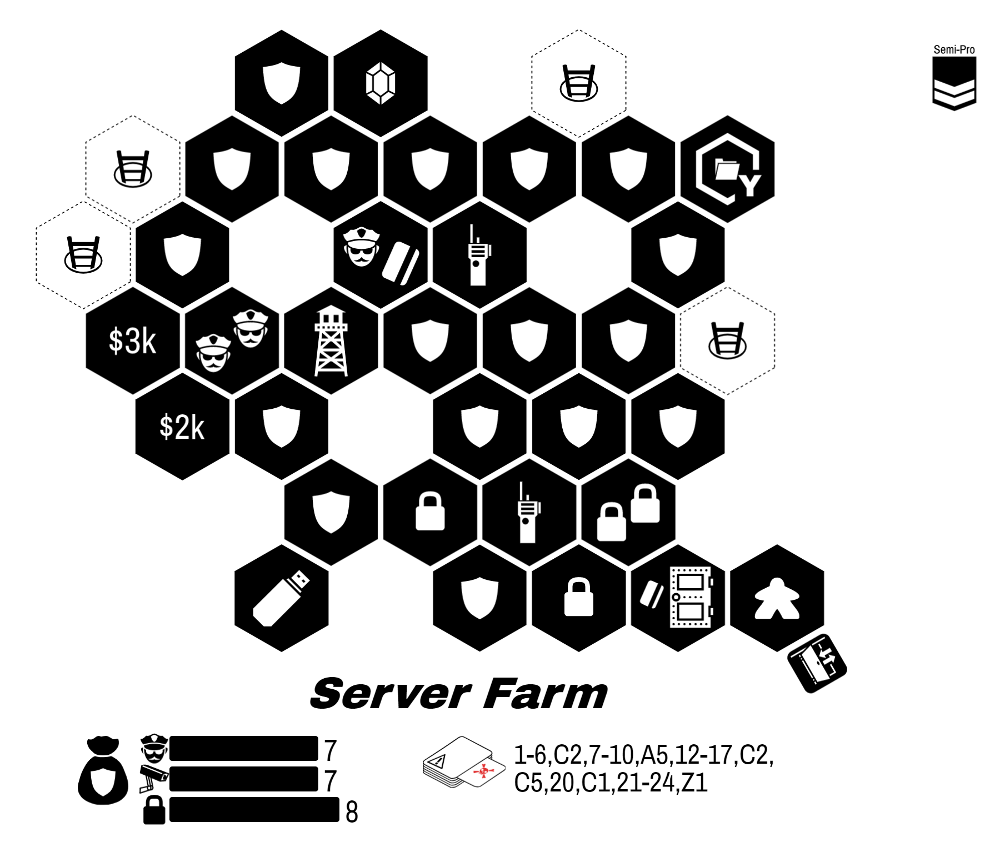
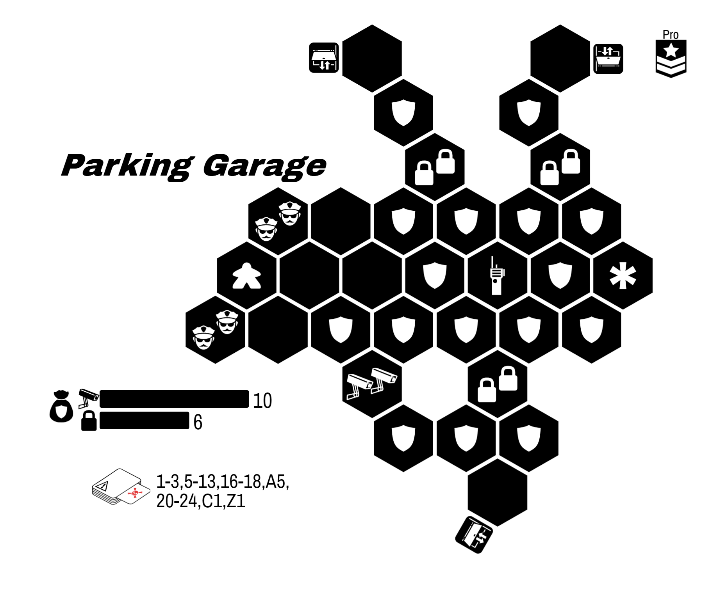
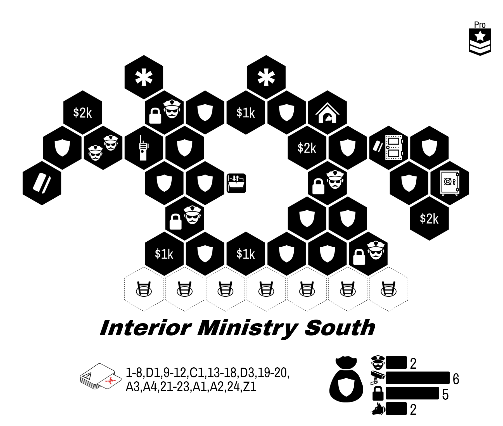
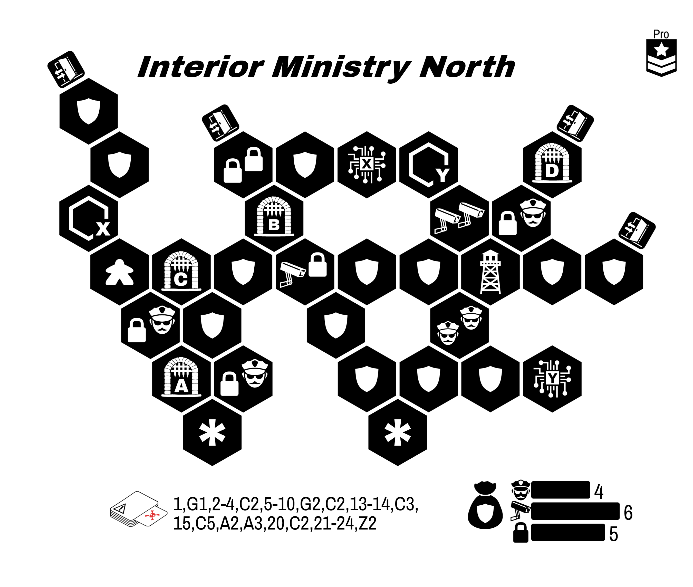

  River City

Your journey begins with some text messages from an old friend:

> Welcome back! Things around here haven't changed since you left.
{:class="text-message"}

> I hear you have some new skills to try out? I can introduce you to some folks... but you and your friends will need prove yourselves before they provide their services.
{:class="text-message"}

River City is an **open-ended** campaign.

* All heists are **available** to any team.
* Every heist you complete will introduce you to a new **Fixer**
* You are welcome to **explore this booklet** without spoilers.
* **Players can come and go**. Your party can change between heists as needed.
* When a character is Busted, your team may opt to do a **breakout**. See page 3.
* During planning, you may visit the Shop to **purchase items**.

Version ⏱

---

* Choose an entirely Amateur team.
* Gain the *Old Friend* Fixer.
* You have $0k team cash.
{:class="directions"}

# Opportunities

| Difficulty | Avg. Level |
| ---------- | ---------- |
| Amateur    | < 2        |
| Semi-Pro   | 2-3        |
| Pro        | > 3        |
{:class="difficulty-table"}

> Just name the fixer and I'll arrange an introduction.
{:class="text-message"}

| Opportunity           | Location            | Difficulty | Unlocks Fixer        | Page |
| :-------------------- | :------------------ | :--------- | -------------------- | ---- |
| The Inclusion Job     | Delinquent Jeweler  | Amateur    | Pawn Shop Owner      | TBD  |
| The Startup Job       | Tech Lab            | Amateur    | Visage               | TBD  |
| The Dark Horse Job    | The Track           | Amateur    | Bookie               | TBD  |
| The Greedy Prisoner   | Estate Basement     | Semi-Pro   | The Connoisseur      | TBD  |
| The Blind Justice Job | Courthouse          | Semi-Pro   | Beat Cop             | TBD  |
| TBD                   |                     | Semi-Pro   | Extorted Locksmith   | TBD  |
| TBD                   |                     | Semi-Pro   | Security Consultant  | TBD  |
| TBD                   |                     | Semi-Pro   | Diversion Specialist | TBD  |
| The Melee Job         | Museum of Antiquity | Semi-Pro   | The Curator          | TBD  |
| The Side Channel      | Server Farm         | Semi-Pro   | Shell                | TBD  |
| The                    |                     | Pro        | The Architect        | TBD  |
| The Safehouse Rescue  | Parking Garage      | Pro        | Retired Mastermind   | TBD  |
| The Final Score       | Interior Ministry   | Pro        | The Mayor            | TBD  |
{:class='tabletoc'}

Can't decide? These are some good threads:

* **Get That Loot**
  - _Big payouts, just know your limits_
  - The Inclusion Job
  - The Melee Job
  - The Greedy Prisoner
  - TBD: Scavenger
  - The Final Score
* **When A Plan Comes Together**
  - _Planning, coordination, satisfying results_
  - The Startup Job
  - TBD: The Machinist
  - The Side Channel
  - The Safehouse Rescue
  - The Final Score
* **Confidence**
  - _Every risk has some kind of reward_
  - The Dark Horse Job
  - The Blind Justice Job
  - _TBD_
  - The Final Score
{:.heistthread}

# County Jail Opportunities

> Busted? Minor occupational hazard.
{:class="text-message"}

If a character is busted, you may simply build a new character. Alternatively, your team my opt to rescue you. Even if the entire team is busted, you may opt for a breakout using these rules.

---

  * **Spread Out**. No limit on the number of characters on entrances. However, each character must leave out a different exit. If they do not, all characters are Busted.
  * **Break in to Break out**. Busted characters must start inside the jail. Non-Busted characters must start outside of the jail.
  * **Pick Your Moment**. Your team may choose which opportunity is appropriate. The more difficult the job, the more profitable it is.

---

| Opportunity | Difficulty | Unlocks Fixer | Team Reward | Page |
| :---------- | :--------- | :-----------: | :---------: | ---- |
| The Yard    | Semi-Pro   | Prison Guard  | $10k        | TBD  |
| The Bricks  | Semi-Pro   | Prison Guard  | $10k        | TBD  |
| The Hole    | Pro        | Prison Guard  | $15k        | TBD  |
{:class='tabletoc'}

# Pre-Built Characters

TODO: finish filling these out.

<!-- •••••••••••••••••• -->

|                                                                       | Name           | Character & Skills                               | ➜                         | 💡           | 🔍     | 🔓         | 👊 | 📷         | 🔊                                       |
| :-------------------------------------------------------------------: | :------------: | :----------------------------------------------: | -------------------------- | -------------- | -------- | ------------ | ---- | ------------ | ------------------------------------------ |
| {:.s} | Johnny Swagger | **Angry Locksmith**   Smash 'n' Grab, Bypass | ∎∎∎∎∎∎∎∎∎∎       | ∎∎∎         | ∎∎∎∎ | ∎∎         | ∎∎ | ∎∎         | ∎∎∎∎∎∎∎∎∎∎∎∎∎∎∎∎∎         |
| {:.s} | Karma          | **Angry Locksmith**   Hurry, Wing It         | ∎∎∎∎∎∎∎∎∎∎∎∎   | ∎∎∎∎       | ∎∎∎   | ∎∎∎       | ∎∎ | ∎∎         | ∎∎∎∎∎∎∎∎∎∎∎∎∎∎∎∎∎∎∎∎   |
| {:.s}                       | Jitters        | **Thug**   Hurry, Yank Wires                 | âˆâˆâˆâˆâˆâˆâˆâˆâˆâˆâˆâˆâˆ | âˆâˆâˆâˆâˆâˆâˆ | ∎∎∎   | ∠          |      | ∎∎∎∎     | ∎∎∎∎∎∎∎∎∎∎∎∎∎∎∎∎∎∎∎     |
| {:.s}                       | Tiny Mike      | **Thug**   Wing It, Bypass                   | ∎∎∎∎∎∎∎∎∎∎∎     | ∎∎           | ∎∎     | ∎∎∎∎∎∎ | ∎∎ | ∎∎         | ∎∎∎∎∎∎∎∎∎∎∎∎∎∎∎∎∎∎∎     |
| {:.s}     | Enigma         | **Street Urchin**   Hurry, Bypass            | âˆâˆâˆâˆâˆâˆâˆâˆâˆâˆâˆâˆâˆ | ∎∎∎∎∎∎   | ∠      | âˆâˆâˆâˆâˆ   |      |              | ∎∎∎∎∎∎∎∎∎∎∎∎∎∎∎∎∎         |
| {:.s}     | Iceheart       | **Street Urchin**   Wing It, Yank Wires      | ∎∎∎∎∎∎∎∎∎∎∎     | ∎∎∎         | ∎∎∎∎ | ∎∎         | ∎∎ | ∎∎∎∎∎∎ | ∎∎∎∎∎∎∎∎∎∎∎∎∎∎∎∎∎∎∎∎∎ |
| {:.s}     | Phobia         | **Script Kiddie**   Smash 'n' Grab, Bypass   |                            |                |          |              |      |              |                                            |
| {:.s}     | Null           | **Script Kiddie**   Hurry, Yank Wires        |                            |                |          |              |      |              |                                            |
| {:.s}                 | Showtime       | **Burglar**   Bypass, Wing It                |                            |                |          |              |      |              |                                            |
| {:.s}                 | Clutch         | **Burglar**   Smash 'n' Grab, Yank Wires     |                            |                |          |              |      |              |                                            |
| {:.s}                 | Crazy Eyes     | **Lookout**   Hurry, Wing It                 |                            |                |          |              |      |              |                                            |
| {:.s}                 | Smokes         | **Lookout**   Smash 'n' Grab, Bypass         |                            |                |          |              |      |              |                                            |
| {:.s}           | Status         | **Pickpocket**   Hurry, Yank Wires           |                            |                |          |              |      |              |                                            |
| {:.s}           | Locket         | **Pickpocket**   Hit 'n' Run, Smash 'n' Grab |                            |                |          |              |      |              |                                            |
| {:.s}         | F-Stop         | **Shutter Bug**   Wing It, Bypass            |                            |                |          |              |      |              |                                            |
| {:.s}         | Stretch        | **Shutter Bug**   Hurry, Hit 'n' Run         |                            |                |          |              |      |              |                                            |
{:.prebuilt}

# The Inclusion Job

  

From the Pawn Shop Owner:

> Our friends down the road have decided to experiment with capitalism again. I need to show them the cost of leaving a cartel.
{:.text-message}

**Objective:** Steal all three jewels.

**Special Rules:**

* Lockdown Gates (see rules)
* Reinforcements (see rules)

**Success Unlocks:** Pawn Shop Owner

{::comment}
https://mastersoftheheist.com/design/?savekey=Delinquent+Jeweler|55|5|5|6|4|0|0|0|0|0|20|15|1-8,G1,9-12,C3,13-14,G3,C3,15-21,C1,Z2|35|225|A|OIBQBKHpPXUNo8ASATGFBGZulIGUBhCE4sc-ebMAKQHUwiNKBBMAUQFlOBWPcNwgARCiWAAhMdKoIG0yuABKHTjw79ZkIZHJ7x8WfMXSaWwxbUDrSDjnNA
{:/comment}

# The Startup Job

  

From Visage:

> Trade secrets are for cowards. Get me a copy of their code and I can help you out.
{:.text-message}

**Objective:** Steal the document from the vault.

**Special Rules**

* Keycard (see rules)
* Watchtower (see rules)

**Success Unlocks:** Visage

{::comment}
https://mastersoftheheist.com/design/?savekey=Tech+Lab|110|5|3|6|6|0|0|0|0|0|15|220|1-12,C2,13-18,C2,19-24,Z1|190|245|A|OIBQBKYumz8QQaQMIBlGcqsASAzFggMopgoCyYp1ZATMBmnUeVWgPJgDqAKngEZawuKxo1RfEQkiVpg4RJnhcLcWXVgAolVF7wO1loBsrfZhNn4QA
{:/comment}

# The Dark Horse Job

  

From The Bookie:

> Bosses over at the track are trying to pull a fast one on us freelancers. Steal their ledger.
{:.text-message}

**Objective:** Steal the documents

**Item:** Cheap Picks

**Special Rules** (see rules)

* Remote locks
* Guard Dogs
* Item

**Success Unlocks:** Bookie

{::comment}
http://localhost:3000/?savekey=The+Track|190|240|5|3|5|0|0|1|0|0|20|110|1-7,D1,D2,D3,8-12,C7,13-20,C6,21-24,Z1|25|230|A|OIBQBAogzGpgJDOBlAGmAIgeTAJgMIAyYASgJoazjL6QCyYNjtTuwxTwGXVvT2vOEPD4GwhLmal0yMn1rjx-HONFSlLTQhhMIY8OIgBGQQbO8IANlM3F5u7ftOgA
{:/comment}

# The Greedy Prisoner

  

From The Connoisseur:

> I... got distracted by their beauty. I also figured he'd free me eventually but it appears that I'm his new... prize.  Anyways I would greatly appreciate my freedom. The loot is my payment.
{:.text-message}

**Objective:** Steal at least two jewels and the NPC must escape.

**Special Rules**:

* The NPC token is a Prisoner (see NPCs in rules)
* Remote Locks (see rules)
* Guard Dogs (see rules)

**Success Unlocks:** The Connoisseur

{::comment}
http://localhost:3000/design/?savekey=Estate+Basement|50|230|2|6|5|0|0|2|0|0|105|135|1-8,D1,9-15,C6,16-18,D2,C4,C5,A1,A4,19-20,21-24,Z1|90|200|S|OIBQBKHpAkDMVH0ZV4DKANM6DCYAlTAWTACkB1HfPHbNJAJjABEB5RdATU-wYdqUU0DHxG9qrANKFsQgj1q1IjYGOEaVwADIal6-uP2IAoqUObwZjSYCMlh5BMA2R+IuGgA
{:/comment}

{::comment}
Group feel bifurcated - the right hand side is clearly the objective side, but it doesn't help the other side. Can one side be more helpful? Or maybe the X remote lock should be on the tougher side?
{:/comment}

# The Blind Justice Job

  

From the Beat Cop:

> I need to know what they have on me. Get me the dossier at the courthouse, then we'll talk.
{:.text-message}

**Objective:** Steal the document

**Item:** Lucky Penny

**Special Rules:**

* Lockdown Gates (see rules)
* Remote Locks (see rules)
* Reinforcements Locks (see rules)

**Success Unlocks:** Beat Cop, Gain $5k

{::comment}
https://mastersoftheheist.com/design/?savekey=Courthouse|80|35|4|4|8|0|0|0|0|0|25|200|1-7,C3,8-12,G1,A2,16,G2,G3,19-21,C4,22-24,Z2|35|175|S|OIBQBKHpPXUNo+TIFEAsC0CYIEEwBlAYWXNLDQFkKyAZPAJQA0ARO4s1eSmrsPQDyAknko9OlJmmIsIeACR5JqMv2EDgHVb24AhARJQnyk-rrOm0ANiA
{:/comment}

# The Melee Job

  

You get a text from the Curator:

> It would appear that some of our guards have sticky fingers. Help me with some cleaning?
{:.text-message}

**Objective:** Steal 3 jewels

**Safe** requires 🧩🧩🧩🧩 and contains a jewel

**Special Rules**:

* HELD BY GUARDS. When you draw a jewel or keycard from the bag, add a Guard from the supply to that hex
* HELP ME WITH SOME CLEANING. Guide NPC starts with 💡💡💡 and has FANCY CARD FLICK as their special. (See NPCs in rules)
* FANCY CARD FLICK. Use this action to throw the keycard to any hex in a straight line not interrupted by a gap, (locked) Lock, or unknown security.
* OURS NOW. Keep any jewels stolen.

**Success:** Unlock the Curator

{::comment}
http://localhost:3000/design?savekey=Museum+of+Antiquity|5|255|3|4|4|3|1|0|0|0|275|55|1-13,C5,14-24,C4,Z1|90|0|S|OIBQBAogzGq+c4QCzzUgsmATMAMmACQx7aRaIJVgDKAwrQ-Y7AIwDS564zl3LfOHSy9qcZqLQQs7OgQCSYWQQkNB1afzplNw-uKI6K4TZvX6xGgGzwgA
{:/comment}

# The Side Channel

  

From Shell:

> Greatest cybersecurity in the world can't beat a tunnel. Too bad I'm a bit claustrophobic.
{:.text-message}

**Objective:** Steal the documents inside remote lock Y.

**Special Rules:**

* TUNNEL. In planning, you place one Entrance on any external side.
* NO ENTRANCE LIMITS. Any number of player characters may start on an entrance.
* Guide NPC (see rules) starts with 💡💡.
* Special ability for Guide is PAUSE 💡.
* Shell also has CRACK CIPHER. Immediately when Shell has possession of the USB key, they open up the Y gate.
* Watchtower (see rules)

{::comment}
https://mastersoftheheist.com/design/?savekey=Server+Farm|175|30|7|7|8|0|0|0|0|0|20|225|1-6,C2,7-10,A5,12-15,C5,16-17,C2,20,C1,21-24,Z1|155|235|S|OIBQBKHpPXUNggygYTAKQOqPk-4aYRJ6RASgJoAiuK6MA0uuQKL11IAkAzBAExgsAFWJlxneF0FFIpMZMVEAMgHkwbMMsEE6AVWQAhDmrDNlYALI5dtvPFYA2RXclA
{:/comment}

# The Hospitality Job

  

You receive a text message from the Security Consultant:

> A colleague of mine is in a bit of a jam. Can you deliver him?
{:.text-message}

> btw he won't go willingly. thx!
{:.text-message}

{::comment}
http://localhost:3000/design?savekey=Hotel+Basement|10|245|4|4|2|0|1|0|0|0|250|5|1,A1,2,3,C2,4-15,C2,16-20,A2,C5,21-23,A4,24,Z1|20|25|S|OIBQBKHpCiDMVGWdVTwGkDCAZd+UDwASAJjC3OCrULvAGUswmLzs8BZAdRf2ITAAjBhbNuAFTFhSuIvhidprHDXmFWrSJuaEY5RWENYlrY0sP11tcJZvWFANnRA
{:/comment}

**Objective:** The hostage must escape.

**Safe** requires 🧩 🧩 🧩, contains $5k and a jewel

**Special Rules:**

* NPC is a Hostage (see rules)
* Keycard (see rules)
* Watchtower (see rules)
* Safe (see rules)

**Upon Success:** Unlock Security Consultant, gain $7k

# The Safehouse Rescue

  

From Old Friend:

> Found the safehouse where the feds keep my mentor. Let's grab her in transit.
{: class="text-message"}

**Objective:** Rescue Prisoner before she reaches the van

**Success Unlocks:** Retired Mastermind, $10k

**Special Rules:**

  * MOVING TARGET. Each round, except the first round, move all guards and Captured Prisoner one hex in a straight line closer to the van.
  * GUARDS HAVE KEYS. Guards and Captured Prisoner move without restriction.
  * AMBUSH REQUIRED. All four Guards must be subdued **in a single round**. If one is subdued but not the others, activate the C1 crisis during Event phase early.
  * ABORT ABORT ABORT. Prisoner cannot be Freed during the Escape Phase (i.e. the NPC must be activated prior to escape).

{::comment}
https://mastersoftheheist.com/design/?savekey=Parking+Garage|0|60|0|10|6|0|0|0|0|0|10|170|1-3,5-13,16-18,A5,20-24,C1,Z1|50|220|P|OIBQBKHpCiBMYYFkquYgrKyPrgMoDCqR2eZFkAMgtbebhAuqa8aY40gOqIovEASjDCkAVJWYo2o9nMoNyhemBoL1kGR0Uad6TjoOIAjAqA
{:/comment}

# The Final Score

From your old friend:

> So you've decided to hit up the world's largest gang huh? Nice.
{:class="text-message"}

> Wait... you're gonna STAY in there hidden with all those government secrets?
{:class="text-message"}

> Lots of moving pieces on this one. Sorry but this one is out of my league.
{:class="text-message"}

This is a two-part heist.

  * Part 1. You will be stealing the government secrets from their vault, then hiding in the building itself.
  * Part 2. Once the alarms die down, make a break for it! Break out of all four doors.

Your **Old Friend** Fixer is not available for this heist.

Once the alarm sounds for the first heist, your only escape points are the hideouts*.  You may now rebuild the board for the second heist, keeping the hexes with players on them on the table. Rebuild the security bag according to the new security token distributions.

Plan for the additional heist by setting new planning tokens (you no longer need a planning token on your current location). You may not use Fixer abilities during this phase, but you may use Character powers that impact this phase.

Before Part 2: the two people who are on the same tile can share ideas with each other between heists.

# The Final Score: Part 1

  

{::comment}
http://localhost:3000/design/?savekey=Interior+Ministry+South|40|210|2|6|5|0|0|2|0|0|235|225|1-8,D1,9-12,C1,13-18,D3,20,A3,A4,23,A1,A2,24,Z1|60|240|P|OIBQBKHpPXUNggVI8qmfgEgEwN2ABkwBlAYTGwEYzKARAaTQQonwCUBROlvXxuRJtIglmzZcArAWKtKpFpEIkkEypH5YENXrvVgVS+ABUwZi+atntt+HeOOHz+66cggA
{:/comment}

From our insider contact:

> Loading dock is one entrypoint, then tunnel under the south wall.
{:class="text-message"}

> This needs to look like a regular robbery, so get cash
{:class="text-message"}

**Objectives:**

  * Get the documents in the safe
  * Steal $5k worth of cash

**Special rules:**

  * TUNNEL. During planning, place an entrance in one of the designated areas.
  * SMALL HIDEOUTS. Maximum of 2 characters per hideout
  * Safe requires 6x🧩 and contains the documents
  * Keycard (see rules)
  * Reinforcements (see rules)
  * Guard Dogs (see rules)

# The Final Score: Part 2

  

> Our meal ticket is approaches. Why is the mayor in a federal building??
{:class="text-message"}

**Objective:** Escape with the Mayor as your hostage

**Special Rules**

* BREAKOUT. Every player character must exit out of a different exit.
* MEAL TICKET. Mayor moves one hex to the right at the end of each Event phase until captured. Once captured, he is a Hostage (see rules).
* A TRUSTED MAYOR. Watchtower does not impact the Mayor, even as a hostage.
* Reinforcements (see rules)
* Watchtower (see rules)
* Remote locks (see rules)

{::comment}
http://localhost:3000/design/?savekey=Interior+Ministry+North|40|210|5|5|6|0|0|0|0|0|235|225||60|240|P|OIBQBAogzGqTdHiZALLZ4DKBhDZcC8sANMAJQE19CU5bNYARfOHAJjHeABlXGAsgHVYxPOxx9ChIQBUiCiAFZ+XXgvpjYAQVV1kAITV9NC6dX2qAVNb2NLD+07svHr5288fv-IA

{:/comment}

**Upon Success:** see next page.

# The Final Score

The next morning, you receive a text from your Old Friend.

> I knew it. These documents show that the feds have dirt on the Mayor.
{:class="text-message"}

> I think we have a new friend.
{:class="text-message"}

**Unlock the Mayor as a Fixer.** The main questline of River City is complete. However, the rest of River City is still open to you.

## Achievements

| Achievement      | Description                                                                                           | Date |
| ---------------- | ----------------------------------------------------------------------------------------------------- | ---- |
| On Fumes         | Win a scenario where at least two characters have zero leftover ideas at the end.                     |      |
| Nothing Personal | Win a scenario but have at least one character Busted.                                                |      |
| Of Course        | Have a character end up Busted by needing at least 2 on their last ditch effort, and rolled a 1.      |      |
| Back For More    | Complete The Final Score job with the Mayor already as your fixer. The NPC is just a regular hostage. |      |
| Completionist    | Complete all scenarios in River City.                                                                 |      |
| Bingo Blackout   | Fill out the Character table below                                                                    |      |
{:class="achievements"}

Circle a cell if a player has played this character in any heist.

| Amateur         | Pro         | Pro             |
| --------------- | ----------- | --------------- |
| Angry Locksmith | Safecracker | Demolitions Guy |
| Thug            | Bruiser     | Operative       |
| Street Urchin   | Grifter     | Mastermind      |
| Script Kiddie   | Hacktivist  | Black Hat       |
| Burglar         | Grease Man  | Ghost Runner    |
| Lookout         | Watchman    | Sentinel        |
| Pickpocket      | Con Artist  | Thief           |
| Shutter Bug     | Technician  | Tinkerer        |
{:class="achievements"}

# County Jail: The Bricks

  

**Objective:** Everyone escapes out a different exit.

{::comment}
https://mastersoftheheist.com/design/?savekey=The+Bricks|70|5|6|4|5|0|0|1|0|0|20|200||50|200|S|OIBQBAogzGq+dHggFnuxBVDDe20utOgMoDCY5sFVtFAIgPIbZVxsCCOsAQvpAFZSFQmzzsReMcO7B6lSdwDqAFVgAmMABlNdMOuAUdsvAFkl6c5YuFb4+ycd2nIIA
{:/comment}

**Special Rules**

  * WANDERING MEAL TICKET. Prior to capture, the NPC token moves one hex at eastward the end of each Event phase. Once captured, NPC becomes a Hostage (see rules)

**Special rules:**

{::comment}
Here are some random ones I'm saving for now:

https://mastersoftheheist.com/design/?savekey=The+Ledger|105|5|3|8|5|0|1|0|3|0|210|195||35|215|A|OIBQBKYKIMwelEPFALPDkoFlPgCRwDKAwtLknhqWDTZfQcWXWQCIDytLPVkrYTmELcIbYG1GV+ZBrwDSJADJ9kGHKMYYQ4AFIB1KlACMqs9LUXzlm9dVA

https://mastersoftheheist.com/design/?savekey=The+Track|190|240|5|3|5|0|0|1|0|0|20|110|1-7,D1,D2,D3,8-12,C7,13-20,C6,21-24,Z1|25|230|A|OIBQBAogzGpgJDOBlAGmAIgeTAJgMIAyYASgJoazjL6QCyYNjtTuwxTwGXVvT2vOEPD4GwhLmal0yMn1rjx-HONFSlLTQhhMIY8OIgBGQQbO8IANlM3F5u7ftOgA
{:/comment}
