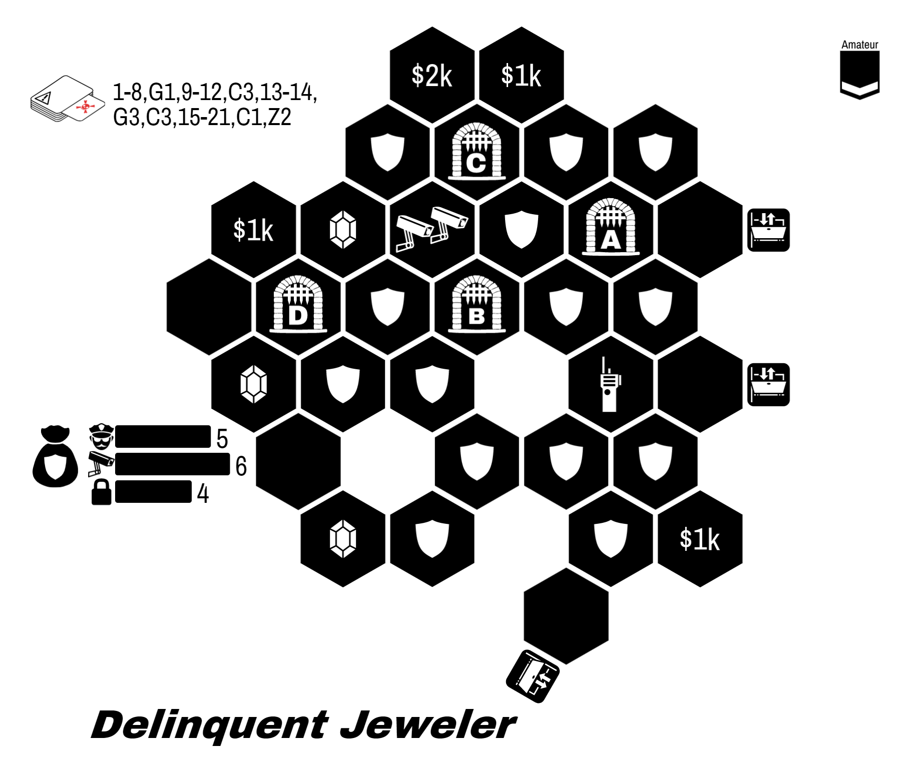
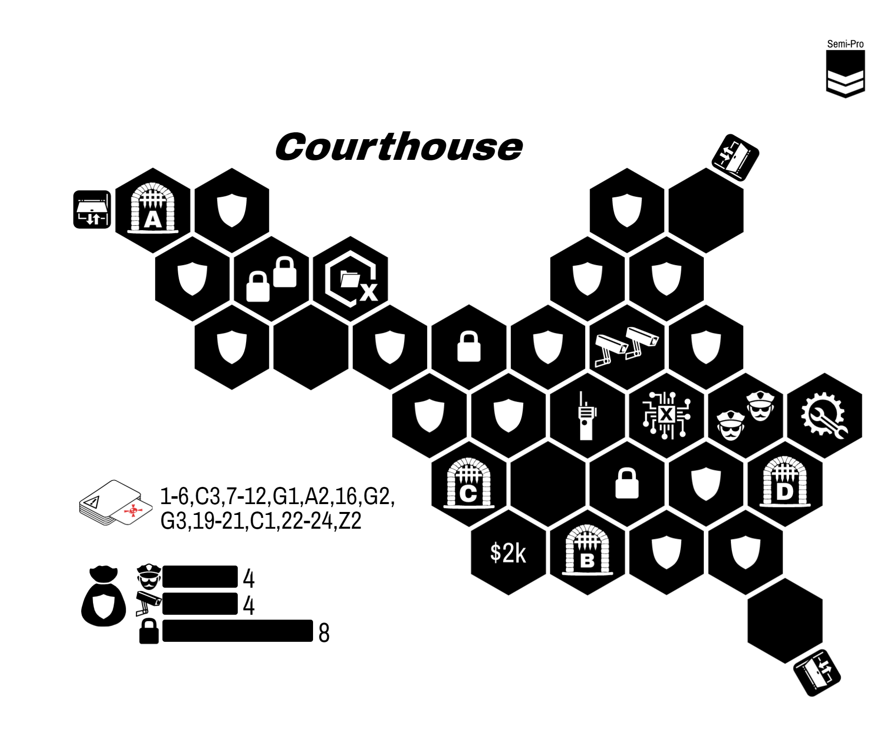

  River City

Your journey begins with some text messages from an old friend:

> Welcome back! Things around here haven't changed since you left.
{:class="text-message"}

> I hear you have some new skills to try out? I can introduce you to some folks... but you and your friends will need prove yourselves before they provide their services.
{:class="text-message"}

River City is an **open-ended sandbox** campaign.

* All heists are **available** to any team.
* Every heist you complete will introduce you to a new **Fixer**
* You are welcome to **explore this booklet** without spoilers.
* **Players can come and go**. Your party can change between heists as needed.
* When a character is Busted, your team may opt to do a **breakout**. See page 3.
* During planning, you may visit the Shop to **purchase items**.

---

* Choose an entirely Amateur team.
* Gain the *Old Friend* Fixer.
* You have $0k team cash.
{:class="directions"}

# Opportunities

> The city is bursting with great opportunities and new people to meet.
  Let me know what you want and I'll arrange the introduction.
{:class="text-message"}

| Opportunity           | Difficulty | Unlocks Fixer       | Page |
|:--------------------- |:---------- |:------------------- |:---- |
| The Inclusion Job     | Amateur    | Pawn Shop Owner     | TBD  |
| The Startup Job       | Amateur    | Visage              | TBD  |
| TBD                   | Amateur    | Bookie              | TBD  |
| TBD                   | Amateur    | Prison Guard        | TBD  |
| The Greedy Prisoner   | Semi-Pro   | The Connoisseur     | TBD  |
| The Blind Justice Job | Semi-Pro   | Frustrated Beat Cop | TBD  |
| TBD                   | Semi-Pro   | Extorted Locksmith  | TBD  |
| TBD                   | Semi-Pro   | Security Consultant | TBD  |
| TBD                   | Semi-Pro   | Persuasive Jeweler  | TBD  |
| TBD                   | Semi-Pro   | Shell               | TBD  |
| TBD                   | Pro        | The Architect       | TBD  |
| The Safehouse Rescue  | Pro        | Retired Mastermind  | TBD  |
| The Final Score       | Pro        | The Mayor           | TBD  |
{:class='tabletoc'}

**The Final Score**. This finale is a challenging, two-part heist. You may attempt it at any time. We recommend a fully Pro team.

Heists are labelled with their difficulty based on the team:

| Difficulty | Avg. Level |
| ---------- | ---------- |
| Amateur    | < 2        |
| Semi-Pro   | 2-3        |
| Pro        | > 3        |
{:class="difficulty-table"}

# County Jail Opportunities

> Busted? Minor occupational hazard.
{:class="text-message"}

If a character is busted, you may simply build a new Amateur character. Alternatively, your team my opt to rescue you. Even if the entire team is busted, you may opt for a breakout using these rules.

---

  * **Spread Out**. No limit on the number of characters on entrances. However, each character must leave out a different exit. If they do not, all characters are Busted.
  * **Break-in to Breakout**. Busted characters must start inside the jail. Non-Busted characters must start outside of the jail.
  * **Pick Your Moment**. Your team may choose which opportunity is appropriate. The more difficult the job, the more profitable it is.

---

| Opportunity | Difficulty | Team Reward | Page |
|:----------- |:---------- |:-----------:|:----:|
| The Yard    | Amateur    |     $5k     |  18  |
| The Bricks  | Semi-Pro   |    $10k     |  19  |
| The Hole    | Pro        |    $15k     |  20  |
{:class='tabletoc'}

# The Inclusion Job

  

| Difficulty: | Amateur                                             |
| -----------:|:--------------------------------------------------- |
|     Events: | 1-8, G1, 9-12, G2, 13-14, G4, G1, C4, 15-20, C1, 25 |
{:class="scenario-stats"}

You receive a text from the Pawn Shop Owner:

> Our friends down the road have decided to experiment with capitalism again. I need to show them the cost of leaving a cartel.
{:.text-message}

**Objective:** Steal all three jewels.

**Special Rules:**

* Lockdown Gates (see rules)
* Reinforcements (see rules)

**Success Unlocks:** Pawn Shop Owner

{::comment}
https://mastersoftheheist.com/design/?savekey=Delinquent+Jeweler|30|5|5|6|4|235|210|OIBQBKHpPXUNggJAJjMgjI+S-gGUBhCE4sc-FbAKQHUwj1KBBMAUQFkOBWHBLhAAiFEsABCoqVUj0plcACV2Hbuz4zwgyOV1jcBsHIVSs-Tf22GLkdthsggA
{:/comment}

# The Startup Job

  

| Difficulty: | Amateur                             |
| -----------:|:----------------------------------- |
|     Events: | 1-4, S2, 5-10, C2, 11-21, C2, 22-25 |
{:class="scenario-stats"}

From Visage:

> Trade secrets are for cowards. Get me a copy of their code and I can help you out.
{:.text-message}

**Objective:** Steal the document from the vault.

**Special Rules**

* Keycard (see rules)
* Watchtower (see rules)

**Success Unlocks:** Visage

{::comment}
https://mastersoftheheist.com/design/?savekey=Tech+Lab|110|35|4|6|6|225|225|OIBQBKHi6XsKkg0gYQDJPmNYAkAzFogMqpioCyYZN5ATMJuvcRdegPJgDqAKvgCMdEdmy1a2fqMSQqMoSMmzweVhPIawAUWpiVOvYm0A2NvqSnzIIA
{:/comment}

# The Greedy Prisoner

  

| Difficulty: | Semi-Pro                           |
| -----------:|:---------------------------------- |
|     Events: | 1-15, C6, 16-18, C4, C5, D2, 20-25 |
{:class="scenario-stats"}

From The Connoisseur:

> I... got distracted by their beauty. I also figured he'd free me eventually but it appears that I'm his new... prize.  Anyways I would greatly appreciate my freedom. The loot is my payment.
{:.text-message}

**Objective:** Steal at least two jewels and rescue the NPC.

**Special Rules**:

* The NPC token is a Prisoner (see NPCs in rules)
* Remote Locks (see rules)
* Guard Dogs (see rules)

**Success Unlocks:** The Connoisseur

{::comment}
https://mastersoftheheist.com/design/?savekey=Estate+Basement|50|230|4|6|9|115|170|OIBQBKHpAkDMVH0ZV4DKBhMWwCUANAWTACkB1HbXdAlacAJmABkxHM3J0BNRXNP2rZBggQyFlKuQlPx8aIpsCX01kZlwmL1E7sMQBREqL0TjawwEZdtyIYBsds86hA
{:/comment}

# The Blind Justice Job

  

| Difficulty: | Semi-Pro                     |
| -----------:|:---------------------------- |
|     Events: | 1-7, S3, 8-16, S1, 17-20, S3 |
{:class="scenario-stats"}

> I need to know what they have on me. Get me the dossier on me at the courthouse, then we'll talk.
{:.text-message}

**Objective:** Steal the document

**Special Rules:**

* Lockdown Gates (see rules)
* Remote Locks (see rules)
* Reinforcements Locks (see rules)

**Success Unlocks:** Frustrated Beat Cop, Gain $5k

{::comment}
https://mastersoftheheist.com/design/?savekey=Courthouse|5|170|4|3|8|20|200|OIBQBKHpPXUNo+TIFEAsC0CYIEEwBlAYWXNLDQFkKyAZPAJQA0ARO4s1eSmrsPQDyAknko9OlJmmIsIeACR5JqMv2EDgHVb24AhARJQnyk-rrOm0ANiA
{:/comment}

# The Safehouse Rescue

  

| Difficulty | Pro                            |
| ----------:|:------------------------------ |
|     Events | 1-3, 5-9, 11-13, 16-24, S1, 25 |
{:class="scenario-stats"}

From Old Friend:

> Found the safehouse where the feds keep my mentor. Let's grab her in transit.
{: class="text-message"}

**Objective:** Rescue Prisoner before she reaches the van

**Success Unlocks:** Retired Mastermind, $10k

**Special Rules:**

  * MOVING TARGET. Each round, except the first round, move all guards and Captured Prisoner one hex in a straight line closer to the van.
  * GUARDS HAVE KEYS. Guards and Captured Prisoner move without restriction.
  * AMBUSH REQUIRED. All four Guards must be subdued **in a single round**. If one is subdued but not the others, activate the S1 crisis during Event phase early.
  * ABORT ABORT ABORT. Prisoner cannot be rescued during the Escape Phase.

{::comment}
https://mastersoftheheist.com/design/?savekey=Parking+Garage|0|60|0|10|6|20|180|OIBQBKHpCiBMYYFkquYgrKyPrgMoDCqR2eZFkAMgtbebhAuqa8aY40gOqIovEASjDCkAVJWYo2o9nMoNyhemBoL1kGR0Uad6TjoOIAjAqA
{:/comment}

# County Jail: The Bricks

  

| Difficulty: | Semi-Pro                 |
| -----------:|:------------------------ |
|     Events: | 1-8, S1, 9-12, S2, 13-27 |
{:class="scenario-stats"}

**Objective:** Everyone escapes out a different exit.

**Upon Success:** Gain $10k

{::comment}
http://localhost:3000/?savekey=The+Bricks|105|235|7|4|5|250|200|OIBQBKHpPXUNmAogZkfJyAsG8wFV9MilI0EBlAYTBolvqdoBEB5YiI+yHgQXwAhLigCsVWkh6Zw0znN6TMLOkrwB1ACoQATGAAye5mB3BahzmXABZdQlv27VyzJdvnHkEA
{:/comment}

# The Final Score

From your old friend:

> So you've decided to hit up the world's largest gang huh? Nice.
{:class="text-message"}

> Wait... you're gonna STAY in there hidden with all those government secrets?
{:class="text-message"}

> Lots of moving pieces on this one. Sorry but this one is out of my league.
{:class="text-message"}

This is a two-part heist.

  * Part 1. You will be stealing the government secrets from their vault, then hiding in the building itself.
  * Part 2. Once the alarms die down, make a break for it! Break out of all four doors.

Your **Old Friend** Fixer is not available for this heist.

Once the alarm sounds for the first heist, your only escape points are the hideouts*.  You may now rebuild the board for the second heist, keeping the hexes with players on them on the table. Rebuild the security bag according to the new security token distributions.

Plan for the additional heist by setting new planning tokens (you no longer need a planning token on your current location). You may not use Fixer abilities during this phase, but you may use Character powers that impact this phase.

Before Part 2: the two people who are on the same tile can share ideas with each other between heists.

# The Final Score: Part 1

  

| Difficulty: | Amateur |
| -----------:|:------- |
|     Events: | Pro     |
{:class="scenario-stats"}

{::comment}
http://localhost:3000/design/?savekey=Interior+Ministry+South+Wing|10|190|6|6|7|250|200|OIBQBKHpPXUNggVI8qmfgEgEwN2ABkwBlAYTGwEYzLCSs6J8AlAUWaT2YGlySFBPzTMh7AKwFiCISHhIGooUMg8ma2kJpj6MjQsOiDxoyfNnLp6xahA
{:/comment}

From our insider contact:

> We need two people to go in through the loading dock and then we'll have the other two come in through our tunnel under the south wall.
{:class="text-message"}

> Also, this needs to look like a regular robbery. Steal at least $5k worth of money.
{:class="text-message"}

**Objectives:**

  * Get the documents
  * Escape to the hideouts.

**Special rules:**

  * TUNNEL UNDER THE SOUTH WALL. Choose the entrypoint
  * SMALL HIDEOUTS. Maximum of 2 characters per hideout
  * Keycard (see rules)
  * Reinforcements (see rules)

# The Final Score: Part 2

  

| Difficulty: | Amateur |
| -----------:|:------- |
|     Guards: | TBD     |
|      Locks: | TBD     |
|    Cameras: | TBD     |
|     Events: | TBD     |
{:class="scenario-stats"}

**Objective:**

{::comment}

{:/comment}
