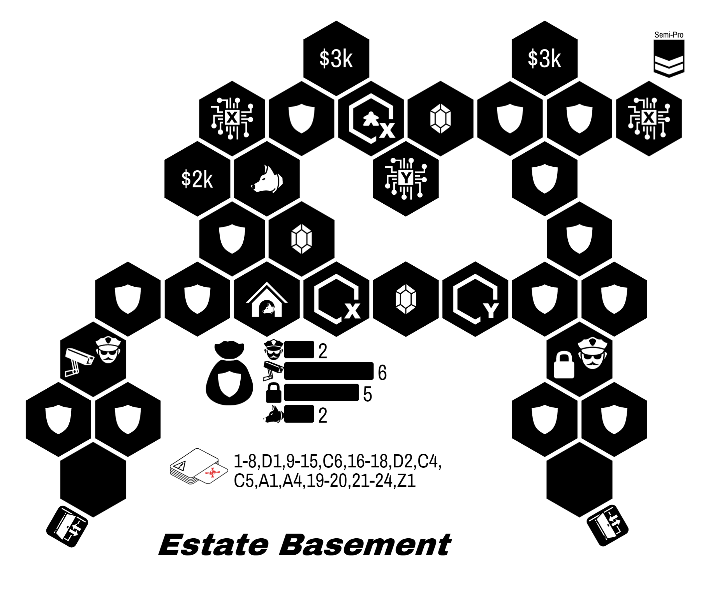
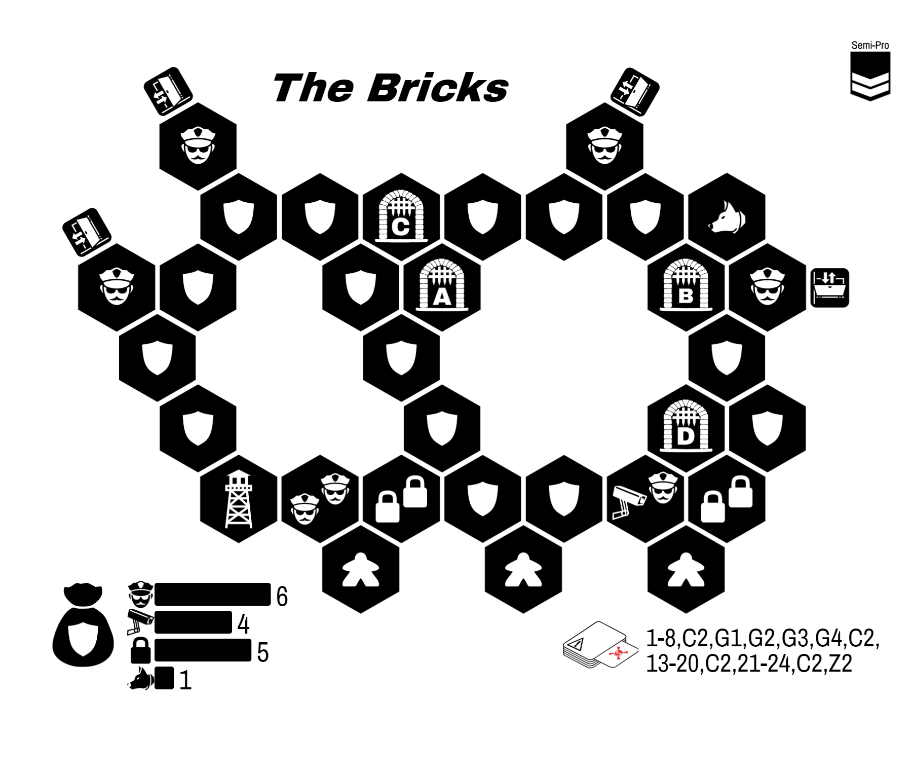

  River City

Welcome back! You'll find that things around here haven't changed since you left. Except I hear you all have some new skills you want to try out? I can introduce you to a few people, but you'll need to you prove yourselves.

-An Old Friend

*River City is an open-ended sandbox campaign. Every heist you complete will introduce you to a new Fixer. You are welcome to explore all scenarios and fixers before completing them.*

---

**Breakouts**. *If any character is Busted, your team may opt to break them back out of County Jail. See page 3.*

---

{:class="text-center"}
Begin your campaign by choosing an entirely Amateur team.

{:class="text-center"}
**Gain the Old Friend Fixer.**

{:class="text-center"}
**Gain $5k of team cash.**

# Opportunities

| Opportunity           | Difficulty | Unlocks Fixer       | Faction       | Page |
|:--------------------- |:---------- |:------------------- |:------------- |:----:|
| The Inclusion Job     | Amateur    | Pawn Shop Owner     | Fence         |  4   |
| Chain of Custody      | Amateur    | Frustrated Beat Cop | Cops          |  5   |
| The Startup Job       | Amateur    | Tech Support Guy    | Hackers       |  6   |
| Semper Paratus        | Amateur    | Extorted Locksmith  | Mafia         |  7   |
| The Exhibition        | Semi-Pro   | The Curator         | Fence         |  8   |
| The Blind Justice Job | Semi-Pro   | Prison Guard        | Cop           |  9   |
| The University Job    | Semi-Pro   | Spammer             | Hackers       |  10  |
| Rivalries             | Semi-Pro   | "Retired" Thief     | Mafia         |  11  |
| The Amnesty Job       | Semi-Pro   | Online Mogul        | Hackers+Mafia |  12  |
| The One that Got Away | Semi-Pro   | Retired Detective   | Cops+Fences   |  13  |
| History is Expensive  | Pro        | The Tunneler        | Fence         |  14  |
| Mayoral Race          | Pro        | Burned Out Sergeant | Cops          |  15  |
| Server Farm           | Pro        | Internet Troll      | Hacker        |  16  |
| Safehouse             | Pro        | Recruiter           | Mafia         |  17  |
| The Final Score       | Pro        | (none)              | (none)        |  21  |
{:class='tabletoc'}

**The Final Score**. This finale is a challenging, two-part heist. You may attempt it at any time. We recommend a fully Pro team.

## Factions

**Fence Cartel**. A bunch of snooty academics, this collective can really help you make money moving merchandise like artwork and jewelry.

**Corrupt Cops**. For when you need guards or get busted.

**Hacker Collective**. Experts at cameras and information.

**Mafia**. They're people people. And they've been doing this a lot longer us.

*Remember:* most Fixers only work with others in their faction for a given heist. However, you can still be introduced to Fixers of multiple factions across the campaign.

# County Jail

If a character is busted, you may simply build a new Amateur character. Alternatively, your team my opt to rescue you. Even if the entire team is busted, you may opt for a breakout using these rules.

---

**Breakout Rule**. No limit on the number of characters on entrances. However, each character must leave out a different exit. If they do not, all characters are Busted.

**Help from Outside**. Busted characters must start inside the jail. Non-Busted characters must start outside of the jail.

**Rehabilitated?** Characters who started the breakout Busted may level up if they escape. Characters who started the breakout Non-Busted do not level up.

**Pick Your Moment**. Your team may choose which opportunity is appropriate. The more difficult the job, the more profitable it is.

---

| Opportunity | Difficulty | Team Reward | Page |
|:----------- |:---------- |:-----------:|:----:|
| The Yard    | Amateur    |     $5k     |  18  |
| The Bricks  | Semi-Pro   |    $10k     |  19  |
| The Hole    | Pro        |    $15k     |  20  |
{:class='tabletoc'}

# The Inclusion Job

  

|                  Difficulty: | Amateur |
| ----------------------------:|:------- |
|                      Guards: | 5       |
|                       Locks: | 5       |
|                     Cameras: | 5       |
|                      Events: | TBD     |
| Max characters per Entrance: | 2       |
|     Max characters per Exit: | ∞       |
{:class="scenario-stats"}

"Our friends down the road have decided to experiment with capitalism again. I need to show them the cost of leaving a cartel."

"If you help me with this, I can move merchandise for you better than your friend here."

**Objective:** Steal all three jewels.

**Success Unlocks:** Pawn Shop Owner

{::comment}
http://localhost:3000/?savekey=Delinquent+Jeweler|30|5|OIBQBKHpPXUNggJAJjMgjI+S-gGUBhCE4sc-FbAKQHUwj1KBBMAUQFkOBWHBLhAAiFEsABCoqVUj0plcACV2Hbuz4zwgyOV1jcBsHIVSs-Tf22GLkdthsggA
{:/comment}

# Chain of Custody

|                  Difficulty: | Amateur |
| ----------------------------:|:------- |
|                      Guards: | TBD     |
|                       Locks: | TBD     |
|                     Cameras: | TBD     |
|                      Events: | TBD     |
| Max characters per Entrance: | 2       |
|     Max characters per Exit: | ∞       |
{:class="scenario-stats"}

**Objective:**

**Success Unlocks:** Frustrated Beat Cop

{::comment}

{:/comment}

# The Startup Job

  

|                  Difficulty: | Amateur                      |
| ----------------------------:|:---------------------------- |
|                      Guards: | 6                            |
|                       Locks: | 6                            |
|                     Cameras: | 6                            |
|                      Events: | 1-4, S2, 5-10, S2, 11-21, S2 |
| Max characters per Entrance: | 2                            |
|     Max characters per Exit: | ∞                            |
{:class="scenario-stats"}

"Trade secrets are for cowards. Get me info on their tech and I can help you out."

**Objective:** Steal the document.

**Success Unlocks:** Tech Support Guy

{::comment}
http://localhost:3000/?savekey=Tech+Lab|110|35|OIBQBKHi6XsKkg0gYQDJPmNYAkAzFogMqpioCyYZN56ATGI8RdegPJgDqAKvk1q1s2IeWx86rSGKR5B5YYkiEps2gFFqI5eC2sNANmm6kRk0A
{:/comment}

# Semper Paratus

  

|                  Difficulty: | Amateur |
| ----------------------------:|:------- |
|                      Guards: | TBD     |
|                       Locks: | TBD     |
|                     Cameras: | TBD     |
|                      Events: | TBD     |
| Max characters per Entrance: | 2       |
|     Max characters per Exit: | ∞       |
{:class="scenario-stats"}

**Objective:**

**Success Unlocks:** Extorted Locksmith

{::comment}

{:/comment}

# The Exhibition Job

  

|                  Difficulty: | Semi-Pro        |
| ----------------------------:|:--------------- |
|                      Guards: | 4               |
|                       Locks: | 6               |
|                     Cameras: | 9               |
|                      Events: | 1-15, S6, 16-27 |
| Max characters per Entrance: | 2               |
|     Max characters per Exit: | ∞               |
{:class="scenario-stats"}

"I suppose it's not so bad to be locked up with these masterpieces. Still... I would like my freedom."

**NPC token** is a Prisoner.

**Objective:** Steal at least two pieces of artwork. The NPC must escape.

**Success Unlocks:** The Curator

{::comment}
http://localhost:3000/?savekey=Estate+Basement|50|230|OIBQBKHpPXUNo8BBFywoBIaZAygMJhFgBKAGgLInGn0UYp3EECaCpe89r8SXHsRTBa5RigAy5DqRT4MAJmB9c-cMukEWajLwwBRGt11GEBgIy6TkAwDYoQA

{:/comment}

# The Blind Justice Job

  

|                  Difficulty: | Semi-Pro                     |
| ----------------------------:|:---------------------------- |
|                      Guards: | 4                            |
|                       Locks: | 8                            |
|                     Cameras: | 3                            |
|                      Events: | 1-7, S3, 8-16, S1, 17-20, S3 |
| Max characters per Entrance: | 2                            |
|     Max characters per Exit: | ∞                            |
{:class="scenario-stats"}

"I need to know what they have on me. Get me the dossier on me at the courthouse, then we'll talk."

**Objective:** Steal the document

**Success Unlocks:** Prison Guard

{::comment}
http://localhost:3000/?savekey=Courthouse|5|170|OIBQBKHpPXUNo+TIFEAsC0CYIEEwBlAYWXNLDQFkKyAZPAJQA0ARO4s1eSmrsPQDyAknko9OlJmmIsIeACR5JqMv2EDgHVb24AhARJQnyk-rrOm0ANiA
{:/comment}

# The University Job

  

|                  Difficulty: | Amateur |
| ----------------------------:|:------- |
|                      Guards: | TBD     |
|                       Locks: | TBD     |
|                     Cameras: | TBD     |
|                      Events: | TBD     |
| Max characters per Entrance: | 2       |
|     Max characters per Exit: | ∞       |
{:class="scenario-stats"}

**Objective:**

**Success Unlocks:** Spammer

{::comment}

{:/comment}

# Rivalries

  

|                  Difficulty: | Amateur |
| ----------------------------:|:------- |
|                      Guards: | TBD     |
|                       Locks: | TBD     |
|                     Cameras: | TBD     |
|                      Events: | TBD     |
| Max characters per Entrance: | 2       |
|     Max characters per Exit: | ∞       |
{:class="scenario-stats"}

**Objective:**

**Success Unlocks:** "Retired" Thief

{::comment}

{:/comment}

# The Amnesty Job

  

|                  Difficulty: | Amateur |
| ----------------------------:|:------- |
|                      Guards: | TBD     |
|                       Locks: | TBD     |
|                     Cameras: | TBD     |
|                      Events: | TBD     |
| Max characters per Entrance: | 2       |
|     Max characters per Exit: | ∞       |
{:class="scenario-stats"}

**Objective:**

**Success Unlocks:** Online Mogul

{::comment}

{:/comment}

# The One that Got Away

  

|                  Difficulty: | Amateur |
| ----------------------------:|:------- |
|                      Guards: | TBD     |
|                       Locks: | TBD     |
|                     Cameras: | TBD     |
|                      Events: | TBD     |
| Max characters per Entrance: | 2       |
|     Max characters per Exit: | ∞       |
{:class="scenario-stats"}

**Objective:**

**Success Unlocks:** Retired Detective

{::comment}

{:/comment}

# History is Expensive

  

|                  Difficulty: | Amateur |
| ----------------------------:|:------- |
|                      Guards: | TBD     |
|                       Locks: | TBD     |
|                     Cameras: | TBD     |
|                      Events: | TBD     |
| Max characters per Entrance: | 2       |
|     Max characters per Exit: | ∞       |
{:class="scenario-stats"}

**Objective:**

**Success Unlocks:** The Tunneler

{::comment}

{:/comment}

# Mayoral Race

  

|                  Difficulty: | Amateur |
| ----------------------------:|:------- |
|                      Guards: | TBD     |
|                       Locks: | TBD     |
|                     Cameras: | TBD     |
|                      Events: | TBD     |
| Max characters per Entrance: | 2       |
|     Max characters per Exit: | ∞       |
{:class="scenario-stats"}

**Objective:**

**Success Unlocks:** Burned Out Sergeant

{::comment}

{:/comment}

# Server Farm

  

|                  Difficulty: | Amateur |
| ----------------------------:|:------- |
|                      Guards: | TBD     |
|                       Locks: | TBD     |
|                     Cameras: | TBD     |
|                      Events: | TBD     |
| Max characters per Entrance: | 2       |
|     Max characters per Exit: | ∞       |
{:class="scenario-stats"}

**Objective:**

**Success Unlocks:** Internet Troll

{::comment}

{:/comment}

# Safehouse

  

|                  Difficulty: | Amateur |
| ----------------------------:|:------- |
|                      Guards: | TBD     |
|                       Locks: | TBD     |
|                     Cameras: | TBD     |
|                      Events: | TBD     |
| Max characters per Entrance: | 2       |
|     Max characters per Exit: | ∞       |
{:class="scenario-stats"}

**Objective:**

**Success Unlocks:** Recruiter

{::comment}

{:/comment}

# County Jail: The Yard

  

|                  Difficulty: | Amateur |
| ----------------------------:|:------- |
|                      Guards: | TBD     |
|                       Locks: | TBD     |
|                     Cameras: | TBD     |
|                      Events: | TBD     |
| Max characters per Entrance: | ∞       |
|     Max characters per Exit: | 1       |
{:class="scenario-stats"}

**Objective:** Everyone escapes out a different exit.

**Upon Success:** Gain $5k

{::comment}

{:/comment}

# County Jail: The Bricks

  

|                  Difficulty: | Semi-Pro                 |
| ----------------------------:|:------------------------ |
|                      Guards: | 5                        |
|                        Dogs: | 2                        |
|                       Locks: | 5                        |
|                     Cameras: | 4                        |
|                      Events: | 1-8, S1, 9-12, S2, 13-27 |
| Max characters per Entrance: | ∞                        |
|     Max characters per Exit: | 1                        |
{:class="scenario-stats"}

**Objective:** Everyone escapes out a different exit.

**Upon Success:** Gain $10k

{::comment}
http://localhost:3000/?savekey=The+Bricks|105|235|OIBQBKHpPXUNmAogZkfJyAsG8wFV9MilI0EBlAYTBolvqcdrOiPsk4EF8AhCEWQBWKq3idM4ScTrix+ACJzZAdQAqEAExgAMjuZgtwWvtlswAWVUJrtmxcdTzzpy6hA
{:/comment}

# County Jail: The Hole

  

|                  Difficulty: | Pro |
| ----------------------------:|:--- |
|                      Guards: | TBD |
|                       Locks: | TBD |
|                     Cameras: | TBD |
|                      Events: | TBD |
| Max characters per Entrance: | ∞   |
|     Max characters per Exit: | 1   |
{:class="scenario-stats"}

**Objective:** Everyone escapes out a different exit.

**Upon Success:** Gain $15k

{::comment}

{:/comment}

# The Final Score

Lots of moving pieces on this one. You're gonna need a breather halfway through to regroup and adjust your plans. Sorry but this one is out of my league.

This is a two-part heist. For the first part, you must start in the middle of the board and break out of all four doors. For the second heist, your characters keep their ideas and your team may discuss your plan for the next board.

Your **Old Friend** Fixer is not available for this heist.

If you have been introduced to (i.e. unlocked) two or more Fixers who can work with a given faction, you are considered a **friend** of that faction. Otherwise, you are an **enemy** of that faction. (Your Old Friend does not count.)

For each enemy faction, the following happens:

  * *Corrupt Cops*: add four Guard Dog tokens to the bag
  * *Hackers*: add a Watchtower to a certain corner
  * *Fence Cartel*: add a Reinforcement token in the southwest corner of the first map
  * *Mafia*: add a hostage to one of the unlocked gates. You must rescue this hostage

Once the alarm sounds for the first heist, finish it as normal. You may now rebuild the board for the second heist, keeping the hexes with players on them on the table. Rebuild the security bag according to the new security token distributions.

Plan for the additional heist by setting new planning tokens (you no longer need a planning token on your current location). You may not use Fixer abilities during this phase, but you may use Character powers that impact this phase.

# The Final Score

  

|                  Difficulty: | Amateur |
| ----------------------------:|:------- |
|                      Guards: | TBD     |
|                       Locks: | TBD     |
|                     Cameras: | TBD     |
|                      Events: | TBD     |
| Max characters per Entrance: | 2       |
|     Max characters per Exit: | ∞       |
{:class="scenario-stats"}

**Objective:**

{::comment}

{:/comment}
